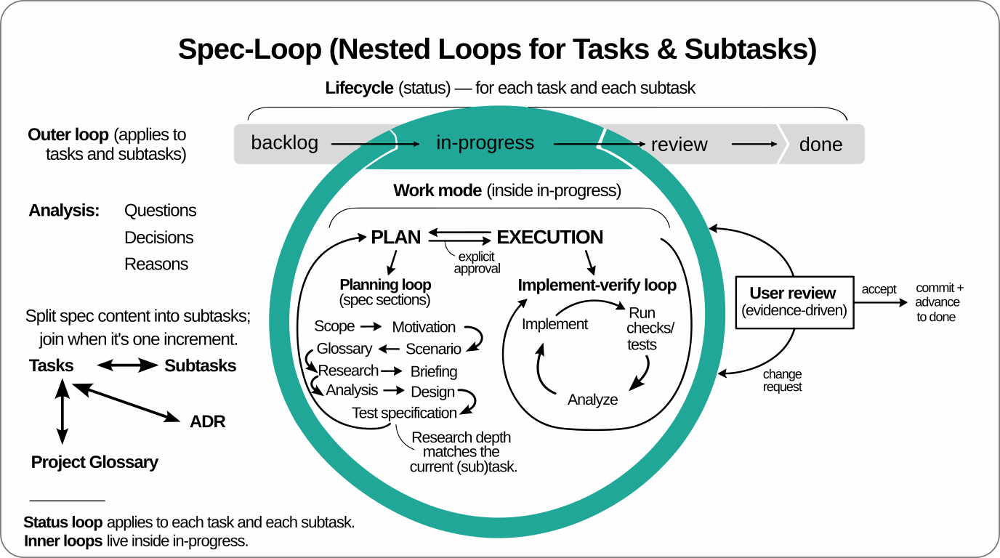

# Spec Loop — Design-First AI-Assisted Development

<p align="center">
  <a href="docs/infographics.svg">
    
  </a>
</p>

There are two common ways people use AI for coding.

**Vibecoding:** you describe intent, the model fills in the gaps, and you get a
large diff with undocumented decisions. Review becomes archaeology. Tests are
optional by accident.

**Waterfall:** you try to avoid that by writing a complete spec first. You
can’t. Constraints appear during implementation. The spec inflates, then it
either blocks change or gets ignored.

Spec Loop avoids both: write the next small spec, review it, then implement it
with tests. Keep the spec local to the next step. Repeat until done.

Spec Loop is a framework of reusable skills.

Its main governing rules live in the `plan-task` skill, in
**[constitution.md](skills/plan-task/constitution.md)**.
That skill governs plan-first work, task files, and the approval gate
before implementation.

The `write-glossary` skill defines the Spec Loop AsciiDoc glossary
format in
**[glossary-format.md](skills/write-glossary/glossary-format.md)**.

The `setup-task-and-glossary-rendering` skill helps users prepare and
troubleshoot rendering for task files and glossary files.

The model uses these skills while drafting and updating task files; you
review and approve at the task-file gate before implementation.

Spec Loop also defines explicit work phases: plan, implementation, and done.
Any transitions to implementation and to done require explicit user approval.

When a project maintains a glossary described by the Constitution's
[project glossary section](skills/plan-task/constitution.md#project-glossary),
that glossary defines the shared domain language above individual tasks and the
code. It keeps design documents, tests, code symbols, and commit text aligned
on the same terms across the whole project.

## Why This Works with Large Codebases

Spec Loop is designed to work with existing codebases at scale.
Before any design or implementation step, the model captures relevant
knowledge in the Research section of the task file: existing behavior,
constraints, APIs, interfaces, and established code practices.

It follows the classic research–plan–implement approach, broken down
into small, incremental sub-tasks.

The research is explicitly scoped to the next increment. It captures only
what is required to implement that increment correctly, and is intentionally
partial. The result is a bounded, reviewable understanding whose size
remains manageable.

For large codebases, the glossary is especially useful because it
keeps domain terms stable across many increments, files, and
subsystems.

Because the scope can be kept reasonably small and the research is
written down, you can verify that the model examined the right parts of
the codebase, identified the correct interfaces, and aligned with
existing practices before any code is written. This is especially
valuable in legacy systems: it prevents clean-room redesigns and makes
incremental change safer.

## Document Roles and Lifetimes

Spec Loop uses more than one document type on purpose. They do not have
the same job or the same lifetime.

- Task files are short-lived working artifacts for the next concrete
  slice of work. They exist to drive research, review, implementation,
  and testing of that slice.
- ADRs capture durable decisions and the reasons behind them.
- A glossary captures stable shared language across tasks, design,
  tests, code symbols, and commits.
- Living project documents capture current truth that should remain
  useful after the task is accepted, such as technical shape,
  operations, or other stable project knowledge.

Historical task files do not need to be kept mutually consistent across
time. The active task, however, should stay aligned with the glossary,
living project documents, and implemented code for its scope.

If a project maintains a technical design document, its purpose is to
describe the current technical shape, stable boundaries, and important
flows. It should not become a second glossary or a catalog of transient
implementation detail.

## Getting Started

Apply the process to your repository.

### Install the skills with `npx skills`

Recommended path:

1. Ensure Node.js is available so `npx` works.
2. Install the Spec Loop skills:

```bash
npx skills add dpolivaev/spec-loop
```

3. For global installation for a specific agent:

```bash
npx skills add dpolivaev/spec-loop -g -a <agent>
```

Valid agent values and additional agent-specific options are documented
at https://github.com/vercel-labs/skills.

### Prepare task and glossary rendering

Spec Loop task files use embedded PlantUML diagrams, and Spec Loop
glossaries may include embedded diagrams. Prepare your editor for
reviewing rendered task files and glossary files before continuing.

Ask the agent to use the `setup-task-and-glossary-rendering` skill to
prepare your editor preview setup.

For example:

```text
Please use the `setup-task-and-glossary-rendering` skill to help me
prepare my editor for reviewing rendered Spec Loop task files and
glossary files.

My coding harness may run in a terminal, but I review files in
<VS Code or JetBrains>.
```

### Update installed skills

Project-level update:

```bash
npx skills update
```

Global update:

```bash
npx skills update -g
```

### Manual fallback when `npx` is unavailable

If `npx` is not available, clone or download this repository and copy the
needed skill directories from `skills/` into your agent's skills directory.

Which directory your agent uses is agent-specific. See
https://github.com/vercel-labs/skills for agent-specific installation details.

### If your harness does not automatically apply installed skills

Some coding harnesses expose installed skills to the model but do not
reliably apply them unless the user prompt or project instructions make
their use explicit.

If your harness behaves that way, add a project instruction such as:

```text
Use the `plan-task` skill for all non-trivial work unless I explicitly
opt out.
Use the `write-glossary` skill for `glossary.adoc` glossary work.
Follow the Constitution loaded through the `plan-task` skill,
including the PLAN -> IMPLEMENTATION explicit approval gate.
```

If your harness supports project instruction files such as `AGENTS.md`,
put the rule there. That is more reliable than relying on ordinary chat
context alone.

## Included Skills

This repository currently ships these skills:

1. **`plan-task`**
   - the planning and readiness-check skill for task-based work;
   - defined by
     [skills/plan-task/constitution.md](skills/plan-task/constitution.md).

2. **`write-glossary`**
   - the Spec Loop AsciiDoc glossary-format skill;
   - defined by
     [skills/write-glossary/glossary-format.md](skills/write-glossary/glossary-format.md).

3. **`setup-task-and-glossary-rendering`**
   - the setup and troubleshooting skill for rendering task files and
     glossary files.

## Documentation

1. Check the Constitution briefly.

   * **[skills/plan-task/constitution.md](skills/plan-task/constitution.md)**
     defines the normative rules: task files, research/design discipline,
     approval gates, traceability requirements, and definition of done.

2. Study the Wordle example by commit history.

   * The [Wordle commit history](https://gitlab.com/dpolivaev/spec-loop/-/commits/main/examples/wordle)
     shows the workflow under real version-control pressure: how task
     specifications evolve step by step, and how implementation and tests
     follow approved design.

3. Check
   **[Review, Responsibility, and Traceability](docs/review-responsibility-and-traceability.md)**.
   It explains how task files and the Constitution map to team development
   practice: boundaries, responsibility, commit linking, and status discipline.

4. Follow one of the hands-on tutorials.

   * **[Wordle Tutorial](docs/wordle-tutorial.md)** walks through a
     compact Java example with staged planning, approvals,
     implementation, glossary maintenance, and testing.
   * **[Online Art Game Tutorial](docs/online-art-game-tutorial.md)**
     walks through a complete browser-oriented example with staged
     planning, approvals, implementation, and testing.
   * The two tutorials teach the same Spec Loop workflow: planning
     first, explicit approval before implementation, small reviewable
     tasks or subtasks, verification, and user correction when the LLM
     misses a supporting update. The main difference is the technical
     setting: Wordle is a compact Java path, while the online art game
     is browser-oriented. You can choose either tutorial.

5. Project glossary conventions.

   * See the Constitution's project glossary section above.
   * **[skills/write-glossary/glossary-format.md](skills/write-glossary/glossary-format.md)**
     is the shared glossary-format guidance file and includes its own
     embedded example.

Recommended quick-check order:
- `README.md`
- `skills/plan-task/constitution.md`
- `docs/review-responsibility-and-traceability.md`
- `docs/online-art-game-tutorial.md`
- `docs/wordle-tutorial.md`

## Diagrams: PlantUML Default, Mermaid Fallback

Spec Loop treats diagrams as specification artifacts: they make design
intent reviewable at the same boundary as the surrounding text.

Where the Constitution requires diagrams in task files, use PlantUML by
default.

Mermaid is a poorer but still possible alternative when the User or
another governing instruction explicitly prefers Mermaid, for example
when GitHub or similar environments are used and PlantUML is not
rendered.

PlantUML remains the recommended default in practice because it is
usually easier to keep precise and reviewable for the structural and
behavioral design work used in Spec Loop.

For inline PlantUML rendering in Markdown on the web, view the repo on
[GitLab](https://gitlab.com/dpolivaev/spec-loop). GitHub does not
render PlantUML embedded in Markdown natively, so reading there can
degrade the intended experience.

For local preview setup, use the
`setup-task-and-glossary-rendering` skill.

## License

Licensed under the MIT License. See [LICENSE](LICENSE).

## Origin

This framework was developed and applied in
Freeplane.
