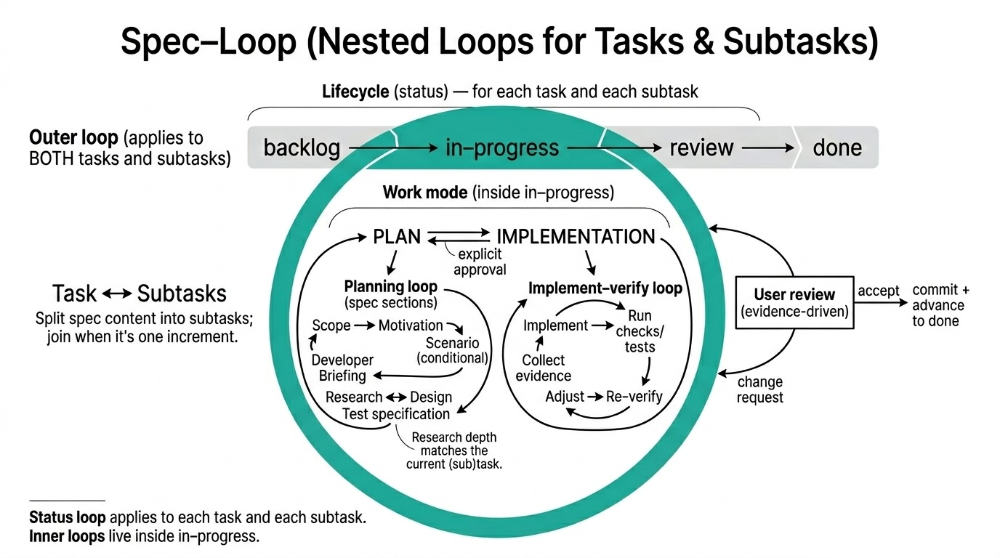

# Spec Loop — Design-First AI-Assisted Development

  

There are two common ways people use AI for coding.

**Vibecoding:** you describe intent, the model fills in the gaps, and you get a
large diff with undocumented decisions. Review becomes archaeology. Tests are
optional by accident.

**Waterfall:** you try to avoid that by writing a complete spec first. You
can’t. Constraints appear during implementation. The spec inflates, then it
either blocks change or gets ignored.

Spec Loop avoids both: write the next small spec, review it, then implement it
with tests. Keep the spec local to the next step. Repeat until done.

The rules are defined in **[CONSTITUTION.md](CONSTITUTION.md)**.
The model drafts and updates task files; you review and approve at the
task-file gate before implementation.

Spec Loop also defines explicit work phases: plan, implementation and done.
Any transitions to implementation and to done require explicit user approval.

## Working with legacy code

Spec Loop is designed to work with existing codebases.
Before any design or implementation step, the model captures relevant legacy
knowledge in the Research section of the task file: existing behavior,
constraints, APIs, interfaces, and established code practices.

It follows the classic research–plan–implement approach, broken down
into small, incremental sub-tasks.

The research is explicitly scoped to the next increment. It captures only
what is required to implement that increment correctly, and is intentionally
partial. The result is a bounded, reviewable understanding whose size
remains manageable.

Because the research is written down, you can verify that the model examined the
right parts of the codebase, identified the correct interfaces, and aligned with
existing practices before any code is written. This prevents clean-room
designs in legacy systems and makes incremental change safe.

## Getting started

Apply the process to your repository.

* Manual: reference `CONSTITUTION.md` explicitly in your prompts so it is in
  the model context for the session.
* Integrated: use instruction files that inject the Constitution and your
  task directory into every session and user message. This removes the need
  to mention `CONSTITUTION.md` explicitly in prompts. This repo includes
  examples you can adapt:
  [AGENTS.md](AGENTS.md) and
  [.github/copilot-instructions.md](.github/copilot-instructions.md).
* Define your task directory in those instruction files (`<TASK_DIR>`), then
  ask the model to create and update task files there and follow the workflow
  defined by the Constitution.

### Claude setup note

If you use Claude, save your project instructions as `CLAUDE.md`.
You can use the content of `AGENTS.md` as the preamble and then add any
extra project-specific guidance you need.

## Documentation

1. Check the Constitution briefly.

   * **[CONSTITUTION.md](CONSTITUTION.md)** defines the normative rules: task
     files, research/design discipline, approval gates, traceability
     requirements, and definition of done.

2. Study the Wordle example by commit history.

   * The [Wordle commit history](https://gitlab.com/dpolivaev/spec-loop/-/commits/main/examples/wordle)
     shows the workflow under real version-control pressure: how task
     specifications evolve step by step, and how implementation and tests
     follow approved design.

3. Check **[Review, Responsibility, and Traceability](docs/review-responsibility-and-traceability.md)**.
   It explains how task files and the Constitution map to team development practice: boundaries,
   responsibility, commit linking, and status discipline.

4. Follow the hands-on tutorial.

   * **[Spec Loop Tutorial](docs/tutorial.md)** walks through a complete
     end-to-end example with staged planning, approvals, implementation,
     and testing.

Recommended quick-check order:
- `README.md`
- `CONSTITUTION.md`
- `docs/review-responsibility-and-traceability.md`
- `docs/tutorial.md`

## Diagrams and PlantUML

Spec Loop treats diagrams as specification artifacts: they make design intent
reviewable at the same boundary as the surrounding text.

For inline PlantUML rendering in Markdown on the web, view the repo on
GitLab. GitHub does not render PlantUML embedded in Markdown natively,
so reading there can degrade the intended experience.

For local preview setup, use one of these guides:

* **[VS Code Markdown Preview (server/local options)](docs/vscode-markdown-plantuml-preview.md)**
* **[JetBrains Markdown Preview (including Android Studio path)](docs/jetbrains-markdown-plantuml-preview.md)**

## License

Licensed under the MIT License. See [LICENSE](LICENSE).

## Origin

This framework was developed and applied in
Freeplane.
