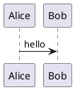

# JetBrains Setup: PlantUML and AsciiDoc

**Goal:** set up JetBrains IDEs for Spec Loop artifacts:
- PlantUML diagrams render *inside the built-in Markdown Preview*,
  **locally** (no PlantUML server).
- `glossary.adoc` opens with an AsciiDoc viewer when the project uses a
  glossary.

This document has two paths:

* **Path A (Most JetBrains IDEs):** enable the built-in Markdown PlantUML extension.
* **Path B (Android Studio / missing preview):** first fix Markdown preview (JCEF runtime), then follow Path A.

---

## Supported IDEs (this guide applies)

This workflow relies on JetBrains’ Markdown preview + “Markdown Extensions” mechanism (PlantUML is one of the extensions). JetBrains documents this for IntelliJ IDEA and similar IDEs.
IntelliJ IDEA docs: [https://www.jetbrains.com/help/idea/markdown.html](https://www.jetbrains.com/help/idea/markdown.html) ([JetBrains][1])

If your IDE does not have a working Markdown preview (or does not show “Markdown Extensions”), use **Path B** (Android Studio/JCEF).

---

## Path A — Enable PlantUML rendering in Markdown Preview (JetBrains IDEs)

### 1) Ensure the Markdown plugin is enabled

1. Open **Settings / Preferences** → **Plugins**.
2. Find **Markdown** and ensure it is **enabled** (it is bundled and enabled by default in most IntelliJ-based IDEs).
   Plugin docs: [https://plugins.jetbrains.com/plugin/7793-markdown/docs](https://plugins.jetbrains.com/plugin/7793-markdown/docs) ([JetBrains Marketplace][2])

### 2) Enable the PlantUML Markdown extension

1. Open **Settings / Preferences**.
2. Go to **Languages & Frameworks → Markdown**.
3. Find **Markdown Extensions**.
4. Enable **PlantUML**.
5. Apply / OK.

JetBrains Markdown docs (including diagrams via extensions): [https://www.jetbrains.com/help/idea/markdown.html](https://www.jetbrains.com/help/idea/markdown.html) ([JetBrains][1])

### 3) Write PlantUML in Markdown

In any `.md` file:

This section intentionally starts with a nested code block.
The outer four-backtick fence is only for showing literal Markdown.
Copy only the inner fenced `plantuml` block.

````

````

Render check (plain plantuml block):


If PlantUML rendering is enabled, the additional block above should
render as a diagram in Markdown Preview. If rendering is not enabled, it
will appear as a code block.

### 4) Open the built-in Markdown Preview

Open the Markdown preview pane (split editor/preview). The diagram should render inline.

---

## Path B — Android Studio / Markdown preview missing (JCEF), then Path A

On some Android Studio installations, Markdown preview can be blank or unavailable because the Markdown preview requires **JCEF** (Java Chromium Embedded Framework), and the bundled runtime may not include it.
Explanation and fix direction: [https://stackoverflow.com/questions/69171807/markdown-editor-and-preview-not-working-in-android-studio](https://stackoverflow.com/questions/69171807/markdown-editor-and-preview-not-working-in-android-studio) ([Stack Overflow][3])
What JCEF is / why it matters for previews: [https://plugins.jetbrains.com/docs/intellij/embedded-browser-jcef.html](https://plugins.jetbrains.com/docs/intellij/embedded-browser-jcef.html) ([JetBrains Marketplace][4])

### 1) Make Markdown preview work (JBR with JCEF)

In Android Studio:

1. Open **Help → Find Action…**
2. Search for: **Choose Boot Java runtime for the IDE…**
3. Select a **JetBrains Runtime with JCEF** and install it.
4. Restart Android Studio.

A detailed walkthrough (including recent Android Studio behavior): [https://joachimschuster.de/posts/android-studio-markdown-struggle-never-ends/](https://joachimschuster.de/posts/android-studio-markdown-struggle-never-ends/) ([Joachim Schuster's blog][5])

### 2) After preview works, do Path A

Once the Markdown preview is visible and **Settings → Markdown → Markdown Extensions** exists, enable **PlantUML** exactly as in Path A.

If you still cannot get Markdown preview working (no JCEF-capable runtime / no preview pane), then this IDE/runtime combination does not meet the requirement “render inside Markdown preview”.

---

## Troubleshooting (only what matters)

### I see the code block, not a diagram

* Confirm the fence language is exactly `plantuml`.
* Confirm the block includes `@startuml` and `@enduml`.

### I don’t see “Markdown Extensions” (or no PlantUML option)

* Ensure the Markdown plugin is enabled.
  [https://plugins.jetbrains.com/plugin/7793-markdown/docs](https://plugins.jetbrains.com/plugin/7793-markdown/docs) ([JetBrains Marketplace][2])
* If you are on Android Studio, follow **Path B** (JCEF runtime).
  [https://stackoverflow.com/questions/69171807/markdown-editor-and-preview-not-working-in-android-studio](https://stackoverflow.com/questions/69171807/markdown-editor-and-preview-not-working-in-android-studio) ([Stack Overflow][3])

---

## Optional (recommended): better PlantUML editing experience in JetBrains IDEs

This is **not required** for Markdown rendering, but many teams install it for comfortable editing/preview in `.puml` files:

* **plantuml4idea (PlantUML integration)**: [https://plugins.jetbrains.com/plugin/7017-plantuml4idea](https://plugins.jetbrains.com/plugin/7017-plantuml4idea) ([JetBrains Marketplace][6])
* Plugin README / notes (including Graphviz note for many diagram types): [https://github.com/esteinberg/plantuml4idea](https://github.com/esteinberg/plantuml4idea) ([GitHub][7])

---

## AsciiDoc viewer for `glossary.adoc`

If your project uses `glossary.adoc`, AsciiDoc support in the IDE is
required.

### 1) Install the AsciiDoc plugin

1. Open **Settings / Preferences** → **Plugins**.
2. Search for **AsciiDoc**.
3. Install the plugin and restart the IDE if prompted.

Plugin page:
[https://plugins.jetbrains.com/plugin/7391-asciidoc](https://plugins.jetbrains.com/plugin/7391-asciidoc)

### 2) Open `glossary.adoc`

Open the `.adoc` file normally in the IDE. The plugin provides AsciiDoc
editing support and preview support for glossary files.

---

## Links used

* JetBrains IntelliJ IDEA Markdown docs (extensions + preview): [https://www.jetbrains.com/help/idea/markdown.html](https://www.jetbrains.com/help/idea/markdown.html) ([JetBrains][1])
* JetBrains Markdown plugin docs: [https://plugins.jetbrains.com/plugin/7793-markdown/docs](https://plugins.jetbrains.com/plugin/7793-markdown/docs) ([JetBrains Marketplace][2])
* Android Studio Markdown preview issue (JCEF requirement): [https://stackoverflow.com/questions/69171807/markdown-editor-and-preview-not-working-in-android-studio](https://stackoverflow.com/questions/69171807/markdown-editor-and-preview-not-working-in-android-studio) ([Stack Overflow][3])
* JetBrains JCEF documentation: [https://plugins.jetbrains.com/docs/intellij/embedded-browser-jcef.html](https://plugins.jetbrains.com/docs/intellij/embedded-browser-jcef.html) ([JetBrains Marketplace][4])
* Android Studio runtime/JCEF fix walkthrough: [https://joachimschuster.de/posts/android-studio-markdown-struggle-never-ends/](https://joachimschuster.de/posts/android-studio-markdown-struggle-never-ends/) ([Joachim Schuster's blog][5])
* plantuml4idea plugin: [https://plugins.jetbrains.com/plugin/7017-plantuml4idea](https://plugins.jetbrains.com/plugin/7017-plantuml4idea) ([JetBrains Marketplace][6])
* plantuml4idea repository (features + notes): [https://github.com/esteinberg/plantuml4idea](https://github.com/esteinberg/plantuml4idea) ([GitHub][7])
* JetBrains AsciiDoc plugin: [https://plugins.jetbrains.com/plugin/7391-asciidoc](https://plugins.jetbrains.com/plugin/7391-asciidoc)

[1]: https://www.jetbrains.com/help/idea/markdown.html "Markdown | IntelliJ IDEA Documentation"
[2]: https://plugins.jetbrains.com/plugin/7793-markdown/docs "Markdown"
[3]: https://stackoverflow.com/questions/69171807/markdown-editor-and-preview-not-working-in-android-studio "Markdown editor and preview not working in Android Studio?"
[4]: https://plugins.jetbrains.com/docs/intellij/embedded-browser-jcef.html "Embedded Browser (JCEF) | IntelliJ Platform Plugin SDK"
[5]: https://joachimschuster.de/posts/android-studio-markdown-struggle-never-ends/ "Fix Markdown Plugin in Android Studio in 2024"
[6]: https://plugins.jetbrains.com/plugin/7017-plantuml4idea "plantuml4idea Plugin for JetBrains IDEs"
[7]: https://github.com/esteinberg/plantuml4idea "GitHub - esteinberg/plantuml4idea: Intellij IDEA plugin for PlantUML"
