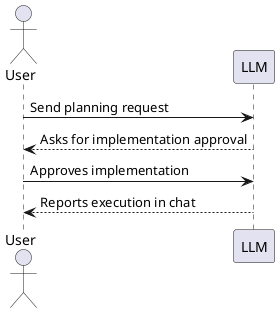

# Spec Loop Tutorial: You Send, You See

This tutorial is intentionally compact and execution-focused.

This tutorial uses public data from the Art Institute of Chicago (AIC).
This project is not affiliated with or endorsed by AIC.

- Read [README.md](../README.md) first.
- Then quickly check [CONSTITUTION.md](../CONSTITUTION.md) and
  [docs/review-responsibility-and-traceability.md](review-responsibility-and-traceability.md).
- Then run this tutorial.
- For every step, validate progress from AI output in chat.
- Send all LLM messages from your project root directory.
- If you use Claude, save project instructions as `CLAUDE.md`. You can
  use [AGENTS.md](../AGENTS.md) content as the preamble and add any other guidance
  needed for your project.

## Step 0: Setup (manual) + Constitution sanity ping

Do this yourself before sending your first substantive request to the
LLM:

1. Read [README.md](../README.md) first, then this tutorial.
   - Before this tutorial, quickly check [CONSTITUTION.md](../CONSTITUTION.md) and
     [docs/review-responsibility-and-traceability.md](review-responsibility-and-traceability.md).
2. Create your own project repository (this repo is tutorial source only).
3. Set up governance files and a concrete task directory path:
   - Preferred: keep [CONSTITUTION.md](../CONSTITUTION.md) in a stable
     shared location outside your project.
   - Keep [glossary-skill.md](../glossary-skill.md) in the same
     directory as [CONSTITUTION.md](../CONSTITUTION.md). This tutorial
     uses [glossary.adoc](../glossary.adoc) throughout, so keep the
     glossary guidance available from the start.
   - Fallback: if a shared location is not practical, copy these files
     into your project instead.
   - Then copy the instruction file your LLM tool uses:
     - most tools: [AGENTS.md](../AGENTS.md)
     - GitHub Copilot: [.github/copilot-instructions.md](../.github/copilot-instructions.md)
     - Claude Code: save [AGENTS.md](../AGENTS.md) content as `CLAUDE.md` (or keep both if useful)
   - These copied files work together: the Constitution defines workflow,
     tool-specific instruction files inject the workflow into sessions, and
     `glossary-skill.md` provides guidance for creating and updating
     `glossary.adoc`.
   - The LLM is expected to follow the Constitution by default; you do not
     need to re-explain it in every prompt.
   - In the instruction file(s), replace `<TASK_DIR>` with a real path
     such as `tasks`.
   - If the governance files are outside the project, reference the
     shared `CONSTITUTION.md` from your instruction file, typically by
     absolute path.
4. Check out `data-aggregator` as a sibling repository (parallel
   directory), not inside your project:

Run the command block below to create `tutorial-project`.

```bash
mkdir -p ~/git-repo/ai
cd ~/git-repo/ai
mkdir -p tutorial-project
cd tutorial-project
git init

cd ~/git-repo/ai
git clone https://github.com/art-institute-of-chicago/data-aggregator.git
```

Expected layout:

```text
~/git-repo/ai/
  tutorial-project/
  data-aggregator/
```

5. Recommended: enable browser automation tooling for browser checks
   (for example [Playwright MCP](https://github.com/microsoft/playwright-mcp#getting-started)).
   Use it when needed so the LLM can verify:
   - `site/index.html` rendering and basic page behavior,
   - game page flow and interactions during gameplay checks.

6. Configure PlantUML preview in your editor using:
   - [docs/vscode-markdown-plantuml-preview.md](vscode-markdown-plantuml-preview.md), or
   - [docs/jetbrains-markdown-plantuml-preview.md](jetbrains-markdown-plantuml-preview.md).

7. Verify PlantUML rendering with this installation check snippet:

This section is written to be unambiguous in all modes:
- With PlantUML rendering enabled, you should see a diagram in the
  second example.
- Without PlantUML rendering, both examples may appear as code blocks.
- In raw Markdown view, the first example shows literal Markdown
  syntax with outer fences; copy only the inner fenced `plantuml`
  block from that first example.

````

````

as


8. Constitution check + initial governance commit:
   - Ensure [CONSTITUTION.md](../CONSTITUTION.md) is present at your project repo root and
     your LLM tool loads it (via your copied [AGENTS.md](../AGENTS.md) /
     `CLAUDE.md`).
   - Keep [glossary-skill.md](../glossary-skill.md) in the same
     directory as [CONSTITUTION.md](../CONSTITUTION.md) so the LLM can
     consult it later for [glossary.adoc](../glossary.adoc) creation and
     updates.
   - Send this now as your first LLM message (before any other request):

```text
Before we start: tell me which instruction/governance files you have
already read for this repository (filenames if known). Then restate the
PLAN -> IMPLEMENTATION approval gate in one sentence.

Then create an initial commit containing CONSTITUTION.md,
glossary-skill.md, and the
instruction/governance files already present in this project.
```

   - On the first LLM response, you should see a leading 🫡 without
     asking for it. If you do not see it (or the tool reports
     [CONSTITUTION.md](../CONSTITUTION.md) is unavailable/unreadable), stop and fix file
     access/instruction loading before proceeding.
   - You should also see an initial commit that includes [CONSTITUTION.md](../CONSTITUTION.md)
     and the relevant copied governance files for your tool setup, including
     [glossary-skill.md](../glossary-skill.md).

----------

Each following tutorial step uses the same structure:

- ‘You send’ shows a suitable message to send to the LLM. Any equivalent wording is fine.
- This tutorial assumes [glossary.adoc](../glossary.adoc) is created in
  Step 1 and then maintained throughout the later steps.
- Governance and workflow gates (from the copied [AGENTS.md](../AGENTS.md) and
  [CONSTITUTION.md](../CONSTITUTION.md)) are expected to be loaded by your LLM tool
  automatically. [glossary-skill.md](../glossary-skill.md) is expected next to
  [CONSTITUTION.md](../CONSTITUTION.md) and should be consulted when
  [glossary.adoc](../glossary.adoc) is created or updated. If the LLM does not follow them, fix instruction
  loading at the tool configuration level before proceeding.
- The constitution, not repeated prompt wording, defines approval and
  implementation boundaries.
- Before implementation, you can always ask the LLM to revise the
  current task, subtask, or design instead of proceeding directly.
- ‘You see’ is what you should expect to observe in results/artifacts.
- ‘You see’ may include terminology aligned with
  [glossary.adoc](../glossary.adoc).
- If implementation changes or clarifies shared domain language,
  ‘You see’ should also include the corresponding
  [glossary.adoc](../glossary.adoc) update.
- ‘After completion’ describes move-to-done/commit expectations.
- ‘You learned (this step)’ is the takeaway after the step is done.

‘You see’ describes the expected outcome and typical artifacts for each
step. If the LLM deviates, decide whether the deviation is acceptable.
If it matters to you, ask the LLM to adjust and re-verify until the
step matches what you consider important.

When relevant, ‘You see’ may also include supporting hygiene changes
required by the constitution, such as task status updates, ignore-rule
updates, or required glossary updates. If one is missing, ask the LLM
to correct it before you accept the step.

Sometimes the LLM fails to follow the required task structure, section
order, or formatting. If you suspect that might be the case, you can
always ask it to check the task or subtask against
[CONSTITUTION.md](../CONSTITUTION.md) before proceeding.

If you notice files in the change set that should be ignored, you can
tell the LLM to fix that.

## Step 1: Project README ([README.md](../README.md))

### You send

```text
Project brief:

We are building a small website with two parts:
1) a museum overview page based on Art Institute of Chicago data,
2) a game called Progressive Timeline.

Data source attribution:
- Art Institute of Chicago (AIC): https://www.artic.edu/
- Attribution must be preserved in generated outputs.
- This project is an educational exercise and should clearly attribute
  AIC as the source of museum content and artwork metadata.

In Progressive Timeline, the player must order artworks by year
from earliest to latest.

Level progression:
- Level 1: 2 artworks
- Level 2: 3 artworks
- Level 3: 4 artworks
- each next level adds one artwork

Data rule:
- use only artworks with a clearly extractable year
- exclude artworks with ambiguous years

The game includes a leaderboard sorted by:
1) reached level (desc)
2) total completion time (asc) for ties

Please write `README.md` for this repository based on the project brief.
Include the project brief verbatim in the README under a "Project Brief"
section. The README must preserve the AIC attribution requirements from
the brief and clearly describe the two parts (museum overview page +
Progressive Timeline game), the core rules, and the leaderboard sorting.
Keep the README concise and practical.

Also create `glossary.adoc` from the approved project brief. It should
define the canonical project terms needed for this tutorial and keep
their wording consistent with the brief.

Also update `AGENTS.md` so it explicitly tells the LLM to read
`README.md` and follow the "Project Brief" section there for project
requirements unless I explicitly override it.

This is documentation-only work, we do not need a task file for it.
```

### You see

- [README.md](../README.md):
  - Exists and captures the project brief requirements.
  - Includes the project brief text under "Project Brief".
- [glossary.adoc](../glossary.adoc):
  - Exists and defines the canonical project terms from the brief.
  - Uses wording consistent with the brief so later tasks can reuse it.
- [AGENTS.md](../AGENTS.md):
  - Explicitly points the LLM to [README.md](../README.md) as the source
    of the project brief and requirements.

### After completion (commit)

- After you accept this work item as done: ask the LLM to commit the
  README, `glossary.adoc`, and `AGENTS.md` changes.

### You learned (this step)

- The LLM can create documentation, wire persistent instructions to the
  canonical project brief, establish `glossary.adoc` as the project
  vocabulary, and (after you accept it) commit without creating a task
  file.

## Step 2: Museum Overview Page (`site/index.html`) + Just-Enough API Research

### You send

```text
A sibling `data-aggregator` checkout exists at `../data-aggregator`
relative to this repo root (parallel directory, not inside this repo).
Use it for reverse engineering only. If it is missing, stop and ask me
for the correct path.

After the correct location is confirmed, add it to the project
governance instructions (for example `AGENTS.md` / `CLAUDE.md`) so
future tasks can reuse it without re-asking.

Please create a task for the museum overview page in this repository to
create the page at `site/index.html`. The task must include just-enough
AIC API research directly inside the task file `Research` section. Run
real HTTP checks with curl (or equivalent) against the public AIC API (do
not run a local instance) and record verification evidence (commands +
observed results) inside the task file. The page should introduce AIC as
the data source, show
departments, and show exactly 20 representative artworks with title,
artist, department, and image for each item. Include the rules for
retrieving artwork images in the task research. Use API data and image
URLs programmatically without manual downloads, add automated checks
that prove the page can be served and opened, and report the exact local
serve command in chat.
```

### You see (plan)

- Chat: reports that a task file was created and asks for explicit
  implementation approval.
- Governance: [AGENTS.md](../AGENTS.md) / `CLAUDE.md` updated to record the confirmed
  sibling `data-aggregator` path.
- Task file:
  - Contains Scope, Motivation, Research, Design, and Test specification
    (and other required sections, for example Scenario when applicable).
  - Research includes curl verification evidence and practical rules
    needed for the museum page (including image URL rules) and any
    relevant reverse engineering notes from `data-aggregator`.

Approve only after the task definition and subtask breakdown look correct.

### You see (after implementation is completed)

- Chat: reports the exact local serve/open verification command and the
  result.
- `site/index.html`: exists and shows exactly 20 artworks with title,
  artist, department, and image.

### After completion (move to done / commit)

- After you accept this work item as done: ask the LLM to move the task
  to `done`, then ask it to commit.

### You learned (this step)

- Implementation starts only after explicit approval and is verified with
  concrete evidence.

For all work items below that include implementation: the LLM is
expected to follow the Constitution automatically; "manual control" is
the exception. If the LLM starts implementation before planning and
explicit approval boundaries, first check whether it remembers the
Constitution (for example ask it to restate the PLAN -> IMPLEMENTATION
approval gate), then tell it to stop and follow the Constitution
strictly.

## Step 3: ADR for Game Stack Selection

### You send

```text
Please create one ADR for MVP stack selection for the game
implementation in `architecture-decisions/`.

First discuss the criteria with me. We want an MVP stack that supports a
clean, layered design: the game rules should not be tied to the UI, the
design should stay visible and reviewable, and most core logic should be
testable without the browser. Persistence is out of scope for now.

Then compare 3-5 realistic MVP stack options with pros and cons. Include
at least one simpler option and at least one option that is a strong fit
for clean or hexagonal architecture.

Record one final choice with rationale. In the same ADR:
- define the practical test tooling
- define the exact test command(s)
- define the browser-based tooling for gameplay and design checks
- define the expected high-level architecture for the MVP
- explain why the chosen stack is a good fit for clean, reviewable
  design
- mark persistence as out of scope and deferred to the leaderboard work
```

### You see

- Chat: discusses decision criteria before presenting the final ADR.
- ADR:
  - Compares realistic MVP stack options and records the chosen one with rationale.
  - Explains the choice in terms of clean/layered design, not only implementation speed.
  - Includes test tooling and the exact test command(s).
  - Includes browser-based tooling for gameplay and design checks.
  - Defines the expected high-level architecture for the MVP.
  - Marks persistence as out of scope and deferred to the leaderboard work.

### After completion (commit)

- After you accept the ADR as done: ask the LLM to commit the ADR change.
  This step is ADR-only and does not involve moving anything to `done`.

### You learned (this step)

- ADRs capture long-lived decisions (including the exact test command)
  without requiring a task file.

## Step 4: Core Gameplay (Subtasks)

### You send

```text
Starting point: reuse relevant AIC API research already recorded in
earlier task files in this repo.

Please create one task for core gameplay in this repository. The scope
must include a Level 1 playable flow with 2 artworks, progressive
levels where each next level adds one artwork, and strict year
eligibility that accepts only standalone 4-digit years like 1879 and
rejects ranges, circa/ca., decades, null or unknown values, and mixed
text values. Ensure the game page is reachable from a link on
site/index.html.

For the initial task creation, do not fully design every future
subtask. Create only:
- the overall task header
- an ordered implementation subtask breakdown
- Scope and Motivation for each subtask

Reuse earlier task-file research where relevant, but keep future
subtasks lightweight. We will flesh out only the current subtask before
implementation.

Use `glossary.adoc` during planning as the reference for gameplay terms
and definitions.
```

### You see (plan)

- Chat: reports that a task file was created with a task header and an
  ordered subtask breakdown, then stops for review.
- Task file:
  - Overall Scope and Motivation are clear.
  - Each subtask has Scope and Motivation, but future subtasks are not
    fully designed yet.
  - Relevant earlier task-file research is referenced where needed.
  - Task and subtask terminology aligns with `glossary.adoc`.

### Subtask-by-subtask workflow

- Review the task header and the task breakdown first.
- If the breakdown needs adjustment, ask the LLM to revise it before any
  implementation starts.
- If it looks good, ask the LLM to flesh out only the first subtask.
- Review that current-subtask detail. If it looks good, ask the LLM to
  implement only that subtask.
- After each implemented subtask, either ask for changes or accept it
  and ask the LLM to move it to `done`.
- Then ask it to create a separate commit and only after that ask it to
  flesh out the next subtask.

### You see (current subtask design)

- Chat: fleshes out only the current subtask and asks for explicit
  implementation approval.
- Task file: the current subtask is fleshed out; future subtasks remain
  lightweight.
- The current subtask Design and Constraints, when present,
  use glossary terms from `glossary.adoc` consistently and make any
  glossary term change explicit before approval.

### You see (during subtask implementation)

- Chat: implements only the approved current subtask and stops.
- Tests: separate verification evidence is provided per implemented
  subtask.
- Git: there is a separate commit per accepted subtask; the overall
  task is moved to `done` only after the last subtask is done.
- Code: game is reachable from `site/index.html` and playable (after
  relevant subtasks complete).
- [glossary.adoc](../glossary.adoc): expands to cover the gameplay-core
  terms introduced by the implementation and links those terms to the
  relevant code.

### You learned (this step)

- Keep future subtasks lightweight until you reach them: review the
  current subtask in detail, implement it, verify it, commit it, then
  move on.

## Step 5: Leaderboard (In-Memory, Then Persistence)

### You send

```text
Please create one task for the leaderboard in this repository. Break
the implementation work down in this order:
1. in-memory leaderboard implementation
2. persistence implementation

The sorting must be reached level descending and total completion time
ascending for ties. Persistence acceptance criteria are that data
survives restart, the storage location is documented, and the reset
procedure for local development and tests is documented with an exact
command.

For the initial task creation, do not fully design every future
subtask. Create only:
- the overall task header
- an ordered breakdown of the implementation subtasks above
- Scope and Motivation for each subtask

Keep future implementation subtasks lightweight. We will flesh out only
the current subtask before implementation.

Use `glossary.adoc` during planning as the reference for leaderboard
terms and definitions.
```

### You see (plan)

- Task file:
  - Exists with ordered implementation subtasks.
  - Requires a separate persistence ADR before persistence
    implementation is fleshed out.

### You send

- Please flesh out only the in-memory leaderboard subtask

### You see (in-memory subtask design)

- Task file: the in-memory leaderboard subtask is fleshed out; future
  implementation subtasks remain lightweight.

### You send

- Implement it.

### You see (in-memory implementation)

- Verification evidence is provided for the in-memory leaderboard
  subtask.
- Behavior: leaderboard sorting matches the required rules.
- [glossary.adoc](../glossary.adoc): links the leaderboard terms to the
  implemented code.

### You send

```text
Please create the persistence ADR. The ADR must define the
chosen persistence approach, storage location, reset procedure for local
development and tests with an exact command, and practical verification
commands.
```

### You see (persistence ADR)

- ADR: records the chosen persistence approach, storage location
  expectations, reset procedure expectations, and practical verification
  commands before the persistence implementation subtask is fleshed out.

### You send

- Please design the remaining subtask

### You see (persistence subtask design)

- Task file: the persistence implementation subtask is fleshed out.

### You send

- Implement it.

### You see (persistence implementation)

- Verification evidence is provided for the persistence implementation
  subtask.
- Docs: storage location and reset procedure are documented with an exact
  command.
- Behavior: leaderboard sorting matches the required rules and data
  survives restart.

### After completion (move to done / commit)

- After you accept the in-memory leaderboard subtask as done: ask the
  LLM to move it to `done`, then commit.
- After you accept the persistence ADR: ask the LLM to commit the ADR
  change.
- After you accept the persistence implementation subtask as done: ask
  the LLM to move that subtask and the overall task to `done`, then
  commit.

### You learned (this step)

- Ordered delivery reduces risk: get the in-memory behavior working
  first, make the persistence decision explicitly, then implement
  persistence.

## You learned

Each step follows the Constitution interaction model:

- In chat, you ask the LLM to create a task or ADR.
- First, the LLM writes the task/ADR content needed for the current
  review step. For larger tasks, start with the task header and an
  ordered subtask breakdown, then flesh out Research, Scenario, Constraints when
  needed, Design, and Test specification only for the current
  subtask before implementation.
- You approve or reject implementation explicitly.
- Only after explicit approval should the LLM make executable changes
  (code/tests/config/runtime assets).
- Tasks should include automated tests for their deliverables.
- In large implementation steps, ask the LLM to decompose work into
  smaller implementation subtasks before detailed design and
  implementation approval.
- Every implementation subtask includes both implementation and testing.
- When subtasks exist, require separate status updates per subtask
  (each subtask is tracked independently).
- After you explicitly accept a work item as `done`, ask the LLM to
  commit before moving on.
- Depending on your tool, you may be asked to confirm the commit
  command (review the commit message there), or the commit may happen
  immediately (review the commit message right after). If it does not
  match the work item's purpose, or it is misleading about what
  changed, ask the LLM to improve the message and amend the commit.
- When a step is implemented via subtasks: move the overall task to
  `done` only after the last subtask is done.

Learning outcomes:

- Keep task and subtask scopes small and reviewable.
- Use ADRs for architectural decisions with clear rationale.
- Verify behavior using concrete evidence, not assumptions.

How to think while running this tutorial:

- Keep the process meaningful, not bureaucratic.
- Low-risk, non-behavioral housekeeping may be done and (after you
  accept it) you can ask the LLM to commit it as part of a step when
  appropriate (for example: `.gitignore`, documentation typo fixes).
- Chat is for coordination and approvals; task files and ADRs are the
  durable specification artifacts.
- Only the user may relax or override Constitution workflow rules.

Common anti-patterns:

- Implementation starts before explicit approval.
- Unrelated changes are mixed into one subtask.
- Implementation changes are made without verification evidence.
- A task or subtask is moved to `done` without explicit user
  confirmation.
