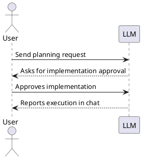

# Spec Loop Tutorial: You Send, You See

This tutorial is intentionally compact and execution-focused.

- Read [README.md](../README.md) first.
- Then quickly check [CONSTITUTION.md](../CONSTITUTION.md) and
  [docs/review-responsibility-and-traceability.md](review-responsibility-and-traceability.md).
- Then run this tutorial.
- For every step, validate progress from AI output in chat.
- Send all LLM messages from your project root directory.
- If you use Claude, save project instructions as `CLAUDE.md`. You can
  use [AGENTS.md](../AGENTS.md) content as the preamble and add any other guidance
  needed for your project.

## Step 0: Setup (manual) + Constitution sanity ping

Do this yourself before sending your first substantive request to the
LLM:

1. Read [README.md](../README.md) first, then this tutorial.
   - Before this tutorial, quickly check [CONSTITUTION.md](../CONSTITUTION.md) and
     [docs/review-responsibility-and-traceability.md](review-responsibility-and-traceability.md).
2. Create your own project repository (this repo is tutorial source only).
3. Copy governance files into your project and set a concrete task
   directory path:
   - Copy [CONSTITUTION.md](../CONSTITUTION.md) into your project in all cases.
   - Then copy the instruction file your LLM tool uses:
     - most tools: [AGENTS.md](../AGENTS.md)
     - GitHub Copilot: [.github/copilot-instructions.md](../.github/copilot-instructions.md)
     - Claude Code: save [AGENTS.md](../AGENTS.md) content as `CLAUDE.md` (or keep both if useful)
   - These governance files are shared guardrails for both sides. The LLM is
     expected to follow the Constitution by default; you do not need to
     re-explain it in every prompt.
   - In the copied instruction file(s), replace `<TASK_DIR>` with a
     real path such as `tasks`.
4. Check out `data-aggregator` as a sibling repository (parallel
   directory), not inside your project:

Replace placeholder values in the command block below before running it.

```bash
mkdir -p ~/git-repo/ai
cd ~/git-repo/ai
mkdir -p <your-project-name>
cd <your-project-name>
git init

cd ~/git-repo/ai
git clone https://github.com/art-institute-of-chicago/data-aggregator.git
```

Expected layout:

```text
~/git-repo/ai/
  <your-project-name>/
  data-aggregator/
```

5. Recommended: enable browser automation tooling for browser checks
   (for example [Playwright MCP](https://github.com/microsoft/playwright-mcp#getting-started)).
   Use it when needed so the LLM can verify:
   - `site/index.html` rendering and basic page behavior,
   - game page flow and interactions during gameplay checks.

6. Configure PlantUML preview in your editor using:
   - [docs/vscode-markdown-plantuml-preview.md](vscode-markdown-plantuml-preview.md), or
   - [docs/jetbrains-markdown-plantuml-preview.md](jetbrains-markdown-plantuml-preview.md).

7. Verify PlantUML rendering with this installation check snippet:

This section is written to be unambiguous in all modes:
- With PlantUML rendering enabled, you should see a diagram in the
  second example.
- Without PlantUML rendering, both examples may appear as code blocks.
- In raw Markdown view, the first example shows literal Markdown
  syntax with outer fences; copy only the inner fenced `plantuml`
  block from that first example.

````

````

as


This tutorial uses public data from the Art Institute of Chicago (AIC).
This project is not affiliated with or endorsed by AIC.

8. Constitution sanity check:
   - Ensure [CONSTITUTION.md](../CONSTITUTION.md) is present at your project repo root and
     your LLM tool loads it (via your copied [AGENTS.md](../AGENTS.md) / `CLAUDE.md`).
   - Send this now as your first LLM message (before any other request):

```text
Before we start: tell me which instruction/governance files you have
already read for this repository (filenames if known). Then restate the
PLAN -> IMPLEMENTATION approval gate in one sentence.

Do not create or modify any files yet.
```

   - On the first LLM response, you should see a leading 🫡 without
     asking for it. If you do not see it (or the tool reports
     [CONSTITUTION.md](../CONSTITUTION.md) is unavailable/unreadable), stop and fix file
     access/instruction loading before proceeding.

Each step uses the same structure:

- ‘You send’ is the exact message to send to the LLM.
- Governance and workflow gates (from the copied [AGENTS.md](../AGENTS.md) and
  [CONSTITUTION.md](../CONSTITUTION.md)) are expected to be loaded by your LLM tool
  automatically. If the LLM does not follow them, fix instruction
  loading at the tool configuration level before proceeding.
- ‘You see’ is what you should expect to observe in results/artifacts.
- ‘After completion’ describes move-to-done/commit expectations.
- ‘You learned (this step)’ is the takeaway after the step is done.

‘You see’ describes the expected outcome and typical artifacts for each
step. If the LLM deviates, decide whether the deviation is acceptable.
If it matters to you, ask the LLM to adjust and re-verify until the
step matches what you consider important.

## Step 1: Project README ([README.md](../README.md))

### You send

```text
Project brief:

We are building a small website with two parts:
1) a museum overview page based on Art Institute of Chicago data,
2) a game called Progressive Timeline.

Data source attribution:
- Art Institute of Chicago (AIC): https://www.artic.edu/
- Attribution must be preserved in generated outputs.
- This project is an educational exercise and should clearly attribute
  AIC as the source of museum content and artwork metadata.

In Progressive Timeline, the player must order artworks by year
from earliest to latest.

Level progression:
- Level 1: 2 artworks
- Level 2: 3 artworks
- Level 3: 4 artworks
- each next level adds one artwork

Data rule:
- use only artworks with a clearly extractable year
- exclude artworks with ambiguous years

The game includes a leaderboard sorted by:
1) reached level (desc)
2) total completion time (asc) for ties

Please write `README.md` for this repository based on the project brief.
Include the project brief verbatim in the README under a "Project Brief"
section. The README must preserve the AIC attribution requirements from
the brief and clearly describe the two parts (museum overview page +
Progressive Timeline game), the core rules, and the leaderboard sorting.
Keep the README concise and practical.

This is documentation-only work, we do not need a task file for it.
```

### You see

- Chat: response starts with 🫡.
- [README.md](../README.md):
  - Exists and captures the project brief requirements.
  - Includes the project brief text under "Project Brief".

### After completion (commit)

- After you accept this work item as done: ask the LLM to commit the
  README change.

### You learned (this step)

- The LLM can create documentation and (after you accept it) commit
  without creating a task file.

## Step 2: Museum Overview Page (`site/index.html`) + Just-Enough API Research

### You send

```text
Use the project brief from `README.md`.

A sibling `data-aggregator` checkout exists at `../data-aggregator`
relative to this repo root (parallel directory, not inside this repo).
Use it for reverse engineering only. If it is missing, stop and ask me
for the correct path.

After the correct location is confirmed, add it to the project
governance instructions (for example `AGENTS.md` / `CLAUDE.md`) so
future tasks can reuse it without re-asking.

Please create a task for the museum overview page in this repository to
create the page at `site/index.html`. The task must include just-enough
AIC API research directly inside the task file `Research` section. Run
real HTTP checks with curl (or equivalent) against the public AIC API (do
not run a local instance) and record verification evidence (commands +
observed results) inside the task file. The page should introduce AIC as
the data source, show
departments, and show exactly 20 representative artworks with title,
artist, department, and image for each item. Include the rules for
retrieving artwork images in the task research. Use API data and image
URLs programmatically without manual downloads, add automated checks
that prove the page can be served and opened, and report the exact local
serve command in chat.
```

### You see (plan)

- Chat: reports that a task file was created and asks for explicit
  implementation approval.
- Governance: [AGENTS.md](../AGENTS.md) / `CLAUDE.md` updated to record the confirmed
  sibling `data-aggregator` path.
- Task file:
  - Contains Scope, Motivation, Research, Design, and Test specification
    (and other required sections, for example Scenario when applicable).
  - Research includes curl verification evidence and practical rules
    needed for the museum page (including image URL rules) and any
    relevant reverse engineering notes from `data-aggregator`.

Approve only after the task definition and subtask breakdown look correct.

### You see (after implementation is completed)

- Chat: reports the exact local serve/open verification command and the
  result.
- `site/index.html`: exists and shows exactly 20 artworks with title,
  artist, department, and image.

### After completion (move to done / commit)

- Before you ask the LLM to commit: if needed, ask the LLM to add/update a practical
  `.gitignore` for artifacts that already exist in this project (for
  example IDE files, local caches, logs, and local env files).
- After you accept this work item as done: ask the LLM to move the task
  to `done`, then ask it to commit.

### You learned (this step)

- Implementation starts only after explicit approval and is verified with
  concrete evidence.

For all work items below that include implementation: the LLM is
expected to follow the Constitution automatically; "manual control" is
the exception. If the LLM starts implementation before planning and
explicit approval boundaries, first check whether it remembers the
Constitution (for example ask it to restate the PLAN -> IMPLEMENTATION
approval gate), then tell it to stop and follow the Constitution
strictly.

## Step 3: ADR for Game Stack Selection

### You send

```text
Please create one ADR for MVP stack selection for the game
implementation in `architecture-decisions/`. First discuss the
criteria with me, then compare 3-5 realistic MVP stack options with
pros and cons, and record one final choice with rationale. In the same
ADR, define practical test tooling and the exact test command, mark
persistence as out of scope for now.
```

### You see

- Chat: discusses decision criteria before presenting the final ADR.
- ADR:
  - Records the chosen stack with rationale.
  - Includes test tooling choice and the exact test command, and marks
    persistence as out of scope and deferred to the leaderboard work.

### After completion (commit)

- After you accept the ADR as done: ask the LLM to commit the ADR change.
  This step is ADR-only and does not involve moving anything to `done`.

### You learned (this step)

- ADRs capture long-lived decisions (including the exact test command)
  without requiring a task file.

## Step 4: Core Gameplay (Subtasks)

### You send

```text
Starting point: reuse relevant AIC API research already recorded in
earlier task files in this repo.

Please create one task for core gameplay in this repository and
propose implementation subtasks. The scope must include a Level 1
playable flow with 2 artworks, progressive levels where each next level
adds one artwork, and strict year eligibility that accepts only
standalone 4-digit years like 1879 and rejects ranges, circa/ca.,
decades, null or unknown values, and mixed text values. Ensure the game
page is reachable from a link on site/index.html. Each implementation
subtask should include testing scope.
```

### You see (plan)

- Chat: reports that a task file was created with a subtask breakdown and
  asks for explicit implementation approval.
- Task file:
  - Subtasks include testing scope.
  - Research references earlier task file(s) as a starting point.

Approve only after the task definition looks correct.

### You see (during subtask implementation)

- Chat: asks for explicit approval before implementing each subtask and
  stops after each subtask.
- Tests: separate verification evidence is provided per implemented
  subtask.
- Git: ask the LLM to commit per accepted subtask; the overall task is
  moved to `done` only after the last subtask is done.
- Code: game is reachable from `site/index.html` and playable (after
  relevant subtasks complete).

### You learned (this step)

- Subtasks keep implementation reviewable: approve, implement, verify,
  ask the LLM to commit—one subtask at a time.

## Step 5: Leaderboard (In-Memory, Then Persistence)

### You send

```text
Please create one task for the leaderboard in this repository with
two phases and include a proposed subtask breakdown. The sorting must be reached level descending and total
completion time ascending for ties. Build and test an in-memory
leaderboard first, then create an ADR for persistence strategy, and then
build and test the selected persistence option. Persistence acceptance
criteria are that data survives restart, the storage location is
documented, and the reset procedure for local development and tests is
documented with an exact command. Propose small subtasks and include
testing scope for every implementation subtask.
```

### You see (plan)

- Chat: reports that a task file was created with two phases and asks for
  explicit implementation approval.
- Task file: two phases are explicit (in-memory first, then persistence)
  and include a subtask breakdown.

Approve only after the task definition looks correct.

### You see (after implementation is completed)

- Chat: confirms the two-phase order and provides verification evidence.
- Docs: storage location and reset procedure are documented with an exact
  command.
- Behavior: leaderboard sorting matches the required rules.

### After completion (move to done / commit)

- After you accept Phase 1 (in-memory leaderboard) as done: ask the LLM
  to commit.
- After you accept Phase 2 (persistence) as done: ask the LLM to move
  the task to `done`, then ask it to commit.

### You learned (this step)

- Phased delivery reduces risk: get a working baseline first, then add
  persistence with an ADR-backed decision.

## You learned

Each step follows the Constitution interaction model:

- In chat, you ask the LLM to create a task or ADR.
- First, the LLM writes the task/ADR content (Scope + Research + Design +
  Test Spec where applicable) and asks for explicit implementation
  approval before any executable changes.
- You approve or reject implementation explicitly.
- Only after explicit approval should the LLM make executable changes
  (code/tests/config/runtime assets).
- Tasks should include automated tests for their deliverables.
- In large implementation steps, ask the LLM to decompose work into
  smaller implementation subtasks before approval.
- Every implementation subtask includes both implementation and testing.
- When subtasks exist, require separate status updates per subtask
  (each subtask is tracked independently).
- After you explicitly accept a work item as `done`, ask the LLM to
  commit before moving on.
- Depending on your tool, you may be asked to confirm the commit
  command (review the commit message there), or the commit may happen
  immediately (review the commit message right after). If it does not
  match the work item's purpose, or it is misleading about what
  changed, ask the LLM to improve the message and amend the commit.
- When a step is implemented via subtasks: move the overall task to
  `done` only after the last subtask is done.

Learning outcomes:

- Keep task and subtask scopes small and reviewable.
- Use ADRs for architectural decisions with clear rationale.
- Verify behavior using concrete evidence, not assumptions.

How to think while running this tutorial:

- Keep the process meaningful, not bureaucratic.
- Low-risk, non-behavioral housekeeping may be done and (after you
  accept it) you can ask the LLM to commit it as part of a step when
  appropriate (for example: `.gitignore`, documentation typo fixes).
- Chat is for coordination and approvals; task files and ADRs are the
  durable specification artifacts.
- Only the user may relax or override Constitution workflow rules.

Common anti-patterns:

- Implementation starts before explicit approval.
- Unrelated changes are mixed into one subtask.
- Implementation changes are made without verification evidence.
- A task or subtask is moved to `done` without explicit user
  confirmation.
