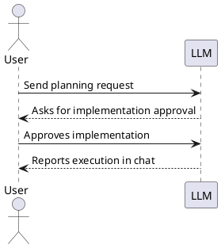

# Spec Loop Tutorial: You Send, You See

This tutorial is intentionally compact and execution-focused.

- Read `README.md` first.
- Then quickly check `CONSTITUTION.md` and
  `docs/review-responsibility-and-traceability.md`.
- Then run this tutorial.
- For every step, validate progress from AI output in chat.
- After you are satisfied with a step, ask LLM to move task to done and
  to commit. LLM should automatically add the numerical prefix to the
  tasks moved into done.
- Send all LLM messages from your project root directory.
- If you use Claude, save project instructions as `CLAUDE.md`. You can
  use `AGENTS.md` content as the preamble and add any other guidance
  needed for your project.

## Project Brief

Use this brief in Step 1:

```text
We are building a small website with two parts:
1) a museum overview page based on Art Institute of Chicago data,
2) a game called Progressive Timeline.

Data source attribution:
- Art Institute of Chicago (AIC): https://www.artic.edu/
- This project is an educational exercise and should clearly attribute
  AIC as the source of museum content and artwork metadata.

In Progressive Timeline, the player must order artworks by year
from earliest to latest.

Level progression:
- Level 1: 2 artworks
- Level 2: 3 artworks
- Level 3: 4 artworks
- each next level adds one artwork

Data rule:
- use only artworks with a clearly extractable year
- exclude artworks with ambiguous years

The game includes a leaderboard sorted by:
1) reached level (desc)
2) total completion time (asc) for ties
```

## Step 0: Setup (manual only, no LLM message)

Do this yourself before sending any message to the LLM:

1. Read `README.md` first, then this tutorial.
   - Before this tutorial, quickly check `CONSTITUTION.md` and
     `docs/review-responsibility-and-traceability.md`.
2. Create your own project repository (this repo is tutorial source only).
3. Copy governance files to your project and set a concrete task directory path:
   - In your project `AGENTS.md`, replace `<TASK_DIR>` with a real
     path such as `<PROJECT_ROOT>/tasks`.
   - If you use Claude, store these instructions as `CLAUDE.md`; start
     from `AGENTS.md` content as preamble and add extra project guidance
     as needed.
4. Check out `data-aggregator` as a sibling repository (parallel
   directory), not inside your project:

Replace placeholder values in the command block below before running it.

```bash
mkdir -p ~/git-repo/ai
cd ~/git-repo/ai
mkdir -p <your-project-name>
cd <your-project-name>
git init

cd ~/git-repo/ai
git clone https://github.com/art-institute-of-chicago/data-aggregator.git
```

Expected layout:

```text
~/git-repo/ai/
  <your-project-name>/
  data-aggregator/
```

5. Configure PlantUML preview in your editor using:
   - `docs/vscode-markdown-plantuml-preview.md`, or
   - `docs/jetbrains-markdown-plantuml-preview.md`.

6. Verify PlantUML rendering with this installation check snippet:

This section is written to be unambiguous in all modes:
- With PlantUML rendering enabled, you should see a diagram in the
  second example.
- Without PlantUML rendering, both examples may appear as code blocks.
- In raw Markdown view, the first example shows literal Markdown
  syntax with outer fences; copy only the inner fenced `plantuml`
  block from that first example.

````

````

as


## Step 1: API Recon (`docs/api-cheat-sheet.md`)

### You send

Replace placeholder values in the message block below before sending it.

```text
Please create a research task for AIC API recon for my project at
the current repository root, with tasks in `tasks` and the local
data-aggregator checkout at <DATA_AGGREGATOR_ROOT>. Use the project
brief from this tutorial and write the result to
`docs/api-cheat-sheet.md`. The cheat sheet should include
a concise map of routes, handlers, and models, a list of endpoints with
HTTP methods, key fields needed for the museum page and game including
year extraction and image access, and image URL retrieval rules. Run
real HTTP checks with curl or equivalent and report verification in
chat; default to public AIC API unless you explicitly use a local
instance with base URL and startup command. Also add a practical
.gitignore for artifacts that already exist in this project (for
example IDE files, local caches, logs, and local env files). Do not ask
for explicit coding approval before writing the cheat sheet, this is a
documentation-only task.
```

### You see

- AI output in chat does not ask for explicit implementation approval
  before writing the cheat sheet.
- AI output in chat includes real API verification evidence.
- `docs/api-cheat-sheet.md` is created with required sections.
- `.gitignore` is added or updated for real local artifacts in this
  project.

For all implementation steps below (Steps 2-5): if the LLM starts
implementation before planning and explicit approval boundaries, tell it
to stop and follow the Constitution strictly.

## Step 2: Museum Overview Page (`site/index.html`)

### You send

```text
Please create a task for the museum overview page in this repository to
create the page at `site/index.html`, reusing Step 1 artifacts,
especially `docs/api-cheat-sheet.md`. The page
should introduce AIC as the data source, show departments, and show
exactly 20 representative artworks with title, artist, year,
department, and image for each item. Use API and IIIF URLs
programmatically without manual downloads, add automated checks that
prove the page can be served and opened, and report the exact local
serve command in chat.
```

### You see (plan)

- AI output in chat reports that the task file was created.
- AI output in chat asks for explicit implementation approval.
- In the task file, verify the expected sections (Scope, Motivation,
  Research, Design, and Test specification; Scenario when applicable).

Approve only after the task definition looks correct.

### You see (after implementation is completed)

- AI output in chat reports serve/open verification command and result.
- `site/index.html` exists and shows exactly 20 artworks with required
  fields.

## Step 3: ADR for Stack Selection

### You send

```text
Please create one ADR for MVP stack selection in
`architecture-decisions/`. First discuss the decision
criteria with me, then compare 3-5 realistic MVP stack options with
pros and cons, and record one final choice with rationale. In the same
ADR, define practical test tooling and the exact test command, mark
persistence as out of scope for now and deferred to Step 5.
```

### You see

- AI output in chat includes criteria discussion before final ADR text.
- AI output in chat shows option comparison and final rationale.
- ADR file exists in `architecture-decisions/`.

## Step 4: Core Gameplay (Subtasks)

### You send

```text
Please create one parent task for core gameplay in this repository and
propose implementation subtasks. The scope must include a Level 1
playable flow with 2 artworks, progressive levels where each next level
adds one artwork, and strict year eligibility that accepts only
standalone 4-digit years like 1879 and rejects ranges, circa/ca.,
decades, null or unknown values, and mixed text values. Ensure the game
page is reachable from a link on site/index.html. Each implementation
subtask should include testing scope.
```

### You see (plan)

- AI output in chat reports that the parent task file was created with
  subtask decomposition.
- AI output in chat asks for explicit implementation approval before
  implementation starts.
- In the task file, verify that the parent task and subtasks include
  the expected sections (Scope, Motivation, Research, Design, and Test
  specification; Scenario when applicable).

Approve only after the task and subtask definitions look correct.

### You see (after implementation is completed)

- AI output in chat requests approval separately per subtask before
  coding each one.
- AI output in chat provides separate test evidence per subtask.
- Game is reachable from `site/index.html` and playable.

## Step 5: Leaderboard (In-Memory, Then Persistence)

### You send

```text
Please create one parent task for the leaderboard in this repository with
two phases. The sorting must be reached level descending and total
completion time ascending for ties. Build and test an in-memory
leaderboard first, then create an ADR for persistence strategy, and then
build and test the selected persistence option. Persistence acceptance
criteria are that data survives restart, the storage location is
documented, and the reset procedure for local development and tests is
documented with an exact command. Propose small subtasks and include
testing scope for every implementation subtask.
```

### You see (plan)

- AI output in chat reports that the task file was created with two
  explicit phases: in-memory first, then persistence.
- AI output in chat asks for explicit implementation approval.
- In the task file, verify that task/subtasks include the expected
  sections (Scope, Motivation, Research, Design, and Test
  specification; Scenario when applicable).

Approve only after the task definition looks correct.

### You see (after implementation is completed)

- AI output in chat confirms the two-phase order and shows verification
  evidence.
- AI output in chat documents restart behavior, storage location, and
  reset command.
- Leaderboard behavior matches required sorting and tests pass.

## You learned

Each step follows the Constitution interaction model:

- In chat, you ask the LLM to **create a task**.
- First, ask the LLM to write the task only (Scope + Research + Design
  + Test Spec).
- The LLM should stop after planning and ask for implementation
  approval.
- You give feedback in chat and explicitly approve or reject
  implementation.
- Only after explicit approval should the LLM implement
  (code/docs/tests).
- Tasks should include automated tests for their deliverables, except
  research-only tasks.
- In large implementation steps, explicitly ask the LLM to decompose
  work into smaller implementation subtasks before approval.
- Every implementation subtask must include both implementation and a
  testing block.
- When subtasks exist, require separate status updates per subtask
  (each subtask is tracked independently).
- After a user explicitly accepts a subtask as `done`, require a git
  commit for that subtask before moving on.
- You give feedback in chat.

Research is often not a separate task. In many steps, research is done
as part of task or subtask planning, and its results are captured in the
task/subtask sections to build task context.

By default, this tutorial uses task files for planning work. If you
explicitly choose to run selected planning work outside task files, that
is allowed. Only the user can change or relax Constitution workflow
rules; the LLM may propose changes but cannot apply them on its own.

This is expected default behavior. You usually do not need to remind the
LLM about it. If the LLM starts implementation before explicit approval,
flag it and ask it to return to the correct phase boundary.
