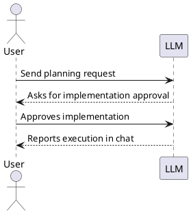

# Spec Loop Tutorial: You Send, You See

This tutorial is intentionally compact and execution-focused.

- Read `README.md` first.
- Then quickly check `CONSTITUTION.md` and
  `docs/review-responsibility-and-traceability.md`.
- Then run this tutorial.
- For every step, validate progress from AI output in chat.
- Send all LLM messages from your project root directory.
- If you use Claude, save project instructions as `CLAUDE.md`. You can
  use `AGENTS.md` content as the preamble and add any other guidance
  needed for your project.

## Step 0: Setup (manual only, no LLM message)

Do this yourself before sending any message to the LLM:

1. Read `README.md` first, then this tutorial.
   - Before this tutorial, quickly check `CONSTITUTION.md` and
     `docs/review-responsibility-and-traceability.md`.
2. Create your own project repository (this repo is tutorial source only).
3. Copy governance files into your project and set a concrete task
   directory path:
   - Copy: `CONSTITUTION.md`, `AGENTS.md`,
     `docs/review-responsibility-and-traceability.md`, and (if you use
     GitHub Copilot) `.github/copilot-instructions.md`.
   - These governance files are shared guardrails for both sides. The LLM is
     expected to follow the Constitution by default; you do not need to
     re-explain it in every prompt.
   - In the copied instruction file(s), replace `<TASK_DIR>` with a
     real path such as `tasks`.
   - If you use Claude Code, you can save `AGENTS.md` content as
     `CLAUDE.md` (or keep both) and add extra project guidance as
     needed.
4. Check out `data-aggregator` as a sibling repository (parallel
   directory), not inside your project:

Replace placeholder values in the command block below before running it.

```bash
mkdir -p ~/git-repo/ai
cd ~/git-repo/ai
mkdir -p <your-project-name>
cd <your-project-name>
git init

cd ~/git-repo/ai
git clone https://github.com/art-institute-of-chicago/data-aggregator.git
```

Expected layout:

```text
~/git-repo/ai/
  <your-project-name>/
  data-aggregator/
```

5. Optional: enable browser automation tooling for browser checks
   (for example Playwright MCP).
   Use it when needed so the LLM can verify:
   - `site/index.html` rendering and basic page behavior,
   - game page flow and interactions during gameplay checks.

6. Configure PlantUML preview in your editor using:
   - `docs/vscode-markdown-plantuml-preview.md`, or
   - `docs/jetbrains-markdown-plantuml-preview.md`.

7. Verify PlantUML rendering with this installation check snippet:

This section is written to be unambiguous in all modes:
- With PlantUML rendering enabled, you should see a diagram in the
  second example.
- Without PlantUML rendering, both examples may appear as code blocks.
- In raw Markdown view, the first example shows literal Markdown
  syntax with outer fences; copy only the inner fenced `plantuml`
  block from that first example.

````

````

as


This tutorial uses public data from the Art Institute of Chicago (AIC).
This project is not affiliated with or endorsed by AIC.

## Project Brief

Use this brief in Step 1:

```text
We are building a small website with two parts:
1) a museum overview page based on Art Institute of Chicago data,
2) a game called Progressive Timeline.

Data source attribution:
- Art Institute of Chicago (AIC): https://www.artic.edu/
- Attribution must be preserved in generated outputs.
- This project is an educational exercise and should clearly attribute
  AIC as the source of museum content and artwork metadata.

In Progressive Timeline, the player must order artworks by year
from earliest to latest.

Level progression:
- Level 1: 2 artworks
- Level 2: 3 artworks
- Level 3: 4 artworks
- each next level adds one artwork

Data rule:
- use only artworks with a clearly extractable year
- exclude artworks with ambiguous years

The game includes a leaderboard sorted by:
1) reached level (desc)
2) total completion time (asc) for ties
```

Each step uses the same structure:

- ‘You send’ is the exact message to send to the LLM.
- ‘You see’ is what you should expect to observe in results/artifacts.
- ‘After completion’ describes move-to-done/commit expectations.
- ‘You learned (this step)’ is the takeaway after the step is done.

‘You see’ describes the expected outcome and typical artifacts for each
step. If the LLM deviates, decide whether the deviation is acceptable.
If it matters to you, ask the LLM to adjust and re-verify until the
step matches what you consider important.

## Step 1: API Recon (`docs/api-cheat-sheet.md`)

### You send

Replace placeholder values in the message block below before sending it.

```text
Please create a research task for AIC API recon for my project at
the current repository root, with tasks in `<TASK_DIR>` and the local
data-aggregator checkout at <DATA_AGGREGATOR_ROOT>. Use the project
brief from this tutorial and write the result to
`docs/api-cheat-sheet.md`. The cheat sheet should include
a concise map of routes, handlers, and models, a list of endpoints with
HTTP methods, key fields needed for the museum page and game including
year extraction and image access, and image URL retrieval rules. Run
real HTTP checks with curl or equivalent and report verification in
chat; use the public AIC API (do not run a local instance). The
data-aggregator checkout is for reverse engineering only. Also add a practical
.gitignore for artifacts that already exist in this project (for
example IDE files, local caches, logs, and local env files). Do not ask
for explicit coding approval before writing the cheat sheet, this is a
documentation-only task.
```

### You see

- Chat: may ask for implementation approval before writing the cheat
  sheet; either is acceptable for this doc-only step.
- `docs/api-cheat-sheet.md`: states that verification used the public AIC
  API.
- `docs/api-cheat-sheet.md`: includes verification evidence (commands +
  observed results).
- `.gitignore`: added/updated for real local artifacts in this project.

### After completion (move to done / commit)

- When you accept this Step 1 work item as done:
  - Ask the LLM to move the task to `done` first, then commit. The LLM
    should automatically add the numerical prefix to the task moved into
    done.

### You learned (this step)

- You can finish documentation/research work and commit it cleanly
  before starting implementation steps.

For all implementation steps below (Steps 2-5): if the LLM starts
implementation before planning and explicit approval boundaries, tell it
to stop and follow the Constitution strictly.

## Step 2: Museum Overview Page (`site/index.html`)

### You send

```text
Please create a task for the museum overview page in this repository to
create the page at `site/index.html`, reusing Step 1 artifacts,
especially `docs/api-cheat-sheet.md`. The page
should introduce AIC as the data source, show departments, and show
exactly 20 representative artworks with title, artist, year,
department, and image for each item. Use API and IIIF URLs
programmatically without manual downloads, add automated checks that
prove the page can be served and opened, and report the exact local
serve command in chat.
```

### You see (plan)

- Chat: reports that a task file was created and asks for explicit
  implementation approval.
- Task file: contains Scope, Motivation, Research, Design, and Test
  specification (and other required sections, for example Scenario when applicable).

Approve only after the task definition and subtask breakdown look correct.

### You see (after implementation is completed)

- Chat: reports the exact local serve/open verification command and the
  result.
- `site/index.html`: exists and shows exactly 20 artworks with title,
  artist, year, department, and image.

### After completion (move to done / commit)

- After you accept this work item as done: move the task to `done`, then
  commit.

### You learned (this step)

- Implementation starts only after explicit approval and is verified with
  concrete evidence.

## Step 3: ADR for Game Stack Selection

### You send

```text
Please create one ADR for MVP stack selection for the game
implementation in `architecture-decisions/`. First discuss the
criteria with me, then compare 3-5 realistic MVP stack options with
pros and cons, and record one final choice with rationale. In the same
ADR, define practical test tooling and the exact test command, mark
persistence as out of scope for now and deferred to Step 5.
```

### You see

- Chat: discusses decision criteria before presenting the final ADR.
- ADR: records the chosen stack with rationale.
- ADR: includes test tooling choice and the exact test command, and marks
  persistence as out of scope and deferred to Step 5.

### After completion (commit)

- After you accept the ADR as done: ask the LLM to commit the ADR change.
  This step is ADR-only and does not involve moving anything to `done`.

### You learned (this step)

- ADRs capture long-lived decisions (including the exact test command)
  without requiring a task file.

## Step 4: Core Gameplay (Subtasks)

### You send

```text
Please create one task for core gameplay in this repository and
propose implementation subtasks. The scope must include a Level 1
playable flow with 2 artworks, progressive levels where each next level
adds one artwork, and strict year eligibility that accepts only
standalone 4-digit years like 1879 and rejects ranges, circa/ca.,
decades, null or unknown values, and mixed text values. Ensure the game
page is reachable from a link on site/index.html. Each implementation
subtask should include testing scope.
```

### You see (plan)

- Chat: reports that a task file was created with a subtask breakdown and
  asks for explicit implementation approval.
- Task file: subtasks include testing scope.

Approve only after the task definition looks correct.

### You see (during subtask implementation)

- Chat: asks for explicit approval before implementing each subtask and
  stops after each subtask.
- Tests: separate verification evidence is provided per implemented
  subtask.
- Git: commits happen per accepted subtask; the overall task is moved to
  `done` only after the last subtask is done.
- Code: game is reachable from `site/index.html` and playable (after
  relevant subtasks complete).

### You learned (this step)

- Subtasks keep implementation reviewable: approve, implement, verify,
  commit—one subtask at a time.

## Step 5: Leaderboard (In-Memory, Then Persistence)

### You send

```text
Please create one task for the leaderboard in this repository with
two phases and include a proposed subtask breakdown. The sorting must be reached level descending and total
completion time ascending for ties. Build and test an in-memory
leaderboard first, then create an ADR for persistence strategy, and then
build and test the selected persistence option. Persistence acceptance
criteria are that data survives restart, the storage location is
documented, and the reset procedure for local development and tests is
documented with an exact command. Propose small subtasks and include
testing scope for every implementation subtask.
```

### You see (plan)

- Chat: reports that a task file was created with two phases and asks for
  explicit implementation approval.
- Task file: two phases are explicit (in-memory first, then persistence)
  and include a subtask breakdown.

Approve only after the task definition looks correct.

### You see (after implementation is completed)

- Chat: confirms the two-phase order and provides verification evidence.
- Docs: storage location and reset procedure are documented with an exact
  command.
- Behavior: leaderboard sorting matches the required rules.

### After completion (move to done / commit)

- After you accept Phase 1 (in-memory leaderboard) as done: commit.
- After you accept Phase 2 (persistence) as done: move the task to
  `done`, then commit.

### You learned (this step)

- Phased delivery reduces risk: get a working baseline first, then add
  persistence with an ADR-backed decision.

## You learned

Each step follows the Constitution interaction model:

- In chat, you ask the LLM to create a task or ADR.
- First, the LLM writes the task/ADR content (Scope + Research + Design
  + Test Spec where applicable) and asks for explicit implementation
  approval before any executable changes.
- You approve or reject implementation explicitly.
- Only after explicit approval should the LLM make executable changes
  (code/tests/config/runtime assets).
- Tasks should include automated tests for their deliverables, except
  research-only tasks.
- In large implementation steps, ask the LLM to decompose work into
  smaller implementation subtasks before approval.
- Every implementation subtask includes both implementation and testing.
- When subtasks exist, require separate status updates per subtask
  (each subtask is tracked independently).
- After you explicitly accept a work item as `done`, require a commit
  before moving on. When a step is implemented via subtasks: move the
  overall task to `done` only after the last subtask is done.

Learning outcomes:

- Keep task and subtask scopes small and reviewable.
- Use ADRs for architectural decisions with clear rationale.
- Verify behavior using concrete evidence, not assumptions.

How to think while running this tutorial:

- Keep the process meaningful, not bureaucratic.
- Low-risk, non-behavioral housekeeping may be done and committed with a
  step when appropriate (for example: `.gitignore`, documentation typo
  fixes).
- Chat is for coordination and approvals; task files and ADRs are the
  durable specification artifacts.
- Only the user may relax or override Constitution workflow rules.

Common anti-patterns:

- Implementation starts before explicit approval.
- Unrelated changes are mixed into one subtask.
- Implementation changes are made without verification evidence.
- A task or subtask is moved to `done` without explicit user
  confirmation.
