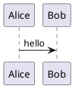

# PlantUML Rendering Inside VS Code Markdown Preview (Two Options: Server or Local)

**Goal:** PlantUML diagrams render *inside Markdown preview* in Visual Studio Code.

This document provides two supported approaches:

* **Option A (Server-based, minimal local installs):** uses VS Code’s built-in Markdown Preview + `myml.vscode-markdown-plantuml-preview` (renders via a PlantUML server).
* **Option B (Local-only, no server):** uses Markdown Preview Enhanced + local `plantuml.jar` (renders locally).

---

## Option A — Server-based Markdown rendering (fewest local installs)

### 1) Install the extension

Install:

* **Markdown PlantUML Preview** (`myml.vscode-markdown-plantuml-preview`)
  [https://marketplace.visualstudio.com/items?itemName=myml.vscode-markdown-plantuml-preview](https://marketplace.visualstudio.com/items?itemName=myml.vscode-markdown-plantuml-preview)

### 2) Configure the PlantUML server (if needed)

This extension renders diagrams by sending them to a PlantUML server.

Setting:

* `markdown.plantuml.server`

Default:

* `https://www.plantuml.com/plantuml`

If you use a self-hosted server, set `markdown.plantuml.server` to your server base URL.

### 3) Write PlantUML in Markdown

Use a fenced code block with language `plantuml`, including `@startuml` and `@enduml`:

This section intentionally starts with a nested code block.
The outer four-backtick fence is only for showing literal Markdown.
Copy only the inner fenced `plantuml` block.

````

````

Render check (plain plantuml block):


If PlantUML rendering is enabled, the additional block above should
render as a diagram in Markdown Preview. If rendering is not enabled, it
will appear as a code block.

### 4) Open Markdown Preview (built-in)

Open the built-in preview:

* Command Palette → **Markdown: Open Preview**
* or **Markdown: Open Preview to the Side**

If the server is reachable, the diagram renders in the preview.

---

## Option B — Local-only Markdown rendering (no server)

### What changes compared to Option A

VS Code’s **built-in** Markdown Preview does not provide local PlantUML rendering by itself. For local rendering in Markdown, you use an extension that provides its own Markdown preview renderer.

### 1) Install local prerequisites

#### 1.1 Install Java

PlantUML requires Java.

* Verify after installation: `java -version`

PlantUML prerequisites overview:
[https://plantuml.com/starting](https://plantuml.com/starting)

#### 1.2 Install Graphviz

Many PlantUML diagram types require Graphviz (`dot`) for layout.

* Verify after installation: `dot -V`

Graphviz / dot notes:
[https://plantuml.com/graphviz-dot](https://plantuml.com/graphviz-dot)

#### 1.3 Download PlantUML JAR

Download `plantuml.jar` and store it in a stable location.

Download:
[https://plantuml.com/download](https://plantuml.com/download)

Example locations:

* Windows: `C:\Tools\PlantUML\plantuml.jar`
* macOS: `~/tools/plantuml/plantuml.jar`
* Linux: `~/tools/plantuml/plantuml.jar`

### 2) Install the VS Code extension (local Markdown renderer)

Install:

* **Markdown Preview Enhanced** (`shd101wyy.markdown-preview-enhanced`)
  [https://marketplace.visualstudio.com/items?itemName=shd101wyy.markdown-preview-enhanced](https://marketplace.visualstudio.com/items?itemName=shd101wyy.markdown-preview-enhanced)

### 3) Point the extension to your local `plantuml.jar`

Set this VS Code setting to the absolute path of your `plantuml.jar`:

* `markdown-preview-enhanced.plantumlJarPath`

This is the key configuration for PlantUML rendering in Markdown Preview Enhanced.
Reference (common failure + fix):
[https://github.com/shd101wyy/vscode-markdown-preview-enhanced/issues/1738](https://github.com/shd101wyy/vscode-markdown-preview-enhanced/issues/1738)

Examples:

* Windows:

  ```json
  { "markdown-preview-enhanced.plantumlJarPath": "C:\\\\Tools\\\\PlantUML\\\\plantuml.jar" }
  ```
* macOS:

  ```json
  { "markdown-preview-enhanced.plantumlJarPath": "/Users/<you>/tools/plantuml/plantuml.jar" }
  ```
* Linux:

  ```json
  { "markdown-preview-enhanced.plantumlJarPath": "/home/<you>/tools/plantuml/plantuml.jar" }
  ```

### 4) Write PlantUML in Markdown

Same Markdown content as Option A:

This section intentionally starts with a nested code block.
The outer four-backtick fence is only for showing literal Markdown.
Copy only the inner fenced `plantuml` block.

````

````

Render check (plain plantuml block):


If PlantUML rendering is enabled, the additional block above should
render as a diagram in preview. If rendering is not enabled, it will
appear as a code block.

### 5) Open the correct Markdown preview (provided by the extension)

Use **Markdown Preview Enhanced** preview (its preview command/UI), not the built-in Markdown preview.

---

## Troubleshooting (only what matters)

### Option A (Server-based)

* You see code instead of a diagram:

  * Confirm the code fence language is exactly `plantuml` and the block contains `@startuml` / `@enduml`.
  * Confirm `myml.vscode-markdown-plantuml-preview` is installed and enabled.
* Rendering fails:

  * The URL in `markdown.plantuml.server` is unreachable (network/proxy/blocked host).

Extension page:
[https://marketplace.visualstudio.com/items?itemName=myml.vscode-markdown-plantuml-preview](https://marketplace.visualstudio.com/items?itemName=myml.vscode-markdown-plantuml-preview)

### Option B (Local-only)

* Nothing renders:

  * `markdown-preview-enhanced.plantumlJarPath` is missing or points to a non-existent file.
* Some diagrams fail or layout is broken:

  * Java is missing (`java -version` must work).
  * Graphviz is missing for that diagram type (`dot -V` must work).

PlantUML prerequisites:
[https://plantuml.com/starting](https://plantuml.com/starting)
Graphviz/dot notes:
[https://plantuml.com/graphviz-dot](https://plantuml.com/graphviz-dot)

---

## Links used

* Markdown PlantUML Preview (server-based):
  [https://marketplace.visualstudio.com/items?itemName=myml.vscode-markdown-plantuml-preview](https://marketplace.visualstudio.com/items?itemName=myml.vscode-markdown-plantuml-preview)

* Markdown Preview Enhanced (local renderer option):
  [https://marketplace.visualstudio.com/items?itemName=shd101wyy.markdown-preview-enhanced](https://marketplace.visualstudio.com/items?itemName=shd101wyy.markdown-preview-enhanced)

* MPE configuration reference (`markdown-preview-enhanced.plantumlJarPath`):
  [https://github.com/shd101wyy/vscode-markdown-preview-enhanced/issues/1738](https://github.com/shd101wyy/vscode-markdown-preview-enhanced/issues/1738)

* PlantUML prerequisites / getting started:
  [https://plantuml.com/starting](https://plantuml.com/starting)

* PlantUML download (`plantuml.jar`):
  [https://plantuml.com/download](https://plantuml.com/download)

* Graphviz / dot notes:
  [https://plantuml.com/graphviz-dot](https://plantuml.com/graphviz-dot)
