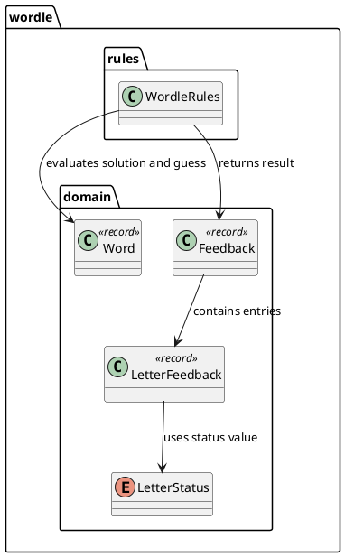
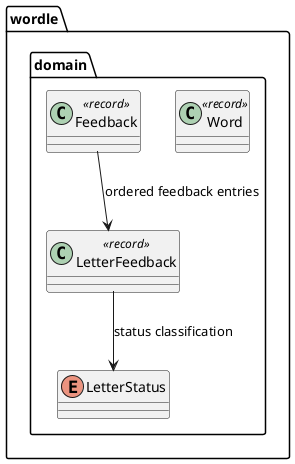
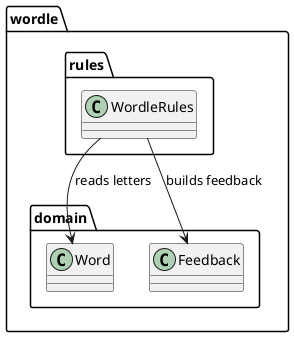

# Task: Define Wordle domain model and evaluation rules

- **Task Identifier:** 2026-01-25-domain-model
- **Scope:** Define the domain model and evaluation rules as cohesive,
  UI-agnostic building blocks for the Wordle Java implementation.
- **Motivation:** Establish a clear model and comparison rules so later
  game logic and interfaces stay consistent.
- **Scenario:** A player submits a five-letter guess against a hidden
  solution. The system validates word shape, compares letters positionally,
  and returns deterministic feedback for each letter, including duplicate
  letter handling.
- **Briefing:** The domain work is split between immutable model types and
  comparison rules. Read the model subtask before the evaluation subtask;
  later engine work depends on both.
- **Research:** The Wordle example previously had Gradle scaffolding and a
  placeholder entry point only. There were no domain classes, no evaluation
  rules, and no existing naming conventions for model boundaries.
- **Design:**

  `Word` owns normalization and shape validation, and `WordleRules` owns
  duplicate-aware scoring logic that first marks exact matches and then
  allocates remaining present letters by available counts.
- **Test specification:**
  - Automated tests:
    - Covered by subtask test specifications.
  - Manual tests:
    - N/A

## Subtask: Define domain objects

- **Status:** done
- **Scope:** Define immutable domain objects for words and feedback,
  including validation entry points.
- **Motivation:** Provide a stable core model before adding game logic
  or UI.
- **Scenario:** A valid input word is converted into the canonical internal
  representation, and a feedback object stores ordered per-letter results
  that downstream components can render without mutation.
- **Briefing:** Relevant work lives in `wordle.domain`. Start with `Word`,
  `Feedback`, `LetterFeedback`, and `LetterStatus`; validation happens at
  construction boundaries before rule evaluation.
- **Research:** No existing domain classes or validation helpers were
  present in `examples/wordle/src` when this subtask started.
- **Design:**

  The domain model is immutable and constructor-driven so state changes are
  explicit and controlled by object creation.
- **Test specification:**
  - Automated tests:
    - Creating `Word` from lowercase input normalizes to uppercase.
    - Creating `Word` with length not equal to five is rejected.
    - Creating `Word` with non A-Z characters is rejected.
    - Creating `Word` with valid five-letter alphabetic input succeeds.
    - `Feedback` preserves entry order.
    - `LetterFeedback` exposes position, letter, and status correctly.
  - Manual tests:
    - N/A

## Subtask: Implement guess evaluation rules

- **Status:** done
- **Scope:** Implement comparison logic that produces per-letter feedback
  given a solution and a guess.
- **Motivation:** Provide the core Wordle feedback behavior needed by the
  game engine and interface layers.
- **Scenario:** A guess is compared with the solution. Exact matches are
  marked first, then remaining letters are marked present only while unused
  occurrences remain, and all others are marked absent.
- **Briefing:** This subtask centers on `WordleRules.compare(solution, guess)`.
  Keep duplicate-letter handling readable; validation remains outside the
  rules class.
- **Research:** No previous rules implementation existed. Duplicate handling
  required a two-pass strategy to avoid over-marking present letters.
- **Design:**

  The rules class evaluates exact matches first and tracks remaining
  unmatched solution letters before assigning present or absent statuses.
- **Test specification:**
  - Automated tests:
    - Identical solution and guess produce all `CORRECT` statuses.
    - Completely non-overlapping words produce all `ABSENT` statuses.
    - Wrong-position overlaps produce correct `PRESENT` statuses.
    - Duplicate case `LEVEL` vs `LELEE` respects remaining-count logic.
    - Guess duplicates beyond solution counts are marked `ABSENT`.
  - Manual tests:
    - N/A
