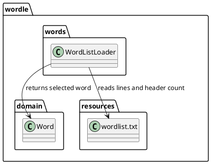

# Task: Implement word list loader and validation

- **Task Identifier:** 2026-01-25-word-list
- **Scope:** Load the dictionary and provide random word selection from the
  word list resource.
- **Motivation:** Ensure solutions are derived from a consistent internal
  source without adding unnecessary membership checks.
- **Scenario:** The game starts and requests a solution word. The loader
  reads the packaged word list, selects one valid entry using the declared
  count header, and returns a `Word` object for the engine.
- **Briefing:** This task bridges the packaged word list and the existing
  `Word` validation path. Read the resource location and selection flow
  before changing loader behavior.
- **Research:** `examples/wordle/src/wordlist.txt` existed outside the
  resource directory, and there was no loader implementation. `Word`
  already performed normalization and validation.
- **Design:**

  The loader reads `<N> words` from line one, generates a random index in
  `[0, N-1]`, iterates remaining lines to the target entry, and constructs
  a `Word` from that entry.
- **Test specification:**
  - Automated tests:
    - Calling `randomWord` with the resource path returns a non-null `Word`.
    - Returned word value is normalized to uppercase.
    - Repeated calls can return different values for multi-entry lists.
    - Header count parsing supports selecting the last declared entry.
  - Manual tests:
    - N/A
