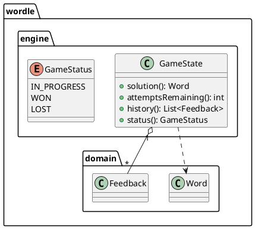
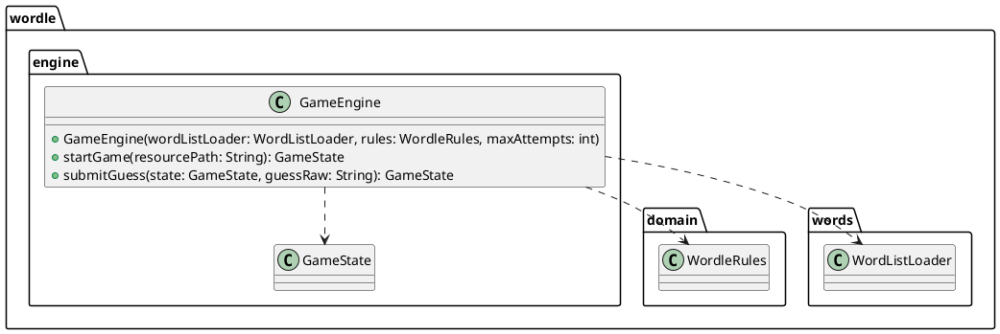

# Task: Build game engine

- **Task Identifier:** 2026-01-25-game-engine
- **Scope:** Implement the game loop state, attempt limits, win/lose
  conditions, and turn progression.
- **Motivation:** Provide a reusable core engine that both CLI and UI layers
  can drive.
- **Developer Briefing:** The Wordle example now has a domain model and a
  word list loader, but no gameplay engine. This task is split into two
  subtasks: define the game state model, then implement the engine logic
  that produces new states from guesses. The engine must remain UI-agnostic
  so CLI and minimal UI can reuse it.
- **Research:** Current code includes domain records (`Word`, `Feedback`,
  `LetterFeedback`, `LetterStatus`), `WordleRules.compare` for evaluation,
  and `WordListLoader.randomWord` for selecting a solution from the
  resource. There is no game state, attempt tracking, or win/lose logic
  implemented.
- **Design:** See subtasks.
- **Test specification:** See subtasks.

## Subtask: Define game state model
- **Status:** done
- **Scope:** Introduce immutable game state types for attempts, history, and
  status.
- **Motivation:** Establish a stable state model before implementing engine
  behavior.
- **Developer Briefing:** Define `GameState` and `GameStatus` in a
  `wordle.engine` package. State must capture the solution, remaining
  attempts, feedback history, and current status.
- **Research:** No game state types exist; all logic is currently in domain
  and word list components.
- **Design:**

- **Test specification:**
  1. `GameState` stores the provided solution, attempts, history, and
       status.
  2. `GameStatus` contains IN_PROGRESS, WON, LOST.

## Subtask: Implement game engine logic
- **Status:** done
- **Scope:** Implement game start and guess submission logic using the state
  model.
- **Motivation:** Provide reusable gameplay behavior for CLI and UI layers.
- **Developer Briefing:** Implement `GameEngine` with `startGame` and
  `submitGuess`. `startGame` picks a random solution via `WordListLoader`.
  `submitGuess` creates feedback via `WordleRules` and returns a new
  `GameState` with updated attempts and status.
- **Research:** There is no engine implementation; WordleRules and
  WordListLoader are ready to be composed.
- **Design:**

- **Test specification:**
  1. Starting a game sets attempts to `maxAttempts`, history empty, status
       `IN_PROGRESS`.
  2. A correct guess sets status to `WON` and leaves attempts unchanged.
  3. An incorrect guess decrements attempts and appends feedback.
  4. After `maxAttempts` incorrect guesses, status becomes `LOST`.
  5. Submitting a guess after `WON` or `LOST` leaves state unchanged or
       throws (define behavior explicitly).
