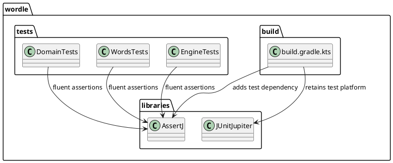

# Task: Use AssertJ in tests

- **Task Identifier:** 2026-01-26-assertj
- **Scope:** Replace JUnit assertions with AssertJ in test code and add the
  AssertJ dependency.
- **Motivation:** Improve test readability and consistency across the
  existing suite.
- **Developer Briefing:** The task is limited to test code and build test
  dependency configuration. Production behavior and public APIs must remain
  unchanged.
- **Research:** Existing tests used JUnit Jupiter assertion helpers. Build
  configuration already used Gradle Kotlin DSL with JUnit Jupiter.
- **Design:**

  Assertion calls are migrated from JUnit assertion utilities to AssertJ
  equivalents while preserving existing test logic and coverage intent.
- **Test specification:**
  - Automated tests:
    - Run `./gradlew test` and confirm all tests pass.
    - Verify test sources contain no JUnit assertion static imports.
  - Manual tests:
    - N/A
