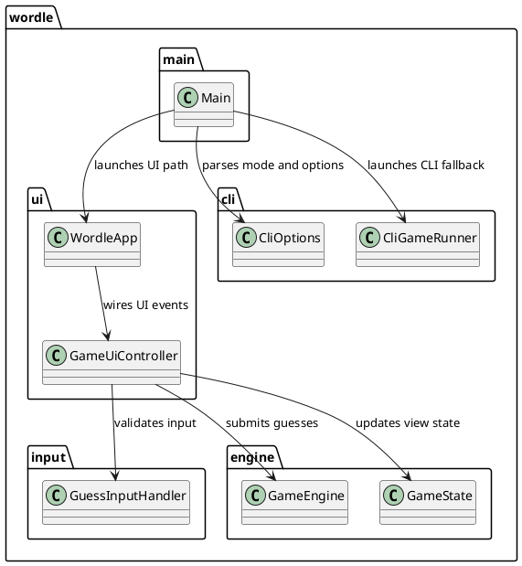
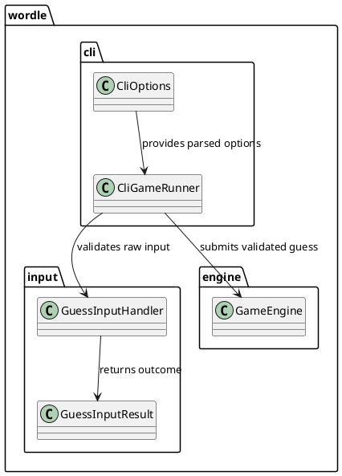
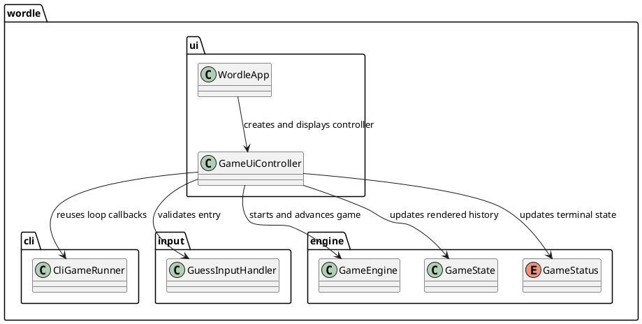
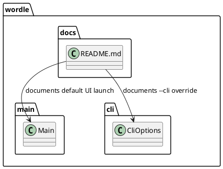

# Task: Add minimal UI

- **Task Identifier:** 2026-01-25-minimal-ui
- **Scope:** Implement a minimal Swing interface for Wordle, keep CLI
  availability, and document UI usage.
- **Motivation:** Provide an approachable graphical entry point that reuses
  the existing engine behavior.
- **Scenario:** A user runs the app in a graphical environment and gets a
  simple Wordle window for entering guesses and viewing feedback. In
  headless mode or when `--cli` is set, the app falls back to CLI flow.
- **Developer Briefing:** This task introduces UI orchestration and shared
  input validation while preserving the CLI path. `Main` chooses UI or CLI
  based on runtime context and command flags.
- **Research:** Prior implementation exposed only CLI flow over the same
  engine and word list components; there was no Swing entry path.
- **Design:**

  UI path and CLI path share validation and engine rules so gameplay
  semantics remain consistent across interaction modes.
- **Test specification:**
  - Automated tests:
    - Covered by subtask test specifications.
  - Manual tests:
    - Covered by subtask test specifications.

## Subtask: Prepare shared input validation

- **Status:** done
- **Scope:** Refactor CLI responsibilities and extract shared input
  validation for CLI and UI.
- **Motivation:** Keep validation behavior consistent and avoid duplicated
  checks.
- **Scenario:** Both CLI and UI submit raw guess text. Shared validation
  rejects empty or invalid-length guesses the same way before engine calls.
- **Developer Briefing:** Split option parsing from loop execution and add a
  reusable `GuessInputHandler` abstraction used by both interface paths.
- **Research:** Existing CLI code combined parsing, validation, and loop
  control in one flow.
- **Design:**

  Parsed options become passive data, while gameplay execution and input
  validation are separated into focused components.
- **Test specification:**
  - Automated tests:
    - Shared validator rejects empty input with user-facing message.
    - Shared validator rejects invalid-length input with message.
    - Shared validator accepts valid-length input and normalizes value.
    - `CliOptions` parsing does not execute gameplay loop.
    - `CliGameRunner` emits feedback, invalid-input, and status callbacks.
  - Manual tests:
    - N/A

## Subtask: Implement Swing UI

- **Status:** done
- **Scope:** Add a minimal Swing UI for entering guesses, viewing feedback,
  and observing final game status.
- **Motivation:** Provide a graphical interaction mode while preserving core
  engine reuse.
- **Scenario:** A user enters guesses in a text field and submits them.
  Feedback rows accumulate in the window, attempts update, and controls
  disable when the game reaches `WON` or `LOST`.
- **Developer Briefing:** Implement `wordle.ui.WordleApp` and a
  `GameUiController` that drives engine state updates and UI rendering.
  `Main` selects UI when non-headless and CLI fallback otherwise.
- **Research:** Swing path did not exist at subtask start; CLI and engine
  integration already existed.
- **Design:**

  The controller owns widget updates, routes submissions through shared
  validation, and disables input when status reaches a terminal value.
- **Test specification:**
  - Automated tests:
    - Empty input is rejected without attempt decrement.
    - Invalid-length input is rejected without attempt decrement.
    - Valid guesses append feedback rows and update attempts.
    - Terminal statuses disable input and display final result.
  - Manual tests:
    - Run `./gradlew run` in non-headless mode and confirm UI default.
    - Run `./gradlew run --args="--cli ..."` and confirm CLI mode.
    - Run in headless mode and confirm automatic CLI fallback.
    - Play through a short UI session and verify feedback updates.

## Subtask: Document UI build and usage

- **Status:** done
- **Scope:** Document Swing UI build and run behavior in README.
- **Motivation:** Ensure users can start and switch interface modes with
  clear commands.
- **Developer Briefing:** Update README with UI default behavior,
  headless fallback behavior, and mode-switch instructions.
- **Research:** Existing README documentation was CLI-centered.
- **Design:**

  This subtask changes documentation only and does not alter runtime logic.
- **Test specification:**
  - Automated tests:
    - N/A
  - Manual tests:
    - N/A
