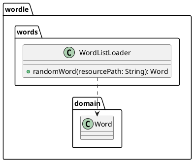

# Task: Implement word list loader and validation
- **Task Identifier:** 2026-01-25-word-list
- **Scope:** Load the dictionary and provide random word selection from the word list resource.
- **Motivation:** Ensure solutions are derived from a consistent internal source without adding unnecessary validation or membership checks.
- **Developer Briefing:** The Wordle example now has a domain model but no word list loading. We will move the provided `wordlist.txt` into resources and add a loader that reads the list and returns a random `Word`. The design avoids membership checks and test cases per the current refinement approach.
- **Research:** `examples/wordle/src/wordlist.txt` exists but is not in the resources directory, and there is no loader in the codebase. Domain validation currently happens inside `Word`, so the loader can rely on `Word` construction as it reads entries.
- **Design:**

Algorithm and file reading details:
1. The first line of `wordlist.txt` contains the total line count in the format `<N> words` (for example, `20 words`), where `N` is the number of word entries that follow.
2. Resolve the resource using the context class loader (e.g., `Thread.currentThread().getContextClassLoader().getResourceAsStream(resourcePath)`), assuming the resource is packaged at `/wordlist.txt`.
3. Read the first line, parse the leading integer `N` from the `<N> words` format, then generate a random index `target` in `[0, N-1]` using `ThreadLocalRandom`.
4. Iterate through the remaining lines until the `target` index is reached; select that line.
5. Construct and return a `Word` from the selected line (this applies normalization and validation in the `Word` constructor).
6. If the file ends before reaching the target index, throw an `IllegalStateException` with a clear message (resource should always contain `N` entries).
- **Test specification:**
  1. Calling `randomWord` with the resource path returns a non-null `Word`.
  2. Returned `Word` is normalized to uppercase.
  3. Repeated calls to `randomWord` eventually return different values when the list contains multiple entries.
  4. The loader reads the first-line count `N` and can select the last entry (target index `N-1`) without error.
