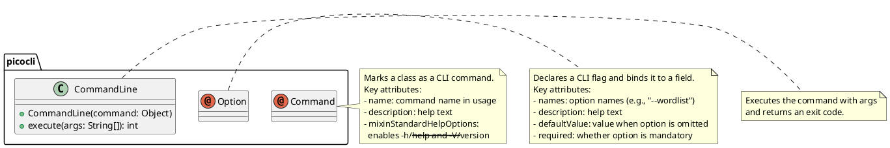
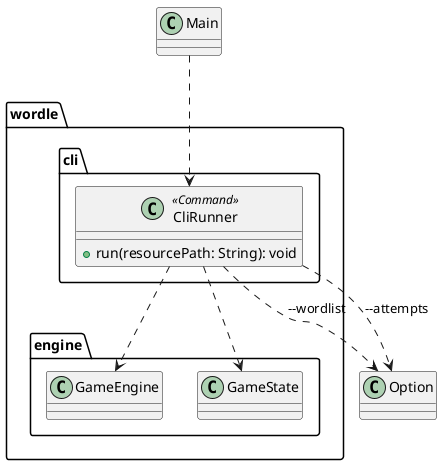
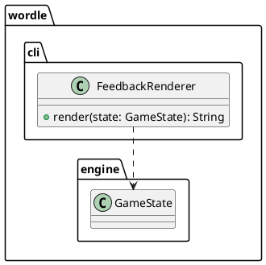

# Task: Add CLI game interface
- **Task Identifier:** 2026-01-25-cli-interface
- **Scope:** Implement a command-line experience for playing Wordle (input loop, feedback rendering) and document CLI build/run/usage steps.
- **Motivation:** Provide a simple interface to exercise and validate the core engine, with clear CLI instructions for users.
- **Developer Briefing:** The engine and domain layers are implemented, but there is no CLI entry point. We will add a simple interactive loop that starts a game, accepts guesses, renders feedback, and ends on win/lose. The CLI will include a brief usage section in the Wordle README with build/run instructions.
- **Research:** Current code includes the game engine (`wordle.engine.GameEngine`), word list loader (`wordle.words.WordListLoader`), and domain model. No CLI utilities or formatting helpers exist yet.
- **Design:** See subtasks.
- **Test specification:** See subtasks.

## Subtask: Implement CLI parsing and game loop
- **Status:** Plan Review
- **Scope:** Add picocli-based CLI command, parse arguments, and run the game loop.
- **Motivation:** Provide a working CLI entry point with configurable attempts and word list.
- **Developer Briefing:** Implement a picocli command that wires `GameEngine` to stdin/stdout. `Main` should delegate to the command and return the exit code from `CommandLine.execute`.
- **Research:** Picocli API surface (external) needed for this subtask:

- **Design:**
  1. Use picocli for argument parsing and help output.
  2. `Main` delegates to a picocli command (e.g., `CliRunner`) with options for word list and attempts.
  3. `CliRunner` accepts `--wordlist` as an external source (file path or URL). If omitted, it uses the internal resource `wordlist.txt`.
  4. `CliRunner` starts a game with a configurable max attempts and loops until `GameStatus` is `WON` or `LOST`.
  5. Each iteration reads a line from stdin, trims it, and submits it to the engine.
  6. When the game ends, print `Result: WON/LOST`. If input ends before completion, print `Result: INTERRUPTED`. Always exit with status code 0.

  CLI arguments (picocli options):
  - `--wordlist <source>`: file path or URL for the word list; if omitted, use internal `wordlist.txt`.
  - `--attempts <n>`: number of attempts before losing (default 6).
  - `--help`: print usage and exit (provided by picocli).

- **Test specification:**
  1. CLI input handling rejects empty lines and prompts again (define behavior explicitly).
  2. Picocli option defaults apply when no args are provided.
  3. `--wordlist` accepts a file path and uses it to load a game.
  4. `--wordlist` accepts a URL and uses it to load a game.
  5. CLI prints a final `Result:` line (`WON`, `LOST`, or `INTERRUPTED`) and returns exit code 0.

## Subtask: Implement feedback rendering
- **Status:** Plan Review
- **Scope:** Add feedback formatting for CLI output.
- **Motivation:** Provide readable game output for users.
- **Developer Briefing:** Implement a renderer that converts `GameState` feedback into a text row.
- **Research:** See parent task research.
- **Design:**
  1. `FeedbackRenderer` formats feedback as a simple text row (e.g., letters with status markers).

- **Test specification:**
  1. `FeedbackRenderer` renders correct/present/absent statuses deterministically for a known `GameState`.

## Subtask: Document CLI build and usage
- **Status:** Plan Review
- **Scope:** Document CLI build/run/usage steps in the README.
- **Motivation:** Ensure users can run and understand the CLI without guesswork.
- **Developer Briefing:** Update `examples/wordle/README.md` with CLI usage, including arguments and example commands.
- **Research:** See parent task research.
- **Design:**
  1. Update `examples/wordle/README.md` with CLI build/run steps and usage.
  2. Include CLI argument descriptions and example invocations.
- **Test specification:**
  1. README contains CLI build/run/usage instructions (manual verification acceptable).
