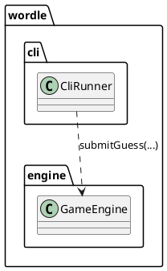
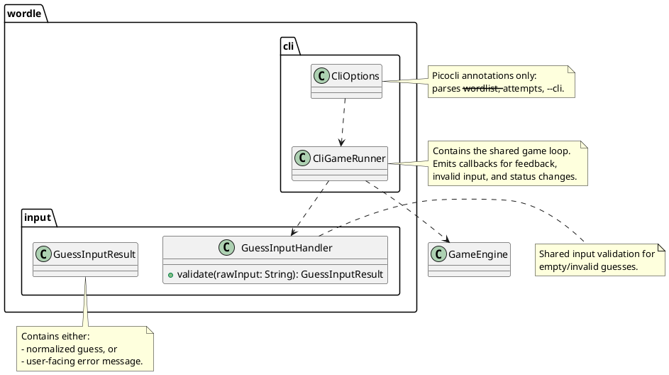
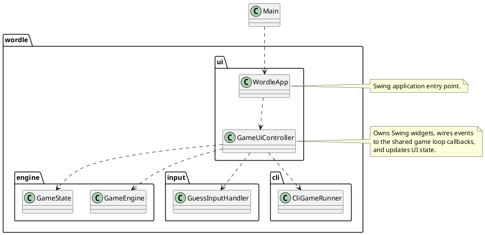

# Task: Add minimal UI
- **Task Identifier:** 2026-01-25-minimal-ui
- **Scope:** Implement a minimal Swing user interface for playing Wordle and document UI build/run/usage steps, with the CLI still available via a command-line switch or headless fallback.
- **Motivation:** Provide an approachable UI example that demonstrates usage of the core engine, with clear UI instructions for users.
- **Developer Briefing:** The engine and domain logic are complete and currently exposed via the CLI. This task adds a Swing UI that calls `GameEngine` directly, rendering feedback and attempts in a small window. The default entry point should start the UI when a display is available, and fall back to the CLI when running headless or when the user passes `--cli`. Documentation will explain how to start the UI and how to force the CLI.
- **Research:** See subtasks.
- **Design:** See subtasks.
- **Test specification:** See subtasks.

## Subtask: Prepare shared input validation
- **Status:** Finished
- **Scope:** Refactor CLI responsibilities by splitting option parsing from the game loop, and extract shared input validation so both CLI and UI reuse the same rules for empty and invalid guesses.
- **Motivation:** Keep guess validation logic consistent and avoid duplicating behavior between CLI and UI.
- **Developer Briefing:** `CliRunner` currently parses options and runs the game loop. We will split parsing into a dedicated options class and move the loop into a reusable runner so CLI and UI can share the loop logic where sensible. Input validation will also be extracted into a shared helper.
- **Research:**

- **Design:**

  1. Split `CliRunner` into:
     - `CliOptions` (picocli annotations only, no game loop),
     - `CliGameRunner` (game loop + output rendering).
  2. `CliGameRunner` owns the shared loop:
     - takes a `GameEngine`, input source, and a `GuessInputHandler`,
     - emits callbacks for feedback rows, invalid input messages, and status changes,
     - returns a final `GameState` for the caller to report status.
  3. Introduce a shared `GuessInputHandler` in `wordle.input` and move CLI validation rules there:
     - valid input -> normalized guess,
     - invalid input -> user-facing message and no attempt consumed.
  4. `CliOptions` creates a `CliGameRunner` and passes the parsed options to it.
  5. The CLI wires callbacks to console output and feedback rendering.
  6. Keep `GameEngine` behavior unchanged; it still validates `Word` construction.
- **Test specification:**
  1. Shared validator rejects empty input and provides a user-facing message.
  2. Shared validator rejects invalid-length input and provides a user-facing message.
  3. Shared validator accepts a valid-length word and returns normalized input.
  4. `CliOptions` parsing does not invoke the game loop directly.
  5. `CliGameRunner` runs a loop and triggers callbacks for feedback, invalid input, and status changes.
  6. CLI uses the shared validator (verified by unit tests for the shared component and one integration-style test for the CLI path).

## Subtask: Implement Swing UI
- **Status:** Plan Review
- **Scope:** Add a minimal Swing UI that lets a user enter guesses, see feedback rows, and view the final result.
- **Motivation:** Provide a simple graphical interface that exercises the same engine logic as the CLI.
- **Developer Briefing:** Introduce a Swing entry point in `wordle.ui` and a small controller that owns `GameEngine` and `GameState`. The UI will use a single window with a history area, input field, submit button, and status line. The CLI remains the default `wordle.Main`, while a new Gradle task will launch the Swing app.
- **Research:**
```plantuml
@startuml
package wordle.engine {
  class GameEngine
  class GameState
  enum GameStatus
}

package wordle.domain {
  record Word
  class Feedback
}

package wordle.cli {
  class CliRunner
  class FeedbackRenderer
}

package wordle.words {
  class WordListLoader
}

class Main

Main ..> CliRunner
CliRunner ..> GameEngine
CliRunner ..> FeedbackRenderer
GameEngine ..> WordListLoader
GameEngine ..> GameState
GameState ..> Word
GameState ..> Feedback

note right of Main
  Gradle application mainClass = wordle.Main
end note

note right of GameEngine
  startGame(resourcePath) and
  startGameExternal(source)
end note

note right of WordListLoader
  Loads internal resource, file path,
  or URL with first-line count header.
end note
@enduml
```
- **Design:**

  1. Use Swing (no new dependencies required).
  2. Keep `application.mainClass = "wordle.Main"` and update `Main` to:
     - detect headless mode (`GraphicsEnvironment.isHeadless()`),
     - check for a `--cli` flag in the arguments,
     - launch the Swing UI by default when not headless and `--cli` is absent,
     - otherwise run the existing CLI path (passing remaining args to picocli).
  3. Implement `wordle.ui.WordleApp` that builds a single-window Swing UI containing:
     - a history container (e.g., `JPanel` with vertical `BoxLayout`) that holds rendered feedback rows,
     - a status line showing attempts remaining and final result,
     - a `JTextField` for input and a `JButton` for submission.
  4. `GameUiController` coordinates UI events and the shared `CliGameRunner` loop:
     - On startup, call `GameEngine.startGame("wordlist.txt")` to use the internal list.
     - On submit, pass input to `CliGameRunner` for validation/processing.
     - Provide callbacks to `CliGameRunner` that append feedback rows and update attempts/status display.
     - When status becomes `WON` or `LOST`, disable input and show the final result.
  5. Render feedback by mapping each `Feedback` item into a short label (e.g., `C`, `R`, `A`, `N`, `E`) with simple text markers so the UI mirrors the CLI semantics.
- **Test specification:**
  1. `GameUiController` rejects empty input and does not decrement attempts.
  2. `GameUiController` rejects invalid-length input and does not decrement attempts.
  3. Valid guesses append a feedback row and update attempts remaining.
  4. When the engine returns `WON` or `LOST`, the UI disables input and reports the result.
  5. Manual smoke test: run `./gradlew run` in a non-headless environment and confirm the UI starts by default.
  6. Manual smoke test: run `./gradlew run --args="--cli ..."` and confirm CLI starts instead of UI.
  7. Manual smoke test: run in a headless environment (or force headless) and confirm CLI starts.
  8. Manual smoke test: in UI mode, play through a short game to confirm feedback and status updates.

## Subtask: Document UI build and usage
- **Status:** Plan Review
- **Scope:** Document how to build and run the Swing UI in the Wordle README.
- **Motivation:** Ensure users can start the UI without guessing Gradle commands.
- **Developer Briefing:** Update `examples/wordle/README.md` to include a Swing UI run command, mention the UI entry point, and describe expected behavior.
- **Research:** See parent task research.
- **Design:**
  1. Add a “Swing UI” section explaining that `./gradlew run` starts the UI by default in non-headless environments.
  2. Document `./gradlew run --args="--cli ..."` to force CLI mode, and that headless environments fall back to CLI automatically.
  3. Document that the UI uses the internal word list and the default attempts count unless otherwise configured.
  4. Note any platform requirements introduced by Swing (if applicable).
- **Test specification:**
  1. README contains a dedicated Swing UI section with the correct run command and a brief usage description.
