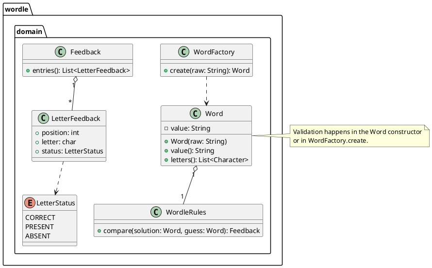

# Task: Define Wordle domain model and evaluation rules
- **Task Identifier:** 2026-01-25-domain-model
- **Scope:** Define the domain model and evaluation rules as cohesive, UI-agnostic building blocks for the Wordle Java implementation.
- **Motivation:** Establish a clear model and comparison rules so later game logic and interfaces stay consistent.
- **Developer Briefing:** This task now contains two subtasks: one for defining domain objects and validation, and one for implementing guess evaluation rules. The parent task keeps scope, motivation, and context while the subtasks carry the detailed research, design, and test specifications.
- **Research:** The Wordle example contains only the Gradle scaffolding and placeholder entry point; there are no existing domain classes or rules implementations in `examples/wordle/src`. No existing model conventions are present, so the domain model and evaluation rules must be introduced from scratch with clear responsibilities and immutability to reduce future coupling.
- **Design:**

- **Test specification:** Subtasks define the test coverage.

## Subtask: Define domain objects
- **Status:** Plan Review
- **Scope:** Define immutable domain objects for words and feedback, including validation entry points.
- **Motivation:** Provide a stable core model before adding game logic or UI.
- **Developer Briefing:** The Wordle example currently lacks any domain classes, so we will define a minimal, focused model to represent words, feedback, and validation entry points. The design below specifies immutable value objects for `Word` and `Feedback`, plus a `WordFactory` to centralize validation when not handled directly by `Word`.
- **Research:** There are no existing domain classes or validation utilities in `examples/wordle/src`, so the model and validation entry points must be introduced from scratch.
- **Design:** See parent task design diagram.
- **Test specification:**
  1. Create `Word` with lowercase input and verify normalization to uppercase.
  2. Reject `Word` with length != 5.
  3. Reject `Word` with non A-Z characters.
  4. Accept `Word` with valid 5-letter A-Z input.
  5. Construct `Feedback` with a list of `LetterFeedback` and verify entries are preserved in order.
  6. Construct `LetterFeedback` and verify position, letter, and status accessors.

## Subtask: Implement guess evaluation rules
- **Status:** Plan Review
- **Scope:** Implement comparison logic that produces per-letter feedback given a solution and a guess.
- **Motivation:** Provide the core Wordle feedback behavior needed by the game engine and UI.
- **Developer Briefing:** Implement the comparison rules in a dedicated `WordleRules` component that takes two `Word` instances and returns `Feedback`. Validation stays in `Word`/`WordFactory` to keep rules focused on evaluation.
- **Research:** There is no existing rules implementation in the Wordle example. The evaluation algorithm must handle duplicate letters by scoring exact matches first, then marking present letters only when remaining occurrences exist.
- **Design:** See parent task design diagram.
- **Test specification:**
  1. Compare identical solution and guess; all positions are CORRECT.
  2. Compare with no matching letters; all positions are ABSENT.
  3. Compare with some letters present in wrong positions; PRESENT statuses set correctly.
  4. Duplicate-letter case: solution `LEVEL`, guess `LELEE`; ensure correct letters are marked first, then PRESENT only up to remaining counts.
  5. Duplicate-letter case where guess repeats a letter more than solution; extra repeats are ABSENT.
