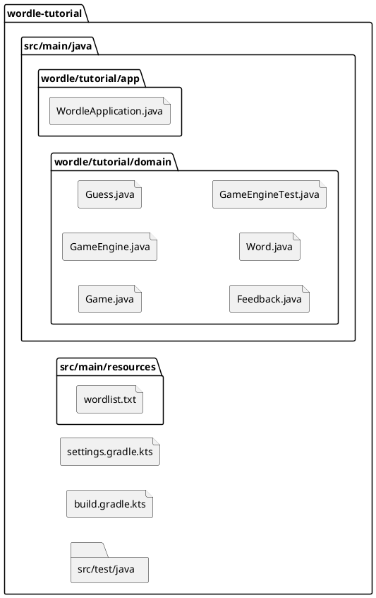
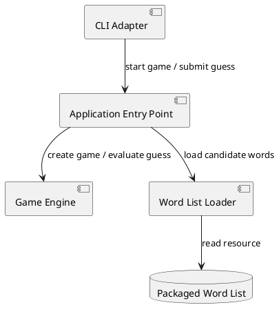
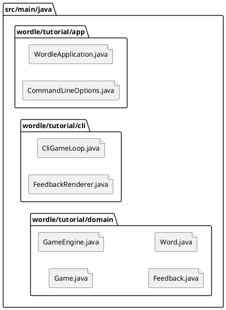
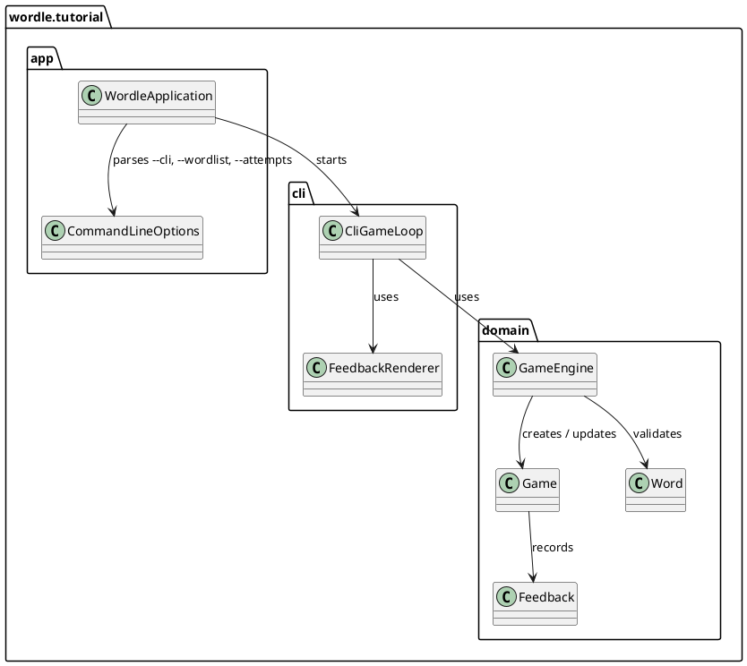
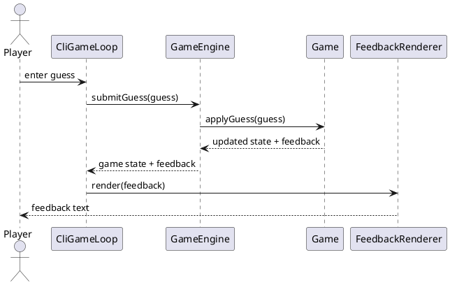

# Example task: Wordle CLI adapter with embedded PlantUML

This compact example task shows valid embedded PlantUML for four common
task-diagram needs.
It is primarily a collection of valid diagram patterns in a realistic
task context, not a required minimum task size and not a signal that
every first planning pass should be this detailed.

This example task shows valid embedded PlantUML for four common
task-diagram needs:

- filesystem / project structure
- component interaction
- class structure
- sequence flow

Keep different concerns in separate PlantUML blocks instead of mixing
diagram types.

## Scope

Add a CLI adapter for Wordle that starts a game, reads guesses from
standard input, renders feedback text, and keeps gameplay rules in the
existing engine and domain classes.

## Motivation

This example demonstrates current task structure and PlantUML patterns
that render reliably in Markdown task files.

## Briefing

The project already contains a reusable game engine and a packaged word
list. The CLI adapter must depend on the application and domain layers
without moving gameplay logic into the UI path.

## Research

Current repository structure relevant to the change:

Current runtime boundary:

## Design

Target project structure for the CLI path:

Class structure for the CLI adapter and engine collaboration:

Guess submission flow:

Design notes:

- Keep filesystem, component, class, and sequence diagrams in separate
  PlantUML blocks.
- Do not mix `file` / `folder` elements with classes in the same
  diagram unless there is a strong reason.
- Use the class diagram for structural changes and the sequence diagram
  for runtime behavior.

## Constraints

- Gameplay rules remain in domain classes.
- The CLI adapter may format output, but it must not reimplement
  evaluation logic.
- The UI path must stay replaceable by a later Swing adapter.

## Test Specification

- automated tests for CLI argument parsing defaults and validation
- automated tests for feedback rendering text
- automated tests proving the CLI path delegates to the existing engine
- verification commands:
  - `./gradlew test`
  - `./gradlew run --args='--cli'`
