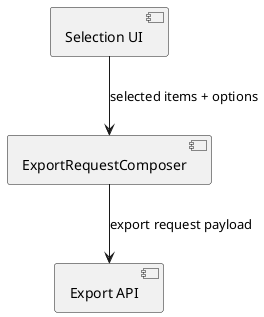

# Example task: Serialized payload change after approval preparation

This compact example shows an approval-prepared task whose main risk is
an external payload contract.

It demonstrates:
- a small component diagram;
- explicit final payload names;
- a compact identifier list/table where diagrams alone would be weak.

Use it as a pattern collection, not as a required task size.

- **Scope:** Normalize an export request payload so the server receives
  one stable structure for selected items and export options.
- **Motivation:** Remove parallel request shapes and make the export API
  contract explicit before implementation.
- **Scenario:** A user selects several items, triggers export, and the
  client sends one normalized request payload to the export endpoint.
- **Briefing:** The change affects one client composer, one endpoint,
  and one serialized request shape.
- **Research:** The current client sends two similar request variants,
  which forces the server to branch on partially duplicated payloads.



- **Design:**
  Final structural decisions:
  1. Keep one request composer.
  2. Use one normalized request payload.
  3. Remove the legacy parallel request shape from the new path.

  Target request payload:

  ```json
  {
    "selectedItemIds": ["a-1", "a-2"],
    "selectionCount": 2,
    "includeMetadata": true,
    "format": "markdown"
  }
  ```

  Serialized contract inventory:

  | Identifier | Kind | Purpose |
  | --- | --- | --- |
  | `selectedItemIds` | request field | ordered selected identifiers |
  | `selectionCount` | request field | explicit count for validation |
  | `includeMetadata` | request field | metadata export toggle |
  | `format` | request field | target export format |
  | `/api/export` | endpoint | normalized export request target |

  No second structural table is kept because the component diagram and
  payload block already describe the review-relevant boundary.

- **Test specification:**
  - Automated tests:
    - composer emits the normalized request shape;
    - selected identifiers preserve order;
    - `selectionCount` matches the emitted list size.
  - Manual tests:
    - export two selected items and inspect the outgoing request;
    - verify that the server receives only the normalized payload shape.
