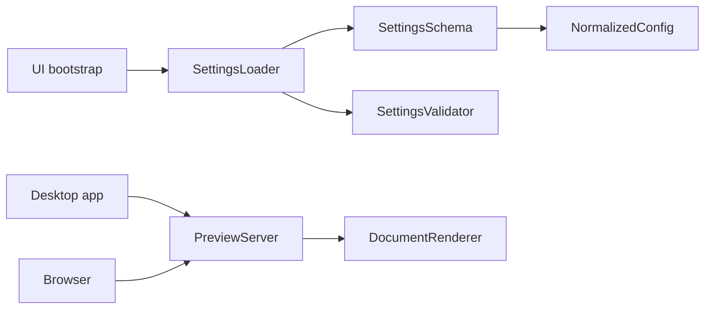
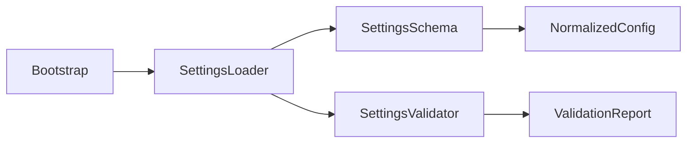
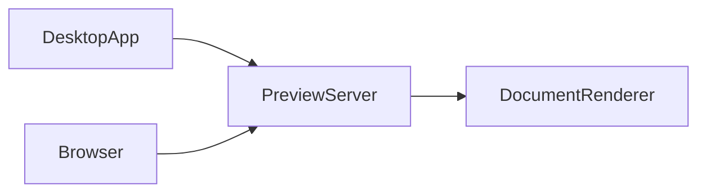

# Review: Settings loader extraction, validation, and preview server
- **Ticket:** github:example/acme-widget#42
- **Review outcome:** request changes
  - **Intent:** Settings loader extraction and schema normalization are
    independently justified. Stricter validation is conditionally
    justified only if migration strategy and failure policy are narrowed.
    The embedded preview server is not justified by the reviewed evidence
    and should wait for explicit product and security agreement.
  - **Implementation:** The loader extraction is coherent, but the branch
    couples it to a breaking validation change and a default-enabled
    preview server.
  - **Verification:** Unit tests cover parser happy paths and invalid-key
    rejection. Missing evidence remains for migration compatibility,
    disabled-server startup, and end-to-end preview behavior.
  - **Complexity:** Justified complexity is concentrated in the
    extracted settings loader, schema, and normalization path.
    Accidental complexity appears in the fail-fast validation rollout and
    the local preview server: both add present user or runtime cost before
    a clear current benefit is established.
  - **Blockers:**
    - legacy settings with unknown keys now fail without migration,
      warning-first rollout, or compatibility fallback
    - preview server starts on application boot without explicit opt-in
  - **Required improvements:**
    - split the branch so the settings loader extraction can be reviewed
      independently
    - clarify whether validation should warn first, migrate old keys, or
      reject only a narrowed class of invalid settings
    - defer the preview server until activation model and security
      boundary are accepted, or add the missing evidence and explicit
      opt-in behavior
  - **Non-blocking improvements:**
    - document the normalized config contract more explicitly
    - separate compatibility-policy tests from parser-shape tests for
      easier review
  - **Net benefits or complexity reductions:**
    - config parsing moves out of UI bootstrap
    - defaults and schema handling become easier to test
    - ownership of configuration behavior becomes clearer
  - **Net costs or complexity increases:**
    - stricter config semantics can break existing installs
    - local HTTP surface adds runtime and security complexity
    - one PR combines a useful refactor with an unrelated product/runtime
      expansion
  - **Area-wise justification summary:**
    - justified complexity worth keeping:
      - settings loader extraction and schema normalization
    - conditionally justified complexity:
      - stricter validation, if migration for existing users and failure
        policy are clarified
    - accidental complexity whose justification depends on disputed
      direction:
      - embedded preview server, which should wait for explicit product
        and security agreement
    - accidental complexity to defer or drop pending discussion:
      - default-enabled localhost preview behavior on application startup
  - **Keep/simplify/split/defer recommendation:**
    - split this branch
    - keep the settings loader extraction and schema normalization
    - simplify validation rollout until compatibility handling is clear
    - defer preview server work until product need and security boundary
      are accepted
  - **Suggested first follow-up PR slice:** settings loader extraction and
    schema normalization, with compatibility-preserving tests for legacy
    configs and defaults

- **Scope:**
  This PR extracts configuration parsing from the Swing bootstrap, adds
  schema-based validation, and introduces an embedded HTTP preview server.

- **Motivation:**
  Reconstructed from the PR description and commit messages: make settings
  logic testable, centralize defaults, and prepare for browser-based
  preview.

- **Scenario:**
  A user upgrades the desktop app, keeps an existing config file, and
  optionally opens a browser preview of the current document.

- **Briefing:**
  Review URL: `<trusted-review-url>`

  This review is decomposed into two areas because the configuration
  refactor has independent value, while the preview server introduces a
  separate runtime and product direction.

  Read the configuration loader first, then the preview server.

- **Research:**
  Before this PR, the UI bootstrap read properties directly, unknown keys
  were ignored, and no local HTTP server existed.

- **Design:**
  The head branch introduces a `SettingsLoader` / `SettingsSchema` /
  `SettingsValidator` path plus a `PreviewServer` that exposes rendered
  content over localhost.

- **Test specification:**
  What should be tested:

  - upgraded-config compatibility
  - default normalization
  - invalid-key policy
  - preview server opt-in / opt-out behavior
  - startup / shutdown lifecycle
  - request handling and renderer integration

  Evidence present:

  - parser-focused unit tests
  - invalid-key rejection tests

  Missing or unclear evidence:

  - migration/regression tests for existing configs
  - application startup proof with preview disabled
  - end-to-end preview verification

  Sufficiency judgment:

  - The verification story is directionally useful but not yet sufficient
    for merge confidence.

- **Assessment:**
  - **Intent:**
    The PR combines one independently useful refactor with two more
    debatable follow-up directions. Extracting configuration loading is
    easy to justify on its own. Stricter validation is plausible, but only
    if its user impact is managed. The preview server is the weakest
    direction because it is a product expansion rather than a necessary
    consequence of the refactor.
  - **Implementation:**
    The branch does not yet realize the bundle safely. Validation changes
    existing behavior without migration support, and the preview server
    expands runtime surface without an explicit opt-in path.
  - **Pros:**
    - clearer separation between UI bootstrap and configuration logic
    - better foundation for focused parser tests
  - **Cons:**
    - backward-compatibility risk for existing settings files
    - additional runtime and security surface from the preview server
  - **Complexity:**
    The loader extraction converts hidden bootstrap complexity into
    explicit components and is mostly justified complexity. The fail-fast
    validation rollout and preview server are mostly accidental complexity
    in this branch because they add cost before a clear present benefit
    is established.
  - **Recommendation:**
    Keep the configuration extraction, narrow or phase the validation
    change, and defer the preview server until its product need and
    boundary are accepted.

## Review Area: Configuration loader and validation
- **Status:** needs-changes
- **Scope:**
  This area extracts configuration parsing into dedicated loader and
  schema types and adds stricter validation for unknown or malformed keys.

- **Motivation:**
  Make configuration behavior testable and consistent instead of leaving
  it embedded inside UI startup.

- **Scenario:**
  A user launches the application with an older config file and expects
  the app either to accept it safely or explain the migration clearly.

- **Briefing:**
  Start with the old bootstrap reader, then inspect `SettingsLoader`,
  `SettingsSchema`, and `SettingsValidator`. Focus on unknown-key
  handling, default normalization, and compatibility policy.

- **Research:**
  Previously the UI bootstrap read raw properties directly and tolerated
  extra keys.

- **Design:**
  The new flow centralizes parsing, normalization, and validation.

- **Test specification:**
  What should be tested:

  - known-key parsing
  - default filling and normalization
  - unknown-key policy
  - migration from legacy key names or tolerated extras

  Evidence present:

  - unit tests for parser happy paths
  - tests that invalid keys are rejected

  Missing or weak evidence:

  - regression tests for previously tolerated real-world configs
  - tests proving warning-first or migration behavior

  Sufficiency judgment:

  - The present tests support the refactor itself, but not the
    compatibility impact of the new policy.

- **Assessment:**
  - **Intent:**
    Extracting config logic from UI bootstrap is independently justified
    and mostly justified complexity. Stricter validation is plausible,
    but its rollout policy needs clearer user-impact reasoning before that
    additional complexity is justified.
  - **Implementation:**
    The loader extraction looks coherent. The validation rollout is too
    abrupt because it turns previously tolerated configs into failures
    without migration or warning-first handling.
  - **Pros:**
    - easier focused testing
    - clearer ownership of defaults and schema
  - **Cons:**
    - compatibility risk is under-handled
    - stronger enforcement arrives before migration support
  - **Complexity:**
    Parsing complexity moves into explicit types, which is justified.
    The accidental complexity is the fail-fast compatibility policy:
    it increases user-impact risk without enough supporting migration
    behavior or present user benefit.
  - **Recommendation:**
    Keep the loader extraction. Simplify or phase the validation change
    until compatibility and migration are covered.

## Review Area: Embedded preview server
- **Status:** needs-changes
- **Scope:**
  This area adds a localhost HTTP server that exposes rendered preview
  content to a browser.

- **Motivation:**
  Support browser-based preview without moving the whole application away
  from the desktop runtime.

- **Scenario:**
  A user opens a browser preview while editing a document in the desktop
  app.

- **Briefing:**
  Inspect server startup first, then routing and renderer integration.
  Focus on opt-in behavior, runtime boundary, and whether this direction
  is justified independently of the config refactor.

- **Research:**
  No local HTTP server existed before this PR; preview behavior remained
  inside the desktop UI.

- **Design:**
  The application now starts a local server and routes browser requests to
  the existing renderer.

- **Test specification:**
  What should be tested:

  - server opt-in / opt-out behavior
  - bind address and port policy
  - startup / shutdown lifecycle
  - request routing and rendering path
  - failure behavior when preview is unavailable

  Evidence present:

  - some route-level unit coverage may exist

  Missing or weak evidence:

  - startup proof with preview disabled
  - end-to-end preview request verification
  - security-boundary checks around exposure and defaults

  Sufficiency judgment:

  - Verification is not yet strong enough for a new runtime surface.

- **Assessment:**
  - **Intent:**
    This direction is not independently justified by the reviewed
    evidence. In this PR it is mostly accidental complexity: a product and
    runtime expansion that should be accepted on its own merits, not
    smuggled in as a side effect of the configuration refactor.
  - **Implementation:**
    Starting the server automatically without explicit opt-in is not a
    safe default. The branch also does not yet show enough verification
    for lifecycle and exposure behavior.
  - **Pros:**
    - opens a path toward browser-based preview
  - **Cons:**
    - increases runtime and security surface
    - lacks a clearly accepted product boundary
  - **Complexity:**
    This area adds a new tier of networking and lifecycle complexity
    rather than simplifying the existing system. In the absence of a
    clearly accepted product need, that added complexity remains
    accidental complexity and should be rejected for now.
  - **Recommendation:**
    Defer the preview server until product need, activation model, and
    security boundary are accepted, then review it as a separate PR.
