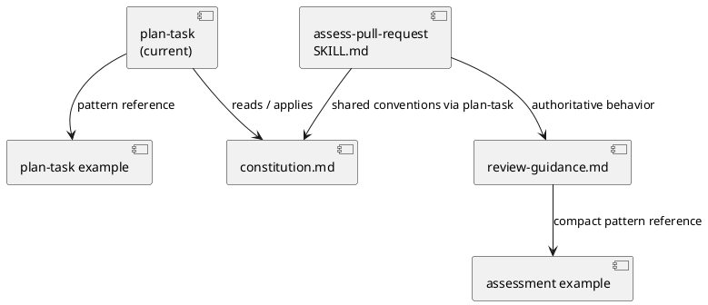
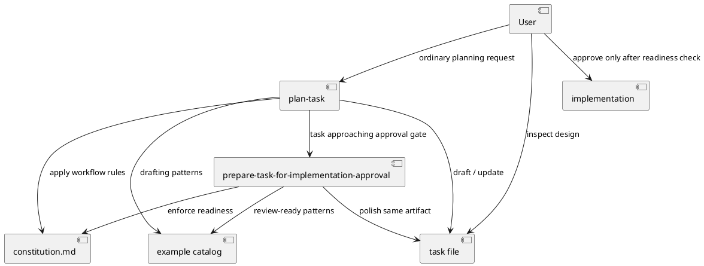
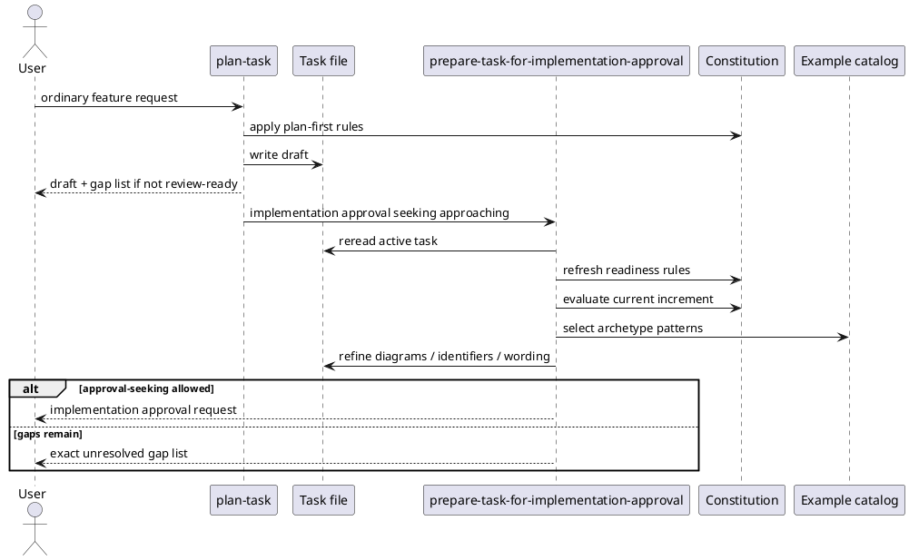

# Task: Separate task drafting from approval preparation

- **Task Identifier:** 2026-05-11-approval-preparation
- **Scope:** Restructure the skill workflow so `plan-task` focuses on
  task drafting, task administration, and planning discipline, while a
  new `prepare-task-for-implementation-approval` skill evaluates design
  completeness and polishes the active task file before the agent seeks
  implementation approval from the user. Update shared guidance, the
  README skill inventory, brief tutorial mentions near `plan-task` in
  both tutorials, and add diagram-first example tasks for the most
  common task archetypes. The skill descriptions must support automatic
  skill selection without relying on the user to name the skills
  explicitly.
- **Motivation:** The active task serves two readers with different
  needs. The LLM uses it as working memory, a focus anchor, and an
  implementation contract. The human uses it as a design-review artifact
  before implementation starts. When one skill tries to serve both modes
  at once, the task can become good enough for the LLM's internal
  progress while still being awkward for human review. Separating draft
  creation from approval preparation should reduce late rework, make
  diagram-first review normal, keep local implementation details out of
  the human review surface, and create an explicit step where the LLM
  recalls the shared Constitution and checks task readiness before
  seeking implementation approval.
- **Scenario:** A user asks for a new feature plan. The agent should
  automatically select `plan-task` from its skill description, create or
  update the active task file, capture research, record open questions,
  and draft a target design. The draft is allowed to be incomplete for
  review as long as it says so and names the remaining gaps.

  Before asking for implementation approval, the agent should
  automatically select
  `prepare-task-for-implementation-approval` from its description.
  That skill rereads the active task, refreshes the applicable
  Constitution rules in active context, sharpens the review-facing
  design, makes diagrams the primary review surface, and then either
  asks for implementation approval or reports an exact gap list instead
  of seeking approval prematurely.

  The user reviews the task mainly through diagrams, key decisions, and
  compact supporting inventories instead of reading large repeated
  responsibility tables. Tables may still survive when they carry exact
  information that diagrams express poorly, but the approval-prepared task
  avoids parallel diagram-plus-table restatements of the same
  structure. If the user approves the design, implementation may start.
  If implementation later requires a new top-level structural decision,
  the LLM returns to PLAN, updates the task, and prepares it again before approval-seeking.
- **Constraints:**
  - Keep one shared Constitution in
    `skills/plan-task/constitution.md`. Do not fork workflow rules into
    competing constitutions.
  - Keep `plan-task` as the primary Constitution owner. The current
    skill model has no separate shared-resource mechanism, so other
    skills must reuse the `plan-task` bundle rather than trying to own a
    parallel shared workflow resource.
  - Split workflow responsibilities at the skill level, not by creating
    a second task artifact. The active task file remains canonical.
  - `plan-task` must not finish by handing the drafted task to the user
    as if it were ready for approval. Before finishing and returning the
    task to the user, it must use
    `prepare-task-for-implementation-approval`.
  - `prepare-task-for-implementation-approval` is mandatory whenever
    `plan-task` is in use. The user may opt out of the shared planning
    workflow, but may not opt out of only one of the two skills.
  - Do not introduce a new task-file status or marker for
    pre-implementation design-review readiness. The binding is
    behavioral: before implementation approval seeking, the agent must
    run `prepare-task-for-implementation-approval`.
  - The frontmatter description of each skill must state application
    criteria only, including when the skill is mandatory or must be
    used. Skill-body content should perform the work and point to
    related or follow-up skills.
  - The descriptions of `plan-task` and
    `prepare-task-for-implementation-approval` must be specific enough
    that the agent can select the right skill automatically from
    ordinary user requests and from the current task state, without
    requiring the user to name the skill.
  - The new approval-preparation skill must be named
    `prepare-task-for-implementation-approval`.
  - `prepare-task-for-implementation-approval` should follow the
    structural pattern already used by `assess-pull-request`: a thin
    `SKILL.md`, one authoritative guidance file, and example files near
    the skill.
  - `prepare-task-for-implementation-approval` must explicitly refresh
    and apply the Constitution rules relevant to task readiness and
    approval gates before the agent seeks implementation approval.
  - Diagrams should become the primary human review surface for design.
    Supporting inventories should stay compact and should exist only
    where diagrams express the information poorly, such as external
    identifiers and exact file inventories.
  - Iterative drafting may use tables, inventories, and checklists as
    planning scaffolding, but the approval-prepared task should avoid
    duplicated content. When both a diagram and a table survive, each
    must add distinct value.
  - The skill split increases workflow-level complexity and is justified
    only if it simultaneously reduces complexity of the participating
    parts through clearer ownership, narrower responsibilities, and
    usually smaller files. File growth is a warning sign that concerns
    are still mixed and should be justified or reduced in the next
    iteration.
  - Keep flexibility for local variables, private methods, private
    fields, and other contained internal implementation details. The new
    workflow should strengthen structural review without forcing
    micro-review.
  - Example tasks should be organized by task archetype or review need.
    Do not require every live task to carry embedded teaching material.
  - The skill documentation must distinguish clearly between a task
    draft, a task prepared for implementation approval, and a task approved for
    implementation.
- **Briefing:** This repository currently ships `plan-task`,
  `write-glossary`, `setup-task-and-glossary-rendering`, and
  `assess-pull-request`. `plan-task` currently acts as both drafting and
  readiness-check skill. `assess-pull-request` already demonstrates a
  split between a thin entry-point skill file and a dedicated guidance
  file plus an example set. The README still lists `plan-task` as the
  planning and readiness-check skill, and both tutorials still mention
  only `plan-task` in their setup notes. Any future implementation will
  therefore need coordinated updates across the `plan-task` skill, the
  new `prepare-task-for-implementation-approval` skill, the
  Constitution, examples, `README.md`, and the two tutorial setup
  notes.
- **Research:**
  - `skills/plan-task/SKILL.md` is currently the only entry-point skill
    for task-based planning work. It reads
    `skills/plan-task/constitution.md` and points to a single compact
    example task in `skills/plan-task/examples/`.
  - Skill selection is automatic and driven by frontmatter
    descriptions, so description wording is part of the workflow
    design, not just documentation.
  - Because these skills are not optional to the model unless the user
    opts out of the shared planning workflow, both the description and
    the skill body should use strong mandatory wording such as
    `mandatory` or `must use` where that reflects the rule.
  - The body of a `SKILL.md` file still shapes behavior, but it should
    do the work and point to related or follow-up skills rather than
    restating application criteria.
  - `skills/plan-task/constitution.md` is the global normative source
    for task structure, planning phases, approval gates, diagram rules,
    and readiness expectations.
  - `README.md` currently describes `plan-task` as "the planning and
    readiness-check skill for task-based work", so the repository
    documentation still treats both modes as one skill.
  - `docs/wordle-tutorial.md` and
    `docs/online-art-game-tutorial.md` both include a short setup-time
    explanation that `plan-task` is the mandatory planning skill, but
    neither currently mentions the approval-preparation skill or the
    handoff before implementation approval.
  - `skills/assess-pull-request/` already uses the split structure that
    this new work wants to reuse: `SKILL.md` as orchestration,
    `review-guidance.md` as the authoritative behavior document, and an
    `examples/` folder for a compact review-ready example.
  - `skills/assess-pull-request/SKILL.md` explicitly reads the
    `plan-task` bundle first for shared conventions instead of owning a
    second Constitution.
  - `skills/write-glossary/SKILL.md` owns glossary-format rules only.
    It does not attempt to own the shared planning Constitution or task
    workflow rules.
  - The existing `plan-task` example,
    `skills/plan-task/examples/example-task-wordle-cli.md`, already
    demonstrates multiple diagram types in a compact task artifact, but
    it is still framed primarily as a task-planning example rather than
    as a human-review polishing example.
  - No current skill explicitly rereads an active task file to prepare
    it before implementation approval seeking. That behavior is only
    implied inside `plan-task` and the Constitution.
  - The existing `review` task lifecycle state in the Constitution is a
    post-implementation state for completed work awaiting user review or
    acceptance. It does not represent pre-implementation task-readiness
    approval.
  - No current skill exists whose explicit first responsibility is to
    recall the applicable Constitution rules and use them as a
    readiness-check gate before seeking implementation approval.
  - The recent Constitution update strengthened structural review by
    requiring explicit structural inventory and by distinguishing
    top-level structural decisions from local implementation details.
    It does not yet model a separate approval-preparation skill.


- **Design:**
  Final workflow decisions:

  1. Keep `plan-task` as the drafting and task-administration skill.
     Its description should trigger on non-trivial work that needs a new
     or updated task draft. It remains responsible for task creation,
     research, scenario, design, test-spec drafting, task moves, and
     the PLAN/IMPLEMENTATION gate discipline.
  1a. `plan-task` must explicitly instruct the agent that before it
      finishes by giving a task back to the user for implementation
      approval, it must invoke
      `prepare-task-for-implementation-approval`.
  2. Add a new skill named `prepare-task-for-implementation-approval` for the explicit
     approval-preparation pass. Its description should trigger when an
     active task exists and the agent is about to seek implementation
     approval. Its job is to reread the active task, refresh the
     applicable Constitution digest in active context, evaluate
     current-increment completeness, polish the task for human design
     review, and then either permit approval-seeking to proceed or list
     exact remaining gaps.
  3. Reuse the `assess-pull-request` structural pattern:
     `SKILL.md` stays thin, while an authoritative guidance file carries
     the real behavior contract and references task examples.
  4. `prepare-task-for-implementation-approval` must depend on `plan-task` as the
     primary Constitution owner, just as `assess-pull-request` depends
     on it for shared conventions. The new skill must add only its
     approval-preparation-specific delta guidance.
  5. The same task file stays canonical. `prepare-task-for-implementation-approval` does
     not create a second review copy of the task, and it does not add a
     new pre-implementation status marker.
  6. Treat the task as a shared turn-based artifact passed between
     agent and user. Each planning or approval-preparation turn updates
     the same task in place and returns it in a more reviewable state.
  7. Diagram-first review becomes the preferred presentation style for
     the design section. Use the smallest diagram set that makes the
     change reviewable: class/component diagrams for structure,
     sequence diagrams for runtime flow, and compact identifier lists
     only where diagrams are weak.
  8. Draft tasks may still contain tables, inventories, and checklists
     that help the LLM think through completeness, naming, and
     boundaries. Treat them as scaffolding, not as the default human
     review surface.
  9. The approval-preparation pass must eliminate or shrink tables that
     only restate what the diagrams already show. Keep both only when
     each artifact carries distinct information.
  10. Canonical ownership by information kind:
     - design decisions and approvals live in concise decision lists;
     - structure, boundaries, and collaborators live in diagrams;
     - exact identifiers and file or schema names live in compact
       lists or tables;
     - unresolved questions and remaining review gaps live in explicit
       gap lists.
  11. Large responsibility tables stop being the default review surface.
     They remain optional support when a diagram cannot express the
     structural inventory clearly enough.
  12. `plan-task` may produce a draft task that is not yet ready for
      approval-seeking, but it must say so explicitly and must not ask
      for implementation approval until
      `prepare-task-for-implementation-approval` runs.
  12a. The handoff path must be proactive, not reactive:
       `plan-task` must launch the readiness-check step before it
       presents the task to the user as finished planning work.
  13. The handoff between the two skills should be description-driven:
      the agent should not need a user instruction that names
      `prepare-task-for-implementation-approval` explicitly.
  14. Examples should teach both modes separately:
      - draft-oriented examples for `plan-task`
      - review-ready, diagram-first examples for
        `prepare-task-for-implementation-approval`
  15. The Constitution should stay shared and global, but future
      updates should describe diagrams as the primary review artifact,
      compact inventories as supporting precision artifacts, and
      duplication avoidance as an explicit approval-preparation concern.
  16. The split is considered structurally successful only if the whole
      workflow becomes more explicit while the participating parts
      become simpler and more single-purpose. If both the workflow and
      the split parts grow in complexity, the split should be
      reconsidered. File size is only an indicator of this rule, not
      the rule itself.





  Planned skill and documentation artifacts:

  | Artifact | Role |
  | --- | --- |
  | `skills/prepare-task-for-implementation-approval/SKILL.md` | thin orchestration entry point for implementation approval preparation, with description wording that supports automatic selection |
  | `skills/prepare-task-for-implementation-approval/implementation-approval-guidance.md` | authoritative guidance for completeness checks and approval-seeking readiness |
  | `skills/prepare-task-for-implementation-approval/examples/example-task-session-state-boundary.md` | compact example for session/state model changes after approval preparation |
  | `skills/prepare-task-for-implementation-approval/examples/example-task-serialized-payload-change.md` | compact example for payload / schema / identifier changes after approval preparation |
  | `skills/plan-task/examples/example-task-wordle-cli.md` | existing planning example reused for drafting-oriented diagram patterns |
  | `skills/plan-task/SKILL.md` | updated to position `plan-task` as drafting skill, to describe when drafting ends and approval preparation begins, and to require approval preparation before asking for implementation approval |
  | `skills/plan-task/constitution.md` | updated to describe class diagrams as the primary structural inventory, diagram-first review, and the explicit approval-preparation step |
  | `README.md` | updated skill inventory and workflow description for the split between task drafting and approval preparation |
  | `docs/wordle-tutorial.md` | brief tutorial note near the existing `plan-task` setup mention that implementation approval seeking also uses `prepare-task-for-implementation-approval` |
  | `docs/online-art-game-tutorial.md` | matching brief tutorial note for the online art game tutorial |

  Implementation-approval guidance should define these explicit
  checks:

  - refresh the applicable Constitution rules and approval-gate
    expectations before evaluating the task;
  - confirm that the skill was selected in the right situation: an
    active task exists and the agent is approaching the
    implementation-approval gate;
  - current increment completeness for research, scenario, design, and
    test specification;
  - exact final names for new structural elements and externally
    meaningful identifiers;
  - review-suitable diagram set for the change archetype;
  - removal of stale alternatives and obsolete wording;
  - distinction between structural review items and implementation-local
    details;
  - elimination of duplicated diagram-plus-table restatements unless
    each artifact contributes distinct information;
  - explicit output choice in the assistant message: either seek
    implementation approval now or report a concrete gap list instead;

  Illustrative output pattern — draft task excerpt:

  ```markdown
  - **Design:**
    Draft for continued planning. Implementation approval preparation still needed.

    Remaining gaps before approval-seeking:
    - decide the persisted identifier name
    - add the structure diagram for the session boundary
    - tighten the test specification for hidden background execution
  ```

  Illustrative output pattern — approval-prepared design excerpt:

  ```markdown
  - **Design:**
    Final structural decisions:
    1. Use one visible session path and one hidden transient path.
    2. Persist only the visible session path.

    ```plantuml
    @startuml
    component "Visible session" as visible
    component "Hidden runner" as hidden
    visible --> hidden : no shared persistence
    @enduml
    ```

    Externally meaningful identifiers:
    - `ai-prompts.json`
    - `RunAiPromptAction.<trimmedPromptName>`

    No separate responsibility table is kept here because the diagram
    already carries the structural review load.
  ```

  The example library should make the diagram-first pattern visible so
  the LLM does not need to infer review polish from rules alone.
- **Test specification:**
  - Automated tests: N/A. The planned implementation changes skill
    guidance, Markdown examples, and repository documentation only.
  - Manual tests:
    - give the agent an ordinary new-feature request and verify that it
      selects `plan-task` automatically, then produces a draft task
      without pretending the task is already review-ready;
    - continue the same conversation toward implementation approval and
      verify that the agent selects
      `prepare-task-for-implementation-approval` automatically, rereads the task,
      refreshes the applicable Constitution rules, strengthens the
      review-facing design, and either seeks implementation approval or
      reports an exact gap list instead;
    - verify that `plan-task` no longer asks for implementation approval
      directly after drafting;
    - verify that the agent cannot opt out of only
      `prepare-task-for-implementation-approval` while still using the
      `plan-task` workflow;
    - verify that the approval-prepared examples emphasize diagrams first
      and keep external identifiers in compact supporting inventories;
    - verify that approval preparation removes or shrinks tables that
      only restate diagram content, while preserving compact tables
      that add exact identifier or file-inventory information;
    - verify that the existing draft-oriented `plan-task` example still
      helps the LLM think through incomplete work without suggesting
      that incomplete drafts are normal approval artifacts;
    - verify that `README.md` lists
      `prepare-task-for-implementation-approval` explicitly and
      describes it and `plan-task` as separate workflow steps;
    - verify that `docs/wordle-tutorial.md` and
      `docs/online-art-game-tutorial.md` mention the approval-
      preparation handoff briefly next to the existing `plan-task`
      setup note;
    - verify that `assess-pull-request` continues to reuse the shared
      `plan-task` bundle without conflicting guidance after the split;
    - compare the split workflow with the former combined behavior and
      verify that, although the overall workflow gained a new handoff,
      the participating files became simpler, narrower, and easier to
      own; if any file grew, verify that the growth is explicitly
      justified by clearer ownership rather than mixed concerns.

## Subtask: Separate skill entry points and automatic handoff
- **Status:** done
- **Scope:** Update `skills/plan-task/SKILL.md` and add
  `skills/prepare-task-for-implementation-approval/SKILL.md` so automatic skill
  selection can distinguish draft creation from approval preparation.
- **Motivation:** The workflow split only works if the agent can choose
  the right skill from ordinary user requests and from the current task
  state without requiring explicit skill names.
- **Scenario:** Reuse the main task scenario. This subtask focuses on
  the point where a drafted active task approaches implementation
  approval seeking and the agent must switch from `plan-task` to
  `prepare-task-for-implementation-approval` automatically.
- **Constraints:**
  - See main task constraints.
  - `plan-task` remains the primary Constitution owner.
  - `prepare-task-for-implementation-approval` must add only approval-preparation-specific
    behavior on top of the shared `plan-task` bundle.
- **Briefing:** Relevant files are `skills/plan-task/SKILL.md` and the
  new `skills/prepare-task-for-implementation-approval/SKILL.md`.
- **Research:** Main-task research already covers the current single
  entry-point model. This subtask adds the local finding that
  `SKILL.md` description wording is itself part of the automatic skill
  routing contract.
- **Design:**
  - Keep the frontmatter description of `plan-task` limited to
    drafting-oriented selection criteria, including that the skill is
    mandatory unless the user opts out.
  - Add an explicit instruction in `plan-task` that before it finishes
    by giving the task to the user for implementation approval, it must
    use `prepare-task-for-implementation-approval`.
  - Make `plan-task/SKILL.md` simpler, narrower, and usually thinner
    than the old mixed-responsibility version by moving
    approval-preparation detail out of it and into the new skill.
  - Keep the frontmatter description of
    `prepare-task-for-implementation-approval` limited to the approval-
    seeking selection boundary, including that the skill is mandatory
    as part of the `plan-task` workflow.
  - Keep `prepare-task-for-implementation-approval/SKILL.md` thin and
    move detailed behavior into its guidance file.
  - Keep skill-body text focused on execution steps, prerequisites, and
    follow-up or related skills rather than repeating selection
    criteria, but use strong mandatory wording where workflow rules are
    not optional.
  - Make the new skill read the `plan-task` bundle first, then apply
    its own approval-preparation delta guidance.
- **Test specification:**
  - Automated tests: N/A.
  - Manual tests:
    - verify that ordinary planning requests trigger `plan-task`;
    - verify that the frontmatter descriptions carry the selection
      criteria, including mandatory-use wording where applicable, while
      the skill-body text focuses on execution and follow-up guidance;
    - verify that `plan-task` does not end by handing a raw draft back
      to the user before approval preparation runs;
    - verify that an existing active task near the approval gate
      triggers `prepare-task-for-implementation-approval` without an explicit skill name;
    - verify that the new skill still reads the `plan-task` bundle
      before applying its own guidance;
    - compare the resulting `SKILL.md` files with the former combined
      responsibility and verify that the split made the entry-point
      files simpler and narrower rather than moving mixed concerns into
      two larger or equally mixed files.

## Subtask: Add approval-preparation guidance and example catalog
- **Status:** done
- **Scope:** Create the authoritative guidance file and an initial
  compact example set for `prepare-task-for-implementation-approval`,
  and adjust shared workflow wording so the approval-preparation pass is
  explicitly diagram-first and duplication-averse.
- **Motivation:** The new skill needs its own review-facing guidance and
  examples so the agent does not have to infer human-review polish from
  the Constitution alone.
- **Scenario:** Reuse the main task scenario. This subtask focuses on
  the moment when a draft task is reread and transformed into a cleaner
  design-review surface before the agent seeks implementation approval.
- **Constraints:**
  - See main task constraints.
  - Diagrams remain the primary review artifact.
  - Compact inventories stay only where they add exact information that
    diagrams express poorly.
- **Briefing:** Relevant files include the new
  `skills/prepare-task-for-implementation-approval/implementation-approval-guidance.md`, its
  `examples/` directory, and possibly
  `skills/plan-task/constitution.md` where approval-preparation wording is
  shared.
- **Research:** Main-task research already covers the precedent from
  `assess-pull-request` and the current `plan-task` example. This
  subtask adds the local requirement that examples should teach distinct
  archetypes instead of one monolithic review template.
- **Design:**
  - Create one authoritative guidance file for approval-preparation
    checks, diagram-first presentation, and duplication removal.
  - Keep that guidance file more focused and more single-purpose than
    the old mixed-responsibility explanation that previously had to
    live inside `plan-task`, and usually smaller where the ownership
    split is working well.
  - Add an initial compact example set organized by distinct
    archetypes.
  - For this first implementation increment, ship the session-state
    boundary example and the serialized-payload-change example.
  - Reuse the existing `plan-task` example for drafting-oriented
    patterns instead of creating a second draft example immediately.
  - Keep draft-oriented examples under `plan-task` separate from
    approval-prepared examples under
    `prepare-task-for-implementation-approval`.
- **Test specification:**
  - Automated tests: N/A.
  - Manual tests:
    - verify that the guidance file is the single authoritative source
      for approval-preparation behavior;
    - verify that the shipped examples demonstrate different diagram
      sets and not just one repeated pattern;
    - verify that approval-prepared examples keep only non-duplicative
      supporting inventories;
    - verify that the example and guidance split keeps each file
      focused and single-purpose rather than producing another broad,
      mixed-purpose document, and use file size only as a secondary
      warning sign.

## Subtask: Document the new skill in README and tutorials
- **Status:** review
- **Scope:** Update `README.md` to list and describe
  `prepare-task-for-implementation-approval`, and add brief mentions in
  `docs/wordle-tutorial.md` and
  `docs/online-art-game-tutorial.md` near the existing `plan-task`
  setup note.
- **Motivation:** The workflow change is now implemented in the skills
  and examples, but a reader who starts from the README or a tutorial
  still sees `plan-task` as the only named planning step. The remaining
  documentation work is to expose the new skill without turning the
  tutorials into a full workflow reference.
- **Scenario:** A reader inspects the repository documentation without
  prior chat context and should understand that `plan-task` drafts or
  updates the task, while
  `prepare-task-for-implementation-approval` runs before the agent asks
  for implementation approval. In the tutorials, that explanation
  should stay brief and appear next to the existing `plan-task` note.
- **Constraints:**
  - See main task constraints.
  - Keep the tutorial additions brief and local to the existing
    `plan-task` setup explanation.
  - Do not widen this increment into a full documentation sweep across
    every skill or guidance file.
- **Briefing:** Relevant files are `README.md`,
  `docs/wordle-tutorial.md`, and
  `docs/online-art-game-tutorial.md`. The skill behavior and examples
  are already in place, so this subtask only needs to align the public
  repository-facing documentation with the implemented workflow split.
- **Research:**
  - `README.md` still describes `plan-task` as "the planning and
    readiness-check skill for task-based work".
  - `docs/wordle-tutorial.md` and
    `docs/online-art-game-tutorial.md` both say that the agent
    automatically applies `plan-task` as the mandatory planning skill
    for non-trivial work.
  - Both tutorials already keep the setup explanation compact, so the
    new skill mention should be a short neighboring clause rather than a
    separate tutorial detour.
- **Design:**
  - Update the README skill list so `plan-task` is described as the
    drafting/planning skill and
    `prepare-task-for-implementation-approval` is listed as the
    mandatory approval-preparation step within that workflow.
  - Keep the README workflow description concise: enough to distinguish
    drafting from approval preparation, without duplicating the full
    Constitution or guidance files.
  - In each tutorial, add one brief note near the existing `plan-task`
    mention that before implementation approval the workflow also uses
    `prepare-task-for-implementation-approval`.
  - Keep the tutorial wording short and non-disruptive so the tutorials
    remain task-focused rather than becoming skill reference pages.
- **Test specification:**
  - Automated tests: N/A.
  - Manual tests:
    - verify that `README.md` lists
      `prepare-task-for-implementation-approval` explicitly and
      distinguishes it from `plan-task`;
    - verify that both tutorials mention the approval-preparation skill
      briefly next to the existing `plan-task` setup explanation;
    - verify that the tutorial edits do not expand into a broader
      workflow deep dive or duplicate the README-level skill inventory.
