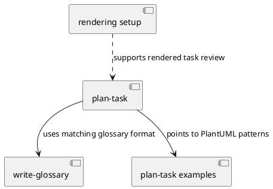
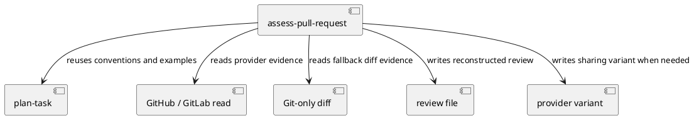
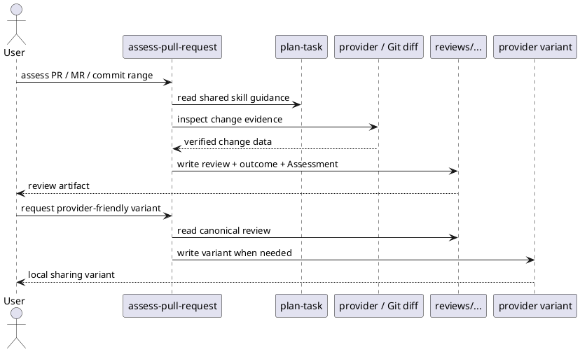

# Task: Create assess-pull-request skill

- **Task Identifier:** 2026-05-07-assess-pull-request
- **Scope:** Create a new `assess-pull-request` skill that analyzes an
  existing pull request, merge request, branch diff, or commit range and
  writes a reviewable review file. Reuse the `plan-task` skill's shared
  conventions, glossary policy, diagram guidance, and examples, while
  adding a global `Review outcome` near the beginning and an
  `Assessment` section as the last section of each generated review or
  review area. Support both local review-file output and optional
  provider-specific sharing variants on explicit user request. Include
  only the minimum repository documentation updates needed to expose the
  new skill.
- **Motivation:** Users may receive a pull request, merge request, or a
  ready-made branch without the planning artifacts that Spec Loop
  normally creates before implementation. A dedicated assessment skill
  would reconstruct the same durable review view from the implemented
  change, making review, traceability, and follow-up work easier
  without pretending the code is still waiting for implementation
  approval. When the user wants a provider-friendly shared version, the
  same reconstructed review should also be available in a target-
  specific variant when the canonical review format is not directly
  suitable.
- **Scenario:** A user is handed either a pull request / merge request
  page or ID, or a commit range, and asks the LLM to assess it. The LLM
  identifies the assessment mode, reads relevant repository context,
  reconstructs the implemented work as a review file, groups distinct
  change clusters into review areas only when the evidence justifies
  it, writes a global `Review outcome` near the beginning of the review,
  and ends each review or review area with an LLM-only `Assessment`
  section. In provider-backed mode it uses read-only provider commands
  to collect metadata, comments, discussion, commit history, and diff as
  assessment evidence. If the user later asks for a provider-friendly or
  Mermaid-based variant, the LLM checks the canonical review first.
  If the target provider can use the canonical format directly, no
  different version is needed. If the target provider requires a
  different diagram dialect, the LLM generates a sibling variant
  instead. The resulting artifacts help the human reviewer understand
  the change, its risks, and any missing follow-up work without treating
  the review as pre-implementation planning.
- **Constraints:**
  - Implement this as a separate skill named `assess-pull-request`.
    Do not extend `plan-task` in this first version.
  - Reuse the `plan-task` skill as a whole, not only
    `constitution.md`, so the new skill inherits the same task-section
    conventions, glossary policy, diagram rules, and supporting
    examples.
  - The output artifact is a review file, not a task file. Use review
    naming and storage that do not collide with the normal `tasks/`
    lifecycle.
  - Use review-specific headings and identifiers:
    - title line: `# Review: <title>`
    - identifier line remains either `- **Ticket:**` or
      `- **Task Identifier:**`
    - a global `- **Review outcome:**` line appears immediately after
      the identifier
    - review areas start with `## Review Area: <title>` followed
      by `- **Status:** <status>`.
  - `Review outcome` is the only place for the overall recommendation
    such as merge, request changes, or do not merge. Do not repeat that
    verdict inside `Assessment` sections.
  - Keep `Assessment` specific to `assess-pull-request` outputs.
    Do not add an `Assessment` section to `plan-task` or its
    Constitution.
  - `Assessment` must be the last section in every generated review and
    every generated review area. It contains only the LLM's local
    analytic assessment, never the overall review verdict and never
    human-review notes or decisions.
  - Distinguish verified facts from inferred intent. Base-state facts
    belong in `Research`; implemented target state belongs in `Design`;
    uncertainty, missing evidence, review risk, and unresolved provider
    discussion belong in `Assessment`.
  - If the comparison range is unclear, the skill must stop and ask
    instead of guessing.
  - Assume read-only provider commands are available for provider-backed
    mode. Assume provider write commands are blocked by the sandbox.
  - The skill must always reconstruct the local review artifact first.
    Sharing-variant generation is an optional output mode triggered only
    by an explicit user request.
  - For provider-backed assessments, generated reviews should use
    `- **Ticket:**` with a normalized provider reference such as
    `github:owner/repo#123` or `gitlab:group/project!456`. Keep the
    full review URL in `Briefing`.
  - Provider detection must work per reviewed project, not per machine.
    Detect the provider from the explicit review reference first. If
    that is not enough, inspect the repository origin / remote host.
    Support GitHub and GitLab, including self-hosted GitLab instances.
    If the provider is still unclear, stop and ask.
  - Support configurable local review-diagram modes:
    `inherit`, `plantuml`, `mermaid`, or `none`.
    When no explicit review mode is configured, derive the effective
    local review-diagram default from the project's task/review default
    plus the detected provider.
  - If the user requests a provider-friendly or Mermaid-based version,
    generate a separate sibling Markdown file only when the target
    provider cannot use the canonical review format directly. If the
    canonical review already matches the target provider's rendering
    support, or it has no diagrams, do not generate a different
    version. Do not change the local review file's configured diagram
    format.
  - Posting review content to a provider is outside this skill. The
    skill only generates or updates local review artifacts and optional
    local sharing variants.
  - If provider-backed read access fails, stop and ask whether to retry,
    provide the needed evidence manually, or fall back to Git-only mode.
  - Mermaid output should prefer simple, reliable diagrams over clever
    or compact ones. If a relationship is hard to express clearly in
    Mermaid, simplify the diagram and explain the rest in prose.
  - This local planning task should stay out of commits unless the User
    later explicitly asks otherwise.
- **Briefing:** This repository currently ships `plan-task`,
  `write-glossary`, and `setup-task-and-glossary-rendering`.
  `plan-task` already bundles `SKILL.md`, `constitution.md`, and a
  PlantUML example task. The new skill should read `plan-task` as a
  whole for shared artifact guidance, then apply a different workflow:
  it reconstructs work from an existing change instead of planning work
  before implementation. The skill should support both Git-only and
  provider-backed evidence, keep the full review artifact in a dedicated
  `reviews/` area, and optionally derive a provider-specific sharing
  variant from that artifact when the user asks and the canonical review
  format is not directly suitable. The design should assume that Fence
  permits read-only provider commands for inspection while blocking
  provider write commands.
- **Research:** The current repository contains three committed skills:
  `plan-task`, `write-glossary`, and
  `setup-task-and-glossary-rendering`. `plan-task` currently consists of
  `SKILL.md`, `constitution.md`, and
  `examples/example-task-wordle-cli.md`. `plan-task` defines the task
  lifecycle folders, task and subtask section ordering, glossary policy,
  diagram guidance, preferred use of `Ticket` when present, and
  PlantUML examples. The Constitution already uses `review` as a
  lifecycle state, but it does not define a `Review` artifact type, a
  `Review outcome` field, or a `Review` section in task files. No
  existing skill reconstructs a review from an existing pull request,
  merge request, branch diff, or commit range. In the current sandbox
  design, read-only `gh` commands can be allowed while mutating GitHub
  commands remain blocked. A corresponding GitLab path is needed,
  including self-hosted GitLab instances discovered from project origin.
  For GitHub sharing variants, Mermaid is the practical rendered diagram
  format when the canonical review uses PlantUML. GitLab can use
  PlantUML directly, so no Mermaid conversion is required there. For
  local review files, the diagram mode should be configurable per
  project or user preference.

- **Design:** Create `skills/assess-pull-request/SKILL.md` as a new
  skill entry point. The skill instructs the LLM to read the
  `plan-task` skill bundle first, then switch to a retrospective
  workflow tailored to existing changes. The skill should accept two
  evidence modes.

  In provider-backed mode, it uses an explicit pull request or merge
  request page, provider review ID, or equivalent reference and gathers
  evidence through provider-specific read-only commands.

  Provider detection order:
  - explicit review reference
  - repository origin / remote host
  - explicit user override
  - ask if still unclear

  Minimum provider-backed evidence contract:
  - provider metadata including at least title/body, URL, base ref,
    head ref, author, current state, and review identifier
  - provider discussion / comments
  - implemented diff
  - all commits in the reviewed provider range, including commit
    messages
  - optional read-only provider API requests when the normal provider
    commands do not expose enough review metadata.

  GitHub access path:
  - `gh pr view <pr> --json number,title,body,url,baseRefName,headRefName,author,state,isDraft`
  - `gh pr view <pr> --comments`
  - `gh pr diff <pr>`
  - optional GET-only `gh api` requests

  GitLab access path:
  - `glab mr view <mr> --json ...` when available
  - `glab mr diff <mr>` when available
  - optional read-only GitLab API requests when the CLI commands do not
    expose enough review metadata

  Use the provider metadata, full diff, all commits and commit messages
  in the reviewed range, and available discussion/comments as review
  evidence. The diff and implemented code remain the source of truth
  for what changed. Provider text, discussion, and commit messages help
  interpret motivation, risks, and logical change clusters.

  In Git-only mode, use explicit base and head commits, an explicit
  merged branch, or a user-approved branch diff to define the reviewed
  range. Analyze the full diff and all commits inside that range.
  Commit messages may be used as supplementary evidence for motivation,
  intent, and logical change clustering, but they do not override the
  implemented diff. If the user asks to assess uncommitted work instead,
  the skill may analyze a staged or working-tree diff only after that is
  made explicit.

  The skill always writes or updates a local review file in `reviews/`,
  because the implemented code already exists and the artifact's purpose
  is review. Use review-specific names such as
  `reviews/github-owner-repo-123.md`,
  `reviews/gitlab-group-project-456.md`, or a descriptive Git-only
  review name derived from the compared range. In provider-backed mode,
  generated reviews should use `Ticket` with a normalized provider
  reference and keep the full review URL in `Briefing`. In Git-only
  mode, generated reviews should use `Task Identifier`.

  The reconstructed review uses this exact order and layout:
  - title line: `# Review: <title>`
  - one identifier line: `- **Ticket:**` or `- **Task Identifier:**`
  - one global outcome line immediately after the identifier:
    `- **Review outcome:** <value>`
  - main sections in this order:
    - `- **Scope:**`
    - `- **Motivation:**`
    - `- **Scenario:**` (conditional)
    - `- **Constraints:**` (optional)
    - `- **Briefing:**`
    - `- **Research:**`
    - `- **Design:**`
    - `- **Test specification:**`
    - `- **Assessment:**`
  - review areas, when needed, come after global sections and use
    `## Review Area: <title>` followed by `- **Status:** <status>`
    and the same section ordering, ending with `Assessment`.

  `Review outcome` is the file-level recommendation derived from the
  full review, for example `merge`, `merge after minor improvements`,
  `request changes`, or `do not merge`. It should also include concise
  supporting bullets such as blockers, required improvements, and
  non-blocking improvements. `Assessment` remains the local analytic
  synthesis at the end of the review or review area and must not
  carry the global verdict.

  Diagram-mode rules:
  - local review files support explicit modes `inherit`, `plantuml`,
    `mermaid`, or `none`;
  - if the user or project sets an explicit review-diagram mode, use it;
  - otherwise start from the project's normal task/review diagram
    default and adjust it by the detected provider;
  - inherited `plantuml` + GitHub target => effective local default
    becomes `mermaid`;
  - inherited `plantuml` + GitLab target, including self-hosted
    GitLab => effective local default stays `plantuml`;
  - inherited `mermaid` => effective local default stays `mermaid`;
  - inherited `none` => effective local default stays `none`;
  - if the provider is still unknown, keep the inherited project
    default for the local review file and ask before generating any
    provider-specific sharing variant;
  - if the effective or explicit local review-diagram mode is
    `plantuml`, use the same PlantUML patterns and examples as
    `plan-task`;
  - if it is `mermaid`, generate Mermaid directly in the local review
    file;
  - if it is `none`, omit diagrams unless the user overrides the mode.

  Output options:
  - default output is the local review file;
  - if the user asks for a provider-friendly or Mermaid-based version,
    generate a sibling sharing variant only when the target provider
    cannot use the canonical review format directly;
  - GitHub target: if the canonical local review uses PlantUML, write
    `reviews/<review-base-name>.github.md` with Mermaid instead;
  - GitLab target, including self-hosted GitLab: if the canonical local
    review uses PlantUML, reuse it directly; no Mermaid conversion is
    required;
  - if the canonical local review already matches the target provider,
    or it has no diagrams, reuse the canonical review directly and do
    not create a separate variant;
  - when the effective local review default already reflects both the
    project default and the detected provider, a separate sharing
    variant is usually unnecessary;
  - keep the local review file in the configured or derived local
    review-diagram mode.

  Evidence priority and reconstruction rules:
  - implemented code, changed files, verified diff evidence, and the
    full commit range define what actually changed;
  - provider description or linked metadata, when available, is the
    preferred source for stated motivation and intended scope;
  - provider discussion and review comments, when available, may supply
    constraints, concerns, known tradeoffs, and follow-up work, but do
    not override implemented facts;
  - commit messages may help identify intent and logical change
    clusters, but do not override the implemented diff;
  - when motivation or intent must be inferred from Git-only evidence,
    the skill must say so explicitly;
  - when provider-backed mode is requested but read-only provider access
    fails, the skill must stop and ask before silently degrading the
    evidence source.

  Section mapping rules:
  - `Scope` comes from the actual changed deliverables and boundaries.
  - `Motivation` comes from explicit provider context when available;
    when it must be inferred, the skill should say so.
  - `Scenario` is included when behavior or shared terms changed.
  - `Constraints` capture explicit non-goals, compatibility limits,
    review boundaries, or restrictions discovered in the change or in
    provider discussion.
  - `Briefing` gives local repository orientation for the reviewer and,
    in provider-backed mode, stores the full review URL.
  - `Research` reconstructs the original state and bounded context.
    Start from the changed files and changed symbols revealed by the
    diff. Inspect their base-state versions, direct relationships, and
    relevant unchanged neighbors. Compare both the old version and the
    new version of the changed files against similar patterns within the
    same module to identify conventions the change follows, reuses, or
    breaks. By default, keep this pattern search within the changed
    module. Do not scan across multiple modules unless the diff itself
    spans them or the user explicitly approves that broader scope.
  - `Design` documents the implemented target state at the head commit.
    Focus on the resulting target structure, behavior, interfaces,
    interactions, and changed relationships. Use it to picture the
    reviewed end state, not to repeat the wider pattern hunt from
    `Research`.
  - `Test specification` captures changed tests, executed verification
    commands, coverage gaps, and missing verification evidence.
  - `Assessment` records the LLM's review conclusions, uncertainties,
    unresolved concerns, and required follow-up work. Review the change
    for test coverage, naming, structure, clean code, consistency with
    surrounding code, clarity, and complexity. Report the dimensions
    that materially affect the review outcome.

  The generated provider-specific sharing variant keeps the same review
  structure and substantive content as the canonical review. Its only
  required transformation is to adapt diagrams for the target provider's
  rendering support when needed. If the canonical review already matches
  the target provider, or it has no diagrams, no different version is
  needed.

  Review subtasks are created only when the diff breaks into distinct
  logical increments that a reviewer would naturally assess separately.
  A single coherent change should stay a single review. Human-review
  decisions, approval, and merge actions stay outside the generated
  review file, but provider-backed discussion may be summarized in
  `Assessment` when it changes the review risk picture.

- **Test specification:** Verify the new skill at four levels.
  First, repository discovery: `npx skills add . -l --full-depth`
  should list `assess-pull-request`. Second, documentation and artifact
  structure: read the generated `SKILL.md` and confirm that it reuses
  `plan-task` as a whole, writes to `reviews/`, requires `Assessment`
  as the last section of each generated review or review area,
  defines both the canonical local review file and optional provider-
  specific sharing-variant behavior, and uses the exact review-file
  heading/order rules above.
  Third, functional assessment behavior: run the skill in both evidence
  modes against a small known change. In Git-only mode, use a commit
  range or branch diff and confirm that it reconstructs `Research` from
  the base state plus bounded same-module pattern analysis, `Design`
  from the implemented target, creates review areas only for real
  logical change clusters, and clearly marks inferred motivation when
  needed. In provider-backed mode, use a pull
  request or merge request reference and confirm that the skill uses the
  read-only provider evidence contract above, including all commits and
  commit messages in the reviewed range, uses a normalized `Ticket`,
  stores the full review URL in `Briefing`, derives a file-level
  `Review outcome`, incorporates provider description, discussion, and
  commit messages into `Motivation`, `Constraints`, subtask grouping,
  or `Assessment` without overriding implemented facts, derives the
  effective local diagram mode from the project default plus the
  detected provider when no explicit review mode is configured, and
  records the materially relevant quality findings for test coverage,
  naming, structure, clean code, consistency, clarity, and complexity
  without boilerplate filler.
  Fourth, provider-specific sharing-variant behavior: ask the skill for
  a provider-friendly version of a reconstructed provider-backed review
  and verify that it writes a separate sibling file only when the target
  provider cannot use the canonical review format directly, preserves
  the configured local review-file diagram mode, reuses the canonical
  review directly when it already matches the target provider or has no
  diagrams, converts PlantUML review diagrams to Mermaid for GitHub
  when needed, leaves PlantUML unchanged for GitLab when applicable,
  keeps the same review structure and substantive content, and treats
  provider posting as outside the skill.

## Subtask: Refine review reconstruction for human decision support
- **Status:** review
- **Scope:** Update `skills/assess-pull-request/SKILL.md` and
  `skills/assess-pull-request/review-guidance.md` so the generated
  review reconstructs the reviewed change itself, not the review
  activity, and decomposes substantial pull requests into task-like
  review areas for detailed human review preparation.
- **Motivation:** The first live use of the skill produced a
  verdict-first review that under-described pull-request scope,
  motivation, and logical work areas. Human reviewers need the artifact
  to explain what the pull request adds, changes, or removes and why,
  before the AI recommendation layer.
- **Scenario:** A user asks for assessment of an already-implemented
  pull request. The skill reconstructs the pull request as if it were a
  retrospective `plan-task` task file with review-specific headings,
  keeping `Scope` and `Motivation` tied to the implemented change and
  organizing major change areas as `Review Area` sections. The human
  reviewer then uses the reconstructed detail plus the AI `Assessment`
  to decide what to inspect, question, or approve.
- **Briefing:** The existing skill already reuses `plan-task` for
  section ordering and diagram guidance, but its wording emphasizes
  retrospective review more than retrospective task reconstruction.
  The updated wording should preserve the existing evidence contract,
  review format, and provider-variant behavior while making the human
  review-preparation purpose explicit.
- **Research:** The current `SKILL.md` says the skill reconstructs a
  review file from an existing pull request or diff, but it does not
  explicitly say that the result should anticipate the missing
  `plan-task` artifact. `review-guidance.md` defines section ordering
  and evidence collection, yet it leaves room to interpret `Scope` and
  `Motivation` as properties of the review instead of the implemented
  change. It also says review areas are used only when needed,
  without explicitly steering large pull requests toward task-like
  decomposition by logical work area. The first generated review
  followed those ambiguities.
- **Design:** Clarify the skill in three places:
  - `SKILL.md` should define the artifact as a detailed human-review-
    preparation document that retrospectively reconstructs the task file
    that should have existed under `plan-task`.
  - `SKILL.md` should state that `Scope` and `Motivation` describe the
    reviewed change itself and that multi-area changes should usually be
    decomposed into `Review Area` sections.
  - `review-guidance.md` should add an explicit purpose section,
    strengthen the mapping of `Scope`, `Motivation`, `Research`,
    `Design`, and `Assessment`, and tell the LLM to organize large
    reviewed changes into logical task-like review areas.
- **Test specification:**
  - Automated tests: N/A
  - Manual tests:
    - re-read the updated skill files and confirm that they frame the
      artifact as human review preparation and retrospective
      `plan-task` reconstruction
    - confirm that the section-mapping rules define `Scope` and
      `Motivation` as pull-request properties rather than review
      properties
    - confirm that the guidance now pushes substantial multi-area pull
      requests toward detailed `Review Area` decomposition
- **Assessment:** The requested refinement is contained to the skill
  wording. It changes guidance, not repository runtime behavior, and is
  locally verifiable by reading the updated Markdown.

## Subtask: Strengthen scenario, briefing, and trade-off analysis
- **Status:** review
- **Scope:** Update `skills/assess-pull-request/SKILL.md` and
  `skills/assess-pull-request/review-guidance.md` so the generated
  review treats `Scenario` and `Briefing` as primary human-review
  support sections both globally and within each `Review Area`, and
  requires explicit pro/contra and complexity-justification analysis in
  each `Assessment`.
- **Motivation:** The refined review format now reconstructs the pull
  request more effectively, but human review still needs stronger help
  with two questions: how to enter the review efficiently, and whether
  each part's added complexity is justified by its benefits. The skill
  should guide the LLM to answer both directly.
- **Scenario:** A human reviewer opens a reconstructed PR review and
  needs to understand the likely use cases, the best reading order, the
  strategic hotspots, the advantages and disadvantages of each change
  area, and whether the increased or reduced complexity appears
  justified. The skill guides the LLM to provide that information
  without forcing artificial balance when the evidence clearly points in
  one direction.
- **Briefing:** `Scenario` and `Briefing` already exist because the
  review intentionally mirrors `plan-task` structure. The next
  refinement is to make them more operational for human review.
  `Assessment` also needs stronger trade-off guidance so the review can
  help decide not only whether the PR is broken, but whether its design
  direction and complexity are worth keeping, simplifying, splitting,
  or dropping.
- **Research:** The current local version of the skill already defines
  the review as a human review-preparation artifact and organizes large
  changes into `Review Area` sections. However, it does not yet say
  strongly enough that `Scenario` and `Briefing` should be treated as
  equally important not only globally but also within review areas.
  It also does not yet require each `Assessment` to discuss pros,
  cons, complexity added or reduced, and whether the trade-off is
  justified. In addition, `SKILL.md` currently repeats substantial
  review semantics that should live only in `review-guidance.md`, which
  blurs the split between orchestration and guidance.
- **Design:** Clarify the skill in four ways:
  - trim `SKILL.md` so it serves only as orchestration and entry-point
    guidance
  - make `review-guidance.md` the authoritative source for review
    structure, section semantics, assessment style, and review-area
    behavior
  - strengthen `review-guidance.md` so `Scenario` usually reconstructs
    the main use cases or operational flows and `Briefing` provides the
    reviewer with change map, reading order, hotspots, and strategic
    questions both globally and within each review area
  - require the global `Assessment`, each `Review Area` `Assessment`,
    and `Review outcome` to analyze pros, cons, complexity increases or
    reductions, and whether the resulting trade-off is justified,
    without inventing false balance when the evidence is one-sided
- **Test specification:**
  - Automated tests: N/A
  - Manual tests:
    - re-read the updated skill files and confirm that `SKILL.md`
      serves as orchestration and points to `review-guidance.md` as the
      authoritative source
    - confirm that `review-guidance.md` makes `Scenario` and
      `Briefing` first-class review aids both globally and within each
      `Review Area`
    - confirm that `Assessment` now requires pro/contra and
      complexity-justification analysis
    - confirm that the guidance explicitly warns against false balance
      while still encouraging differentiated trade-off analysis when the
      evidence is mixed
- **Assessment:** The requested refinement stays within skill wording
  and review semantics. It is locally verifiable by reading the updated
  Markdown and checking that the new guidance is explicit, internally
  consistent, and aligned with the review purpose.

## Subtask: Separate intent from implementation in review analysis
- **Status:** review
- **Scope:** Update `skills/assess-pull-request/review-guidance.md`
  and, only as needed, `skills/assess-pull-request/SKILL.md` so the
  reconstructed review analyzes each review area and the overall PR from
  two explicit perspectives: intent and implementation.
- **Motivation:** Human review needs help distinguishing between
  whether a pull request is pursuing the right change at all and whether
  the submitted code realizes that change correctly. A review that mixes
  these together makes it harder to judge strategic value separately
  from code quality and completeness.
- **Scenario:** A human reviewer reads a reconstructed PR review and
  wants to answer two different questions for the whole PR and for each
  review area: are we doing the right thing, and are we doing the thing
  right? The skill guides the LLM to present both perspectives clearly,
  including cases where the intent is sound but the implementation is
  weak, or where the implementation is competent but the direction
  itself is questionable.
- **Briefing:** The current guidance already reconstructs motivation,
  scenario, briefing, research, design, and trade-off analysis. The new
  refinement should not replace those sections. Instead, it should make
  `Assessment` and `Review outcome` explicitly synthesize the reviewed
  area's intent and implementation separately.
- **Research:** The current local version of the skill already requires
  pros, cons, and complexity-justification analysis, but it still does
  not explicitly tell the LLM to separate strategic correctness from
  implementation correctness. That leaves too much room for blended
  judgments where a bad implementation obscures a good idea or vice
  versa.
- **Design:** Clarify the guidance so that:
  - the global `Assessment` and `Review outcome` explicitly analyze the
    whole PR's intent and implementation separately
  - each `Review Area` `Assessment` explicitly analyzes the local
    intent and local implementation separately
  - the guidance explains that intent asks whether the reviewed change
    is the right thing to pursue, while implementation asks whether it
    is realized correctly, coherently, safely, and completely
  - the resulting judgment may be asymmetric, for example good intent
    with weak implementation or questionable intent with solid local
    implementation
- **Test specification:**
  - Automated tests: N/A
  - Manual tests:
    - re-read the updated guidance and confirm that intent vs
      implementation analysis is explicit at both global and review-area
      levels
    - confirm that the guidance distinguishes strategic correctness from
      implementation correctness without collapsing them into one score
    - confirm that the split coexists cleanly with pro/contra and
      complexity-justification analysis
- **Assessment:** This refinement stays within review semantics and is
  locally verifiable by reading the updated Markdown. It clarifies how
  to reason about reviewed work without changing the overall file
  structure.

## Subtask: Refine split recommendations, English translation, and tone
- **Status:** review
- **Scope:** Update `skills/assess-pull-request/review-guidance.md`
  and, only as needed, `skills/assess-pull-request/SKILL.md` so the
  review can recommend splitting an oversized PR into smaller PRs,
  suggest a sensible first slice, translate non-English comments or
  names into English in the review, and use measured professional
  language suitable for possible direct posting on the provider.
- **Motivation:** A reconstructed review should help a human reviewer
  decide not only whether the PR should merge, but also whether it
  should be split and which part is the best starting point. If the
  review may be posted directly on the PR, it should also stay in
  English and avoid unnecessarily harsh wording.
- **Scenario:** A user wants to post or adapt the generated review for
  direct PR discussion. The review recommends that a branch be split,
  names the best first follow-up PR candidate, translates relevant
  non-English source comments or names into English, and uses factual,
  professional wording such as "not ready to merge" or "not yet
  complete" instead of more confrontational phrasing.
- **Briefing:** The current guidance already supports keep/simplify/
  split/defer/drop judgments and English Markdown output. The new
  refinement should make split recommendations more operational and tone
  more provider-friendly.
- **Research:** The current local guidance allows recommendations such
  as split or defer, but it does not explicitly tell the LLM to suggest
  the first slice to start with when recommending a split. It also does
  not explicitly require translation of non-English source comments or
  names into English in the review, nor does it clearly steer tone away
  from blunt phrases that may read as harsher than intended in a PR
  conversation.
- **Design:** Clarify the guidance so that:
  - `Review outcome` may recommend splitting the reviewed branch into
    multiple PRs and should suggest the first slice when that would help
  - the review is written in English, and relevant non-English source
    comments, names, or terms are translated into English in the review,
    with originals retained only when needed for traceability
  - the review uses professional, factual, non-inflammatory language
    suitable for possible direct posting on the provider
  - strong negative findings are still stated clearly, but phrased in a
    measured way such as "not ready to merge", "not yet complete", or
    "does not currently demonstrate" rather than reflexively using
    harsher labels
- **Test specification:**
  - Automated tests: N/A
  - Manual tests:
    - re-read the updated guidance and confirm that split
      recommendations can name the first suggested PR slice
    - confirm that the guidance now requires English translation of
      relevant non-English source comments or names in the review
    - confirm that the guidance explicitly prefers measured,
      provider-friendly wording without weakening clear findings
- **Assessment:** This refinement stays within review semantics and is
  locally verifiable by reading the updated Markdown. It improves the
  review's usefulness for direct collaboration without changing the file
  structure.

## Subtask: Make review-area diagrams explicit and mandatory
- **Status:** review
- **Scope:** Update `skills/assess-pull-request/review-guidance.md` so
  diagrams are clearly required in reviews and review areas whenever the
  reviewed design changes materially, and then apply that guidance to
  the current reconstructed review.
- **Motivation:** The project constitution already treats diagrams as a
  must-have whenever design changes materially. The retrospective review
  should preserve that insight source, especially for review areas with
  large structural or interaction changes. Global diagrams alone are not
  enough.
- **Scenario:** A human reviewer opens a reconstructed PR review for a
  large multi-area branch. They need area-level diagrams to understand
  structure, flows, and changed boundaries without reconstructing them
  mentally from prose and file lists. The guidance makes those diagrams
  mandatory whenever design changes materially, and the review includes
  them accordingly.
- **Briefing:** The existing skill already inherits general diagram
  rules from `plan-task`, but the review guidance does not yet state
  strongly enough that review-area diagrams are required for major
  design changes. The refinement should make that expectation explicit
  and ensure that the current PR review follows it.
- **Research:** The current local guidance already references diagram
  handling and inherits the `plan-task` conventions, but it still leaves
  too much room to rely only on global diagrams. In a large review, that
  weakens reviewer comprehension exactly where diagrams are most useful.
- **Design:** Clarify the guidance so that:
  - retrospective reviews apply the `plan-task` diagram rules fully
  - diagrams are mandatory whenever the reviewed change or review area
    changes structure, component interaction, runtime flow, or workflow
    in a non-trivial way
  - global diagrams do not replace review-area diagrams for major change
    areas
  - at minimum, each materially changed review area should include a
    `Design` diagram, and a `Research` diagram when understanding the
    prior boundary or flow materially helps review
- **Test specification:**
  - Automated tests: N/A
  - Manual tests:
    - re-read the updated guidance and confirm that review-area diagram
      requirements are explicit and mandatory for material design
      changes
    - confirm that the current PR review now includes diagrams in the
      major review areas with substantial design change
- **Assessment:** This refinement stays within review semantics and is
  locally verifiable by reading the updated Markdown. It strengthens a
  project-level expectation that was already implicit and makes it
  operational for retrospective review.

## Subtask: Make retrospective test specification reconstructive
- **Status:** review
- **Scope:** Update `skills/assess-pull-request/review-guidance.md` so
  `Test specification` in reconstructed reviews explains what should be
  tested, why it matters, what evidence exists, and whether the current
  tests and assertions appear sufficient, then apply that guidance to
  the current PR review.
- **Motivation:** In planned task files, `Test specification` is a real
  verification plan rather than a list of test classes. The
  retrospective review should reconstruct the same information so a
  human reviewer can judge whether the changed code is tested
  appropriately and whether the existing tests seem meaningful.
- **Scenario:** A human reviewer reads a reconstructed PR review and
  wants to know what behavior, contracts, regressions, and integration
  points should be covered by tests in each review area. The review then
  compares those expected tests with the changed tests and verification
  evidence that actually exist, and comments on sufficiency and
  assertion quality.
- **Briefing:** The current local guidance already separates `Research`,
  `Design`, and `Assessment`, but `Test specification` is still too easy
  to interpret as a list of changed test files and commands. The
  refinement should make it reconstructive and evaluative.
- **Research:** The current guidance says `Test specification` captures
  changed tests, claimed verification, executed verification commands,
  coverage gaps, and missing verification evidence. That wording is not
  yet strong enough to require reconstruction of what ought to be
  tested, nor does it clearly ask the reviewer to judge whether the
  current tests seem sufficient and whether their assertions appear to
  validate the intended behavior.
- **Design:** Clarify the guidance so that:
  - `Test specification` first reconstructs the expected verification
    scope from the reviewed behavior and design
  - it then lists the actual test evidence and verification commands
  - it explicitly comments on coverage sufficiency, missing test types,
    integration gaps, and whether the current assertions appear to
    validate the claimed behavior rather than only exercising code paths
  - this applies both globally and within each `Review Area`
- **Test specification:**
  - Automated tests: N/A
  - Manual tests:
    - re-read the updated guidance and confirm that `Test specification`
      now reconstructs what should be tested before listing existing
      tests
    - confirm that the guidance explicitly asks for judgment about test
      sufficiency and apparent assertion quality
    - confirm that the current PR review now contains real test
      specifications rather than test-file inventories alone
- **Assessment:** This refinement stays within review semantics and is
  locally verifiable by reading the updated Markdown. It makes the
  retrospective review more useful for judging verification quality.
