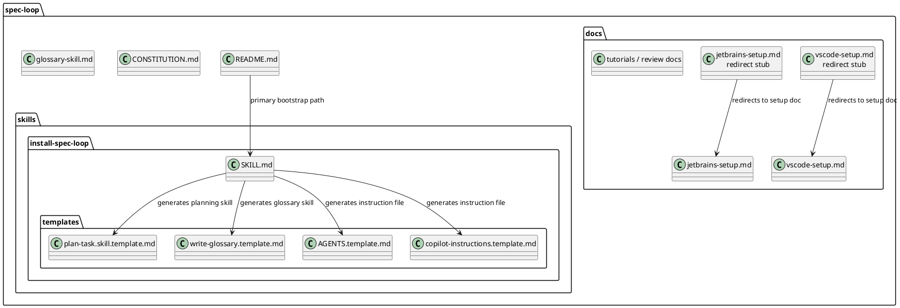
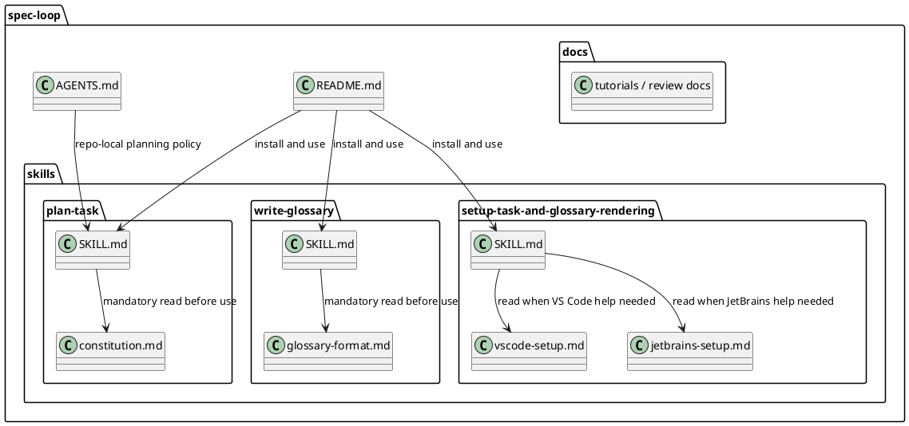

# Task: Restructure Spec Loop as a committed multi-skill repository

- **Task Identifier:** 2026-05-06-multi-skill
- **Scope:** Replace the bridge installer-centered repository shape with a
  committed multi-skill repository that exposes `plan-task`,
  `write-glossary`, and `setup-task-and-glossary-rendering`, while
  preserving the Constitution and glossary-format guidance as separate
  canonical files.
- **Motivation:** The current bridge proved useful for exploring
  packaging, glossary, and setup ideas, but the long-term product should
  be a real `npx skills` multi-skill repository with cleaner
  responsibility boundaries and less bootstrap complexity.
- **Scenario:** A user installs this repository with verified
  `npx skills` commands and receives three committed skills. When the
  user needs implementation preparation or an implementation readiness
  check, the agent selects `plan-task` and reads its local
  `constitution.md`. When glossary format work is required, the agent
  selects `write-glossary` and reads its local `glossary-format.md`.
  When the user needs help rendering task files or glossary files, the
  agent selects `setup-task-and-glossary-rendering` instead of a
  bootstrap installer.
- **Constraints:**
  - Treat the current committed `install-spec-loop` state as a migration
    baseline, not as the final architecture.
  - Move `CONSTITUTION.md` and `glossary-skill.md` into their owning
    skill directories without rewriting their substantive content. Only
    minor path-sensitive or framing edits are allowed when necessary.
  - Rename the moved glossary companion file to `glossary-format.md`.
  - Do not split the setup documentation into more files than the
    repository already has. Reuse the existing VS Code and JetBrains
    setup documents.
  - Do not keep a skill whose main job is installing or updating the
    other skills. Repository installation should be handled by
    `npx skills`.
  - Use `git mv` for every tracked file move or rename.
  - Verify published `npx skills` commands against actual tool behavior
    before final README wording is accepted.
  - Keep reusable skill behavior separate from repository-local policy.
- **Briefing:** The repository currently has one real skill,
  `skills/install-spec-loop/SKILL.md`, plus bridge-only templates and
  copied setup docs under that directory. Root `docs/vscode-setup.md`
  and `docs/jetbrains-setup.md` are redirect stubs. There is no root
  `AGENTS.md` yet. The Wordle example task files show the expected
  task-file format but are not part of the reusable skill packaging.
- **Research:** The current repository shape is bridge-oriented rather
  than product-oriented. Canonical governance and glossary guidance
  still live at the repository root as `CONSTITUTION.md` and
  `glossary-skill.md`. The only committed operational skill is
  `skills/install-spec-loop/SKILL.md`, which currently mixes four
  concerns: choosing installation form, generating `plan-task` and
  `write-glossary` outputs from templates, installing or updating
  instruction files, and guiding editor setup. The real setup content
  already lives under `skills/install-spec-loop/docs/`, while the root
  `docs/vscode-setup.md` and `docs/jetbrains-setup.md` are redirect
  stubs that point there. The repository root currently has no
  `AGENTS.md`, so there is no small repo-local policy layer distinct
  from the active skill content. The README still presents
  `install-spec-loop` as the primary bootstrap path and still describes
  bridge-specific ideas such as generated skills and instruction-file
  installs. The example task files under `examples/wordle/tasks/`
  confirm the current task-file format and show that the repository
  already carries enough precedent to plan the migration as a normal
  Spec Loop task. The bridge state is now committed and can be treated
  as a stable migration baseline rather than as unfinished work.



  The target design should keep the valuable content but invert the
  ownership model: the repository should commit the real skills
  directly, and setup help should become one of those skills instead of
  a bootstrap mechanism.
- **Design:** Convert the repository into a committed three-skill
  package and make bridge logic historical. The target canonical skill
  tree is:

```text
spec-loop/
  README.md
  AGENTS.md
  docs/
    infographics.svg
    online-art-game-tutorial.md
    review-responsibility-and-traceability.md
    wordle-tutorial.md
  skills/
    plan-task/
      SKILL.md
      constitution.md
    write-glossary/
      SKILL.md
      glossary-format.md
    setup-task-and-glossary-rendering/
      SKILL.md
      vscode-setup.md
      jetbrains-setup.md
```

  `skills/install-spec-loop/` and its templates do not survive as a
  permanent product surface. Their useful setup guidance is absorbed
  into `setup-task-and-glossary-rendering`, while their package-install
  and generated skill logic is removed. `CONSTITUTION.md` becomes the
  canonical `skills/plan-task/constitution.md`, and the current root
  glossary guidance becomes the canonical
  `skills/write-glossary/glossary-format.md`. The new skill-local
  `SKILL.md` files act as front doors and should not inline the full
  content of those moved companion files. Root `docs/vscode-setup.md`,
  `docs/jetbrains-setup.md`, `CONSTITUTION.md`, and
  `glossary-skill.md` should be removed after their canonical moved
  copies are in place. Add a small root `AGENTS.md` for repository-local
  policy only. It should require `plan-task` for non-trivial repository
  changes, state that example-specific `AGENTS.md` files in example
  projects must be read and applied, explain that this repository
  itself has no project glossary, and avoid duplicating the
  Constitution or full skill bodies. The default glossary policy moves
  into `plan-task`:
  glossary use is opted in by default, and project or session
  instructions may opt out. `write-glossary` becomes mandatory for
  AsciiDoc glossaries unless project or session instructions explicitly
  opt out. Keep front matter simple in the first pass: `name` and a
  precise `description` are required; release metadata such as version
  fields is deferred until the release model is agreed and verified.



  Implementation should proceed in skill-specific subtasks first and
  then in one final integration subtask that updates repository docs,
  removes bridge files, and verifies installation commands.
- **Test specification:**
  - Automated tests:
    - N/A unless implementation adds a repository validation script. If
      such a script is added, run it before moving the task to review.
  - Manual tests:
    - Verify the final `README.md` only documents `npx skills`
      commands that were actually tested against the repository layout.
    - Install the repository into a temporary sandbox with the verified
      project-local command and confirm that exactly `plan-task`,
      `write-glossary`, and `setup-task-and-glossary-rendering` are
      discoverable.
    - Prompt each installed skill once and confirm it reads only its
      owned companion documents instead of trying to generate other
      skills.
    - Check that removed bridge files and obsolete redirect stubs are
      no longer referenced from the repository.

## Subtask: Create the committed `plan-task` skill

- **Status:** review
- **Scope:** Create `skills/plan-task/SKILL.md`, move the Constitution
  into `skills/plan-task/constitution.md`, and define the planning
  skill as a direct repository artifact rather than a generated
  template.
- **Motivation:** Planning is the primary Spec Loop capability and
  should be installable directly without a bootstrap generation step.
- **Scenario:** When an agent selects `plan-task`, it uses the skill
  for implementation preparation and implementation readiness checks by
  creating, managing, and verifying the task files whose approved
  content is required before implementing code, test, or configuration
  changes. It reads `./constitution.md`, follows project instructions
  such as `AGENTS.md` when present, and returns to this skill again if
  implementation must meaningfully deviate from the approved task
  content.
- **Constraints:**
  - Keep the Constitution content separate from `SKILL.md`.
  - Do not duplicate Constitution rules in `SKILL.md`.
  - Do not add installation or editor-setup behavior to this skill.
  - Make it explicit in both front matter and body that using this
    skill is mandatory unless the user explicitly opts out for the
    current project or session.
  - Use `git mv CONSTITUTION.md skills/plan-task/constitution.md`.
- **Briefing:** The current template under
  `skills/install-spec-loop/templates/plan-task.skill.template.md` is
  useful source material, but the final committed skill should be much
  shorter, point to the Constitution, and avoid repeating the method it
  governs.
- **Research:** The current bridge template mixes planning guidance with
  installer-provided defaults. That is too specific for a committed
  reusable skill. The root Constitution is already compact enough to
  stay as a separate companion file, and the skill should stay short so
  the model does not mistake the short wrapper for the full method.
  The current Constitution glossary section is already mostly
  format-neutral, but after introducing an optional `write-glossary`
  skill it should gain one short clarification: glossary updates remain
  mandatory when required by the Constitution even if `write-glossary`
  is unavailable, while Spec Loop AsciiDoc glossaries should use
  `write-glossary` if available.
- **Design:**
  - Move the Constitution with
    `git mv CONSTITUTION.md skills/plan-task/constitution.md`.
  - Apply one minimal glossary-related clarification in the moved
    `constitution.md`: in the `Project glossary` section, state that
    required glossary updates still must be performed even when the
    `write-glossary` skill is unavailable; when the project glossary
    uses the Spec Loop AsciiDoc format, use `write-glossary` if
    available; otherwise update the glossary directly in the active
    project format.
  - Create `skills/plan-task/SKILL.md` with exactly this content:

```md
---
name: plan-task
description: >-
  Create, manage, and verify the task files whose approved content is
  required for task-based work before implementing code, test, or
  configuration changes. Use for implementation preparation,
  implementation readiness checks, and returning work to planning when
  implementation must meaningfully deviate from the approved task
  content. This skill is mandatory unless the user explicitly opts out
  for the current project or session.
---

Use for implementation preparation and implementation readiness checks
by creating, managing, and verifying the task files whose approved
content is required before implementing code, test, or configuration
changes.

This skill is mandatory unless the user explicitly opts out for the
current project or session.

This skill is defined by [constitution.md](./constitution.md). Read
that file and follow it before using this skill.

Read and apply project instructions such as `AGENTS.md` when present.

Default glossary policy:

- glossary use is opted in;
- project or session instructions may opt out;
- when the project uses the Spec Loop AsciiDoc glossary, use
  `write-glossary`;
- otherwise follow the project's glossary format.

If implementation must meaningfully deviate from the approved task
content, use this skill again before continuing.
```

- **Test specification:**
  - Automated tests:
    - N/A.
  - Manual tests:
    - Ask a sandbox agent to use `plan-task` for a non-trivial coding
      request and confirm it reads
      `skills/plan-task/constitution.md` before planning.
    - Ask the same agent for a readiness-check workflow and confirm the
      skill description makes task file editing and management explicit.
    - Ask for a planning task in a repository with `AGENTS.md` policy
      and confirm the skill reads policy from there instead of relying
      on bridge-era installer defaults.
    - Present a project with `glossary.adoc` and no available
      `write-glossary` skill and confirm the moved Constitution still
      requires glossary updates rather than treating the missing skill
      as an exemption.
    - Present a project with `glossary.adoc` and an available
      `write-glossary` skill and confirm the moved Constitution routes
      the agent to `write-glossary` for the format-specific work.

## Subtask: Create the committed `write-glossary` skill

- **Status:** review
- **Scope:** Create `skills/write-glossary/SKILL.md`, move the current
  glossary guidance into that skill directory as `glossary-format.md`,
  and keep glossary policy separate from glossary format.
- **Motivation:** The repository needs a glossary-format skill that can
  be installed directly while remaining cleanly separated from planning
  policy.
- **Scenario:** When project policy, the user, or `plan-task` requires
  a Spec Loop AsciiDoc glossary artifact, the agent selects
  `write-glossary`, reads `./glossary-format.md`, and updates the
  glossary in that format without deciding glossary policy itself.
- **Constraints:**
  - Keep glossary policy outside this skill.
  - Keep the moved glossary guidance separate from `SKILL.md`.
  - Do not duplicate glossary-format rules in `SKILL.md`.
  - Make it explicit in both front matter and body that using this
    skill is mandatory for AsciiDoc glossaries unless the user
    explicitly opts out for the current project or session.
  - Use `git mv glossary-skill.md skills/write-glossary/
    glossary-format.md`.
- **Briefing:** The current root glossary document is already the
  canonical format guide. The committed skill should become a thin
  front door that points to it and explains when the format skill
  applies.
- **Research:** The current glossary guidance defines a concrete Spec
  Loop glossary format and file naming. That makes it a good companion
  document for `write-glossary`, but also means the skill should stay
  short and should not restate the format rules that live in the moved
  companion file.
- **Design:** Create `skills/write-glossary/SKILL.md` with exactly this
  content:

```md
---
name: write-glossary
description: >-
  Create or update glossary entries in the Spec Loop AsciiDoc glossary
  format. Use when the user, project instructions, or `plan-task`
  already requires a glossary artifact. This skill is mandatory for
  AsciiDoc glossaries unless the user explicitly opts out for the
  current project or session.
---

Use for creating or updating a glossary in the Spec Loop AsciiDoc
format.

This skill is mandatory for AsciiDoc glossaries unless the user
explicitly opts out for the current project or session.

Before doing that work, read [glossary-format.md](./glossary-format.md)
and apply it.

Read and apply project instructions such as `AGENTS.md` when present.

This skill defines the glossary format. It does not decide whether a
glossary is required.

Do not use this skill for non-AsciiDoc glossaries unless the user
explicitly asks to migrate or override the project policy.
```

- **Test specification:**
  - Automated tests:
    - N/A.
  - Manual tests:
    - Ask a sandbox agent to update a project with existing
      `glossary.adoc` and confirm it reads
      `skills/write-glossary/glossary-format.md` before proposing
      edits.
    - Ask for planning-only work with no glossary requirement and
      confirm the skill description does not attract unnecessary
      routing.
    - Present a project with `glossary.md` only and confirm the skill
      does not silently convert it.

## Subtask: Create the committed `setup-task-and-glossary-rendering` skill

- **Status:** review
- **Scope:** Create `skills/setup-task-and-glossary-rendering/SKILL.md`,
  move the existing VS Code and JetBrains setup documents into that
  skill directory, and retire `install-spec-loop` as a bootstrap
  installer.
- **Motivation:** Setup help is still valuable, but it should be a
  focused reusable skill rather than a package installer and template
  generator.
- **Scenario:** A user asks how to set up or fix rendering for task
  files or glossary files in Spec Loop work. The agent selects
  `setup-task-and-glossary-rendering`, reads the relevant setup
  document from the skill directory, explains the steps, and does not
  try to install or update Spec Loop skills.
- **Constraints:**
  - Reuse the existing VS Code and JetBrains setup docs instead of
    splitting them into additional setup files.
  - Keep `SKILL.md` short and make it point to the setup docs instead
    of repeating them.
  - Remove package-install logic, template generation, and
    source-repository detection from the final setup skill.
  - Use `git mv` for tracked setup-document moves.
- **Briefing:** The current `install-spec-loop` skill already contains
  the real setup documents, but they are wrapped in bootstrap-specific
  logic that should not survive.
- **Research:** The repository already has two authoritative setup
  documents under `skills/install-spec-loop/docs/`. Root setup docs are
  redirect stubs. The new setup skill should reveal its purpose through
  its name and use the moved setup docs as its real content.
- **Design:** Move the canonical setup docs with `git mv` to:
  - `skills/setup-task-and-glossary-rendering/vscode-setup.md`
  - `skills/setup-task-and-glossary-rendering/jetbrains-setup.md`

  Create `skills/setup-task-and-glossary-rendering/SKILL.md` with
  exactly this content:

```md
---
name: setup-task-and-glossary-rendering
description: >-
  Help set up and troubleshoot rendering for task files and glossary
  files. Use when the user asks about PlantUML, AsciiDoc, VS Code,
  JetBrains, preview rendering, Java, or Graphviz needed to review
  rendered task or glossary files.
---

Use for setting up or fixing rendering of task files and glossary
files.

For VS Code, read [vscode-setup.md](./vscode-setup.md).
For JetBrains IDEs, read [jetbrains-setup.md](./jetbrains-setup.md).

Use only the setup documents that actually exist here.

For Spec Loop skill installation or updates, tell the user to follow
the installation instructions in the Spec Loop GitHub repository README
and share:

- `npx skills add dpolivaev/spec-loop`
- global installation is available, and the agent-specific details are
  documented at https://github.com/vercel-labs/skills
- https://github.com/dpolivaev/spec-loop
- https://github.com/vercel-labs/skills
```

- **Test specification:**
  - Automated tests:
    - N/A.
  - Manual tests:
    - Ask a sandbox agent how to set up VS Code for Spec Loop and
      confirm it reads the moved VS Code document before answering.
    - Ask how to install Spec Loop skills and confirm the skill shares
      the base `npx skills add dpolivaev/spec-loop` command, mentions
      that global installation details come from the Skills repository,
      and gives the Spec Loop and Skills repository links instead of
      acting as an installer.
    - Ask about a broken PlantUML or AsciiDoc preview and confirm the
      skill reads the relevant setup doc before suggesting fixes.

## Subtask: Integrate the repository docs and remove bridge packaging

- **Status:** review
- **Scope:** Add root `AGENTS.md`, update `README.md` and the tutorials,
  remove bridge-only files and references, verify install commands, and
  document the manual fallback path.
- **Motivation:** After the three committed skills exist, the
  repository-level docs and policy must describe the new product shape
  clearly and stop teaching the bridge architecture.
- **Scenario:** A maintainer opens the repository and sees a small local
  policy file, a README that explains verified install and update
  commands, tutorials that reference the committed skills, and no
  remaining bridge-only packaging path.
- **Constraints:**
  - Root `AGENTS.md` must stay short and must not mention the
    Constitution.
  - Root `AGENTS.md` must state that this repository has no glossary.
  - Root `AGENTS.md` must tell agents to read and apply
    example-specific `AGENTS.md` files when they exist.
  - Remove bridge-only packaging paths including
    `.github/copilot-instructions` references.
  - Document a manual fallback for environments where `npx` is
    unavailable.
- **Briefing:** This subtask ties together the skill work and removes
  the old packaging story from the repository surface.
- **Research:** The current root has no `AGENTS.md`. The README still
  teaches bootstrap installation through `install-spec-loop`. The
  tutorials still describe setup through bridge language. The repository
  already has redirect-style setup docs, but the new direction is to
  remove those root stubs instead of keeping them.
- **Design:**
  - Create root `AGENTS.md` with exactly this content:

```md
# AGENTS.md

This repository contains the Spec Loop skills.

Use the skills in `skills/` when working on this repository.

## Repository policy

Use `plan-task` for non-trivial repository changes before
implementation.

This repository itself has no glossary.

When working inside an example project, read and apply that example
project's `AGENTS.md` file if it exists.
```

  - Update `README.md` so it:
    - presents `npx skills` multi-skill installation as the primary
      path;
    - documents only verified install and update commands;
    - documents a manual fallback path for environments where `npx` is
      not available;
    - explains that `plan-task`, `write-glossary`, and
      `setup-task-and-glossary-rendering` are the three committed
      skills;
    - removes bootstrap-install and instruction-file-install language;
    - points setup questions to `setup-task-and-glossary-rendering`.
  - Update `docs/wordle-tutorial.md` and
    `docs/online-art-game-tutorial.md` so they reference the committed
    skill names and no longer instruct the user to run
    `install-spec-loop`.
  - Remove bridge-only files and references after moved replacements
    exist, including:
    - `skills/install-spec-loop/SKILL.md`
    - `skills/install-spec-loop/docs/`
    - `skills/install-spec-loop/templates/`
    - root `docs/vscode-setup.md`
    - root `docs/jetbrains-setup.md`
    - root `CONSTITUTION.md`
    - root `glossary-skill.md`
    - bridge references to `.github/copilot-instructions`
  - Use `git mv` for all tracked file moves and renames in this subtask
    too.
- **Test specification:**
  - Automated tests:
    - N/A unless a repository validation script is introduced here.
  - Manual tests:
    - Re-read `README.md` and confirm it no longer depends on running
      an installer skill to obtain the other skills.
    - Confirm the root `AGENTS.md` stays short, does not mention the
      Constitution, and tells agents to read example-specific
      `AGENTS.md` files when they exist.
    - Confirm the README documents a manual fallback installation path
      for environments where `npx` is unavailable.
    - Confirm removed bridge files are no longer referenced by docs or
      skill files.
    - Verify the final documented `npx skills` install and update
      commands against the actual repository layout before moving the
      task to review.
